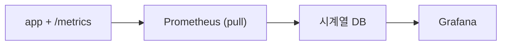

# Metric 수집과 시각화

> Observability 101 시리즈 (3/10)


## 이 글에서 다룰 문제

metric 파이프라인은 *모든 observability 의 출발점* 입니다. 첫 줄이 흐르는 순간, 시스템이 *말하기 시작* 합니다.

> *측정하지 않는 것은 *존재하지 않는 것*.*

## 전체 흐름


## Before/After

**Before**: log 만 보고 *추세* 를 *눈대중*.

**After**: 1초 간격 그래프로 *추세* 가 *바로* 보인다.

## Metric 파이프라인 5단계

### 1단계 — Python `/metrics`

```python
from prometheus_client import Counter, start_http_server

reqs = Counter("http_requests_total", "Total requests", ["path"])

if __name__ == "__main__":
    start_http_server(8000)
    while True:
        reqs.labels(path="/health").inc()
```

### 2단계 — Prometheus 설정

```yaml
scrape_configs:
  - job_name: app
    scrape_interval: 5s
    static_configs:
      - targets: ["app:8000"]
```

### 3단계 — Prometheus 실행 (Docker)

```bash
docker run -d --name prom -p 9090:9090 \
  -v $(pwd)/prom.yml:/etc/prometheus/prometheus.yml \
  prom/prometheus
```

### 4단계 — PromQL 첫 질의

```promql
rate(http_requests_total[1m])
sum by (path) (rate(http_requests_total[5m]))
```

### 5단계 — Grafana 패널

```bash
docker run -d --name graf -p 3000:3000 grafana/grafana
# 브라우저: http://localhost:3000
# Datasource: Prometheus → http://prom:9090
# Panel: rate(http_requests_total[1m])
```

## 이 코드에서 주목할 점

- *Prometheus* 는 *pull* 한다. 앱이 *내준다*.
- `/metrics` 는 *plain text* 로 응답한다.
- `rate()` 는 *증가율* 을 계산한다 (counter → 초당 값).

## 자주 하는 실수 5가지

1. **Counter 값을 *그대로* 그래프 그린다.** *rate()* 가 필요하다.
2. **Label 에 *고유 ID* 를 넣는다.** cardinality 폭발.
3. **Scrape interval 을 *1초* 로.** 부하 폭증.
4. **Pull 인데 *방화벽* 으로 막힌다.** target up 이 *0*.
5. **Grafana 에 *모든 panel* 을 욱여넣는다.** 의미 없는 *벽지*.

## 실무에서는 이렇게 쓰입니다

대부분의 회사는 *Prometheus + Grafana* 로 시작해 *Thanos / Mimir* 로 확장합니다.

## 체크리스트

- [ ] 앱에 `/metrics` 를 노출한다.
- [ ] Prometheus 가 *target* 을 *up* 으로 본다.
- [ ] *PromQL* 한 줄을 쓴다.
- [ ] Grafana 에 첫 패널을 띄운다.

## 정리 및 다음 단계

Metric 파이프라인이 흐르면, *시스템이 그래프로 말합니다*. 다음 글은 *구조화된 로깅* 입니다.

<!-- toc:begin -->
- [Observability란 무엇인가?](./01-what-is-observability.md)
- [Metric, Log, Trace](./02-metric-log-trace.md)
- **Metric 수집과 시각화 (현재 글)**
- 구조화된 로깅 (예정)
- 분산 트레이싱 기초 (예정)
- Dashboard 설계 (예정)
- Alert와 On-Call (예정)
- SLI와 SLO 기초 (예정)
- Cost와 Cardinality (예정)
- 운영 가능한 Observability 스택 (예정)
<!-- toc:end -->

## 참고 자료

- [Prometheus getting started](https://prometheus.io/docs/prometheus/latest/getting_started/)
- [prometheus_client (Python)](https://github.com/prometheus/client_python)
- [PromQL basics](https://prometheus.io/docs/prometheus/latest/querying/basics/)
- [Grafana docs](https://grafana.com/docs/grafana/latest/)

Tags: Observability, Metrics, Prometheus, Grafana, Monitoring
