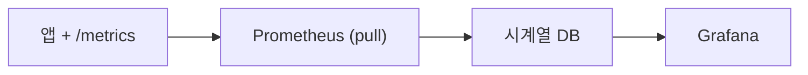

# Metric 수집과 시각화

## 이 글에서 다룰 문제

메트릭은 observability의 출발선입니다. 하지만 숫자를 코드에서 한 번 올린다고 바로 운영 그래프가 생기지는 않습니다. 애플리케이션이 메트릭을 노출해야 하고, 수집기가 정해진 간격으로 긁어 가야 하며, 저장된 데이터를 그래프로 바꾸는 도구도 필요합니다. 이 글에서는 Prometheus의 pull 모델과 `/metrics` 엔드포인트, PromQL, Grafana 패널까지 이어지는 가장 기본적인 메트릭 파이프라인을 정리합니다.

> Observability 101 시리즈 (3/10)

<!-- a-grade-intro:begin -->

핵심 질문: 메트릭은 어떻게 수집되고, 그 값은 어떻게 그래프가 될까요?

> Prometheus가 exporter를 가져가고, Grafana가 Prometheus에 저장된 값을 그립니다.

<!-- a-grade-intro:end -->

## 이 글에서 배울 것

- pull 모델과 push 모델의 차이
- `/metrics` 엔드포인트와 exporter의 역할
- 최소한의 Prometheus 설정
- 첫 번째 Grafana 대시보드를 만드는 흐름
- 입문 단계에서 자주 나오는 다섯 가지 실수

## 왜 중요한가

메트릭 파이프라인이 연결되는 순간 시스템은 숫자로 말하기 시작합니다. 요청 수가 늘었는지, 에러율이 오르는지, 응답 시간이 흔들리는지 같은 기본 질문은 대부분 메트릭에서 시작합니다. 반대로 이 파이프라인이 없으면 로그를 읽고 감으로 추세를 짐작해야 합니다. 운영이 커질수록 이런 방식은 금방 한계에 부딪힙니다.

> 측정하지 않는 것은 운영에서 존재하지 않는 것과 비슷합니다.

## 한눈에 보는 개념



## 핵심 용어

- Exporter: HTTP로 메트릭을 노출하는 구성 요소입니다.
- Scrape interval: Prometheus가 얼마나 자주 값을 가져올지 정하는 주기입니다.
- Time series: 라벨 집합, 값, 시간으로 이뤄진 시계열 데이터입니다.
- PromQL: Prometheus 질의 언어입니다.
- Dashboard panel: 대시보드를 이루는 개별 그래프입니다.

## Before / After

Before: 로그를 읽고 추세를 짐작합니다.

After: 초 단위 그래프에서 변화가 바로 보입니다.

## 실습: metric 파이프라인을 5단계로 만들기

### 1단계 — Python `/metrics`

```python
from prometheus_client import Counter, start_http_server

reqs = Counter("http_requests_total", "Total requests", ["path"])

if __name__ == "__main__":
    start_http_server(8000)
    while True:
        reqs.labels(path="/health").inc()
```

애플리케이션은 먼저 메트릭을 외부에 보여 줄 수 있어야 합니다. 이 예제는 Python 프로세스가 `http_requests_total` 이라는 Counter를 만들고, `/metrics` 를 통해 현재 값을 노출하는 가장 단순한 형태입니다. Prometheus는 이 값을 주기적으로 읽어 갑니다.

### 2단계 — Prometheus 설정

```yaml
scrape_configs:
  - job_name: app
    scrape_interval: 5s
    static_configs:
      - targets: ["app:8000"]
```

Prometheus는 어디에 붙을지 알아야 합니다. `job_name` 은 대상 묶음의 이름이고, `scrape_interval` 은 몇 초마다 가져올지 정합니다. 여기서는 5초 간격으로 `app:8000` 에서 메트릭을 읽습니다.

### 3단계 — Prometheus 실행 (Docker)

```bash
docker run -d --name prom -p 9090:9090 \
  -v $(pwd)/prom.yml:/etc/prometheus/prometheus.yml \
  prom/prometheus
```

이 단계가 끝나면 Prometheus는 설정 파일에 적어 둔 대상을 계속 수집합니다. 앱이 메트릭을 제대로 노출하고 있고 네트워크도 열려 있다면, 브라우저에서 Prometheus UI를 열어 target 상태를 확인할 수 있습니다.

### 4단계 — 첫 PromQL 질의

```promql
rate(http_requests_total[1m])
sum by (path) (rate(http_requests_total[5m]))
```

Counter는 누적값이기 때문에 그대로 그리면 계속 올라가기만 합니다. 그래서 보통 `rate()` 로 초당 증가율을 계산합니다. 두 번째 질의는 `path` 라벨 기준으로 그룹을 나눠 어느 경로에서 트래픽이 생기는지 보여 줍니다.

### 5단계 — Grafana 패널

```bash
docker run -d --name graf -p 3000:3000 grafana/grafana
# 브라우저: http://localhost:3000
# Datasource: Prometheus → http://prom:9090
# Panel: rate(http_requests_total[1m])
```

Grafana는 Prometheus에 저장된 값을 사람이 읽기 쉬운 화면으로 바꿉니다. 처음에는 패널 하나만 있어도 충분합니다. 중요한 것은 그래프 수가 아니라, 질문 하나에 답하는 화면을 만드는 일입니다.

## 이 코드에서 주목할 점

- Prometheus는 pull 하고 앱은 값을 노출 합니다.
- `/metrics` 는 보통 plain text 형식으로 응답합니다.
- `rate()` 는 counter를 초당 증가율로 바꿉니다.

## 자주 하는 실수 5가지

1. Counter 값을 그대로 그래프로 그립니다. `rate()` 없이 보면 의미를 해석하기 어렵습니다.
2. 라벨에 고유 ID를 넣습니다. cardinality가 급격히 늘어납니다.
3. scrape interval을 1초로 너무 짧게 잡습니다. 수집 대상에 불필요한 부하를 줍니다.
4. 방화벽이나 네트워크 정책 때문에 pull이 막힙니다. target이 down으로 보입니다.
5. Grafana에 패널을 무작정 많이 넣습니다. 질문이 없는 그래프는 벽지에 가깝습니다.

## 실무에서는 이렇게 보입니다

많은 팀이 Prometheus와 Grafana 조합으로 시작하고, 시계열 데이터가 커지면 Thanos나 Mimir 같은 확장형 저장 계층으로 넘어갑니다. 시작은 단순해도 좋지만, target discovery와 label 설계는 처음부터 신경 써야 뒤에서 덜 흔들립니다.

## 실무자는 이렇게 생각합니다

- 측정 가능한 것은 먼저 측정합니다.
- pull 모델은 target discovery가 안정적이어야 제대로 굴러갑니다.
- counter는 거의 항상 `rate()` 와 함께 읽습니다.
- 대시보드는 패널 모음이 아니라 질문 하나를 풀기 위한 화면입니다.
- cardinality는 메트릭 비용의 첫 번째 변수입니다.

## 체크리스트

- [ ] 앱에서 `/metrics` 를 노출합니다.
- [ ] Prometheus가 target을 up 으로 봅니다.
- [ ] PromQL 질의를 한 줄 쓸 수 있습니다.
- [ ] 첫 Grafana 패널을 만들 수 있습니다.

## 연습 문제

1. `Counter` 와 `Gauge` 를 둘 다 노출해 보세요.
2. `rate()` 와 `increase()` 의 차이를 설명해 보세요.
3. 5분 평균 처리량을 보여 주는 대시보드 패널을 하나 설계해 보세요.

## 다음 글로 이어가기

메트릭이 흐르기 시작하면 시스템은 그래프로 말합니다. 다음 글에서는 숫자 대신 사건의 맥락을 남기는 구조화된 로깅을 살펴보겠습니다.

<!-- toc:begin -->
- [Observability란 무엇인가?](./01-what-is-observability.md)
- [Metric, Log, Trace](./02-metric-log-trace.md)
- **Metric 수집과 시각화 (현재 글)**
- 구조화된 로깅 (예정)
- 분산 트레이싱 기초 (예정)
- Dashboard 설계 (예정)
- Alert와 On-Call (예정)
- SLI와 SLO 기초 (예정)
- Cost와 Cardinality (예정)
- 운영 가능한 Observability 스택 (예정)
<!-- toc:end -->

## 참고 자료

- [Prometheus getting started](https://prometheus.io/docs/prometheus/latest/getting_started/)
- [prometheus_client (Python)](https://github.com/prometheus/client_python)
- [PromQL basics](https://prometheus.io/docs/prometheus/latest/querying/basics/)
- [Grafana docs](https://grafana.com/docs/grafana/latest/)

Tags: Observability, Metrics, Prometheus, Grafana, Monitoring
