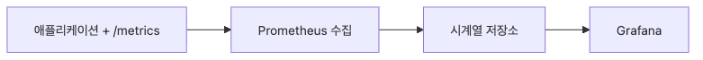

# 메트릭 수집과 시각화

메트릭이 중요하다는 말은 많이 듣지만, 실제 운영에서는 두 번째 질문이 더 중요합니다. 그 숫자가 어디서 나오고, 누가 가져가고, 어떤 화면에서 읽히는가입니다. 숫자를 노출하는 코드 한 줄만으로는 관측성이 만들어지지 않습니다.

메트릭 파이프라인은 애플리케이션, 수집기, 저장소, 대시보드가 이어진 흐름입니다. 이 흐름을 이해하면 왜 Prometheus가 pull 모델을 택했는지, 왜 카운터를 그대로 그리면 안 되는지, 왜 대시보드는 질문 중심이어야 하는지까지 함께 정리됩니다.

이 글은 Observability 101 시리즈의 3번째 글입니다.

## 이 글에서 다룰 문제

- 메트릭은 어떻게 수집되고 그래프로 바뀔까요?
- pull 방식과 push 방식은 무엇이 다를까요?
- `/metrics` 엔드포인트는 어떤 역할을 할까요?
- PromQL은 메트릭을 어떻게 질문으로 바꿀까요?
- 좋은 첫 대시보드는 무엇을 보여 줘야 할까요?

> 애플리케이션은 메트릭을 내보내고, Prometheus는 그것을 주기적으로 읽어 오고, Grafana는 저장된 시계열을 질문 형태의 그래프로 바꿉니다. 관측성 파이프라인은 숫자를 저장하는 일이 아니라 숫자를 읽을 수 있게 만드는 일입니다.

## 왜 중요한가

메트릭 파이프라인은 관측성의 출발선입니다. 첫 바이트가 흐르는 순간부터 시스템은 숫자로 말을 하기 시작합니다. 요청 수가 늘고 있는지, 에러율이 올라가는지, 지연 시간이 흔들리는지처럼 운영의 기본 질문은 대부분 메트릭에서 출발합니다.

문제는 메트릭을 잘못 수집하거나 잘못 그리면 오히려 오해가 커진다는 점입니다. 카운터를 그대로 선 그래프로 그리거나, 라벨을 과하게 붙이거나, 1초마다 무리하게 수집하면 숫자는 많아져도 판단은 더 느려집니다. 그래서 수집과 시각화는 함께 배워야 합니다.

## 한눈에 보는 구조


*애플리케이션이 메트릭을 노출하고 Prometheus가 수집한 뒤 Grafana가 질문 형태의 그래프로 바꾸는 흐름*

## 핵심 용어

- 익스포터: HTTP로 메트릭을 노출하는 구성 요소입니다.
- 수집 주기: Prometheus가 메트릭을 읽어 오는 간격입니다.
- 시계열: 라벨 집합, 값, 시각으로 이루어진 데이터입니다.
- PromQL: Prometheus 질의 언어입니다.
- 패널: 대시보드 안의 개별 그래프입니다.

## 바꾸기 전과 후

바꾸기 전에는 로그 몇 줄을 보며 "아마 지금도 요청이 늘고 있겠지"라고 짐작합니다. 추세를 읽는 데 시간이 오래 걸리고, 지난 10분과 지금을 비교하기도 어렵습니다.

바꾼 뒤에는 초 단위 그래프가 바로 보입니다. 요청 수가 늘었는지, 특정 경로만 올라가는지, 지연 시간이 어느 시점부터 흔들렸는지 화면 한 줄로 확인할 수 있습니다. 추세를 추측하는 대신 읽을 수 있게 됩니다.

## 실습: 메트릭 파이프라인을 다섯 단계로 만들기

### 1단계 — 파이썬에서 메트릭 엔드포인트 노출하기

```python
from prometheus_client import Counter, start_http_server

reqs = Counter("http_requests_total", "Total requests", ["path"])

if __name__ == "__main__":
    start_http_server(8000)
    while True:
        reqs.labels(path="/health").inc()
```

애플리케이션은 먼저 메트릭을 바깥으로 보여 줄 수 있어야 합니다. `/metrics` 엔드포인트는 사람보다 수집기가 읽는 표준 출입구라고 생각하면 됩니다.

### 2단계 — 수집기 설정하기

```yaml
scrape_configs:
  - job_name: app
    scrape_interval: 5s
    static_configs:
      - targets: ["app:8000"]
```

Prometheus는 push를 기다리지 않고 pull로 읽어 옵니다. 어느 대상을 몇 초마다 읽을지 선언해 두면, 수집기가 주기적으로 `/metrics`를 호출합니다.

### 3단계 — 수집기 실행하기

```bash
docker run -d --name prom -p 9090:9090 \
  -v $(pwd)/prom.yml:/etc/prometheus/prometheus.yml \
  prom/prometheus
```

이 단계부터 메트릭은 메모리 안 숫자가 아니라 저장되는 시계열이 됩니다. 수집기가 붙지 않으면 노출된 메트릭은 흘러가 버리는 값에 가깝습니다.

### 4단계 — 첫 질의 써 보기

```promql
rate(http_requests_total[1m])
sum by (path) (rate(http_requests_total[5m]))
```

카운터는 누적값이기 때문에 그대로 그리면 해석이 어렵습니다. `rate()`로 초당 증가량으로 바꿔야 현재 처리량이 보입니다. 이 한 줄이 메트릭 해석에서 가장 자주 쓰는 기본기입니다.

### 5단계 — 첫 대시보드 패널 만들기

```bash
docker run -d --name graf -p 3000:3000 grafana/grafana
# Browser: http://localhost:3000
# Datasource: Prometheus → http://prom:9090
# Panel: rate(http_requests_total[1m])
```

대시보드는 숫자를 꾸미는 화면이 아니라 질문을 붙이는 화면입니다. 첫 패널은 "지금 요청이 얼마나 들어오는가"처럼 하나의 질문만 정확히 답하게 두는 편이 좋습니다.

## 수집 경로를 이렇게 검증합니다

메트릭 파이프라인은 코드가 아니라 경로가 끊겨도 바로 무용지물이 됩니다. 그래서 애플리케이션, 수집기, 대시보드를 각각 한 번씩 확인하는 절차가 필요합니다.

```bash
# 1) 애플리케이션이 메트릭을 노출하는지 확인
curl -s http://localhost:8000/metrics | grep http_requests_total

# 2) Prometheus 타깃이 살아 있는지 확인
curl -s http://localhost:9090/api/v1/targets | grep '"health":"up"'
```

```text
Expected output:
- /metrics 응답에 http_requests_total 이 보입니다.
- Prometheus /targets 에서 app 타깃이 up 으로 보입니다.
- Grafana 패널에서 rate(http_requests_total[1m]) 값이 0이 아닌 선으로 그려집니다.
```

## 이 코드에서 먼저 봐야 할 점

- Prometheus는 끌어오고, 애플리케이션은 노출합니다.
- `/metrics`는 평문 형식의 메트릭을 반환합니다.
- 카운터는 거의 항상 `rate()`를 거쳐 읽는다고 생각하면 됩니다.

## 자주 하는 실수 다섯 가지

1. 카운터를 그대로 그래프로 그립니다. 증가량이 아니라 누적값이라 해석이 어렵습니다.
2. 고유 식별자를 라벨에 넣습니다. 카디널리티가 급격히 커집니다.
3. 수집 주기를 1초로 과하게 줄입니다. 대상 서비스와 수집기 모두 부담이 커집니다.
4. 방화벽 때문에 pull이 막히는데도 애플리케이션 문제로 오해합니다.
5. 질문 없는 패널을 계속 추가합니다. 대시보드가 벽지처럼 변합니다.

## 실무에서는 이렇게 생각한다

작은 팀은 대개 Prometheus와 Grafana로 시작합니다. 규모가 커지면 장기 저장과 집계를 위해 Thanos나 Mimir 같은 구성을 더하지만, 출발점의 원리는 같습니다. 메트릭은 먼저 잘 노출되고, 안정적으로 수집되고, 질문 중심으로 그려져야 합니다.

시니어 엔지니어는 대시보드보다 먼저 파이프라인을 봅니다. 수집 주기가 적절한지, 라벨이 통제되고 있는지, 쿼리가 누적값과 증가량을 헷갈리지 않는지부터 점검합니다. 숫자가 많다고 관측성이 좋아지는 것은 아니기 때문입니다.

## 체크리스트

- [ ] 애플리케이션이 `/metrics`를 노출합니다.
- [ ] Prometheus에서 대상이 정상으로 보입니다.
- [ ] PromQL 질의를 하나 이상 직접 쓸 수 있습니다.
- [ ] Grafana에서 첫 패널을 만들 수 있습니다.

## 연습 문제

1. Counter와 Gauge를 하나씩 노출해 보세요.
2. `rate()`와 `increase()`의 차이를 설명해 보세요.
3. 5분 평균 처리량을 보여 주는 패널을 설계해 보세요.

## 정리

메트릭 파이프라인이 붙으면 시스템은 그래프로 말을 하기 시작합니다. 애플리케이션은 메트릭을 노출하고, Prometheus는 수집하고, Grafana는 질문 단위의 화면으로 바꿉니다. 다음 글에서는 숫자만으로 부족한 이유, 곧 구조화된 로그가 왜 필요한지 이어서 보겠습니다.

<!-- toc:begin -->
- [관측성이란 무엇인가?](./01-what-is-observability.md)
- [메트릭, 로그, 트레이스](./02-metric-log-trace.md)
- **메트릭 수집과 시각화 (현재 글)**
- 구조화된 로깅 (예정)
- 분산 트레이싱 기초 (예정)
- 대시보드 설계 (예정)
- 경보와 온콜 (예정)
- 서비스 수준 지표와 목표 기초 (예정)
- 비용과 카디널리티 (예정)
- 운영 가능한 관측성 스택 (예정)
<!-- toc:end -->

## 참고 자료

- [Prometheus getting started](https://prometheus.io/docs/prometheus/latest/getting_started/)
- [prometheus_client (Python)](https://github.com/prometheus/client_python)
- [PromQL basics](https://prometheus.io/docs/prometheus/latest/querying/basics/)
- [Grafana docs](https://grafana.com/docs/grafana/latest/)

Tags: Observability, Metrics, Prometheus, Grafana, Monitoring
