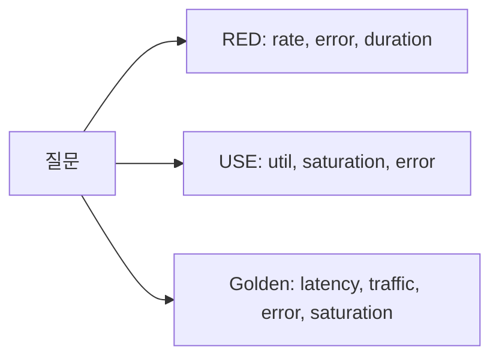

# Dashboard 설계

> Observability 101 시리즈 (6/10)


## 이 글에서 다룰 문제

대부분의 dashboard 는 장식에 그칩니다. 장애가 났을 때 어디를 봐야 할지 모르면 panel 30개도 사실상 없는 것과 같습니다.

> Dashboard 는 질문에 답하는 도구입니다. 답이 없으면 지우는 편이 낫습니다.

## 전체 흐름


## Before/After

**Before**: panel 이 30개나 있지만 흥미롭기만 하고 답은 없습니다.

**After**: panel 6개만으로도 첫 화면에서 건강 상태가 바로 읽힙니다.

## Dashboard 5단계

### 1단계 — RED 패널 (요청)

```promql
# 요청 수
sum(rate(http_requests_total[1m]))
# 오류 수
sum(rate(http_requests_total{status=~"5.."}[1m]))
# 응답 시간 p95
histogram_quantile(0.95, sum by (le) (rate(http_duration_seconds_bucket[5m])))
```

### 2단계 — USE 패널 (자원)

```promql
# CPU 사용률
avg(rate(node_cpu_seconds_total{mode!="idle"}[1m]))
# 메모리 포화도
1 - node_memory_MemAvailable_bytes / node_memory_MemTotal_bytes
```

### 3단계 — Golden signals 한 행

```text
Row: Service Health
  Panel 1: Latency (p50/p95/p99)
  Panel 2: Traffic (req/s)
  Panel 3: Errors (5xx/min)
  Panel 4: Saturation (queue depth)
```

### 4단계 — Annotation: 배포 마커

```yaml
annotations:
  - name: deploy
    datasource: prometheus
    expr: changes(build_info[1m]) > 0
```

### 5단계 — Variable 로 환경 전환

```text
$env = staging | production
$service = api | worker | scheduler
```

## 이 코드에서 주목할 점

- RED 는 서비스 바깥에서 본 시각이고, USE 는 내부 자원 관점입니다.
- p95 는 대부분 사용자의 경험을, p99 는 긴 꼬리 지연을 보여 줍니다.
- Annotation 으로 변화의 원인을 함께 표시합니다.

## 자주 하는 실수 5가지

1. **Panel 30개를 한 화면에 몰아넣습니다.** 무엇을 봐야 할지 알 수 없습니다.
2. **모든 값을 평균으로만 봅니다.** 분포가 사라집니다.
3. **단위 표기를 넣지 않습니다.** 의미가 모호해집니다.
4. **Threshold 가 없습니다.** 위험한지 정상인지 판단하기 어렵습니다.
5. **Dashboard 를 디자인 작품처럼 다룹니다.** 질문에 답하지 못합니다.

## 실무에서는 이렇게 쓰입니다

실무에서는 Service Overview dashboard 를 RED + USE 6패널 정도로 압축하는 경우가 많습니다. 더 깊은 dashboard 는 역할별로 분리합니다.

## 체크리스트

- [ ] RED 4쿼리를 알고 있습니다.
- [ ] USE 의 의미를 이해합니다.
- [ ] 첫 화면이 건강 요약 역할을 합니다.
- [ ] 배포 annotation 이 보입니다.

## 정리 및 다음 단계

질문 단위로 설계한 dashboard 는 의사결정 속도를 바꿉니다. 다음 글은 Alert와 On-Call입니다.

<!-- toc:begin -->
- [Observability란 무엇인가?](./01-what-is-observability.md)
- [Metric, Log, Trace](./02-metric-log-trace.md)
- [Metric 수집과 시각화](./03-metric-collection.md)
- [구조화된 로깅](./04-structured-logging.md)
- [분산 트레이싱 기초](./05-distributed-tracing.md)
- **Dashboard 설계 (현재 글)**
- Alert와 On-Call (예정)
- SLI와 SLO 기초 (예정)
- Cost와 Cardinality (예정)
- 운영 가능한 Observability 스택 (예정)
<!-- toc:end -->

## 참고 자료

- [Brendan Gregg — USE Method](https://www.brendangregg.com/usemethod.html)
- [Tom Wilkie — RED Method](https://www.weave.works/blog/the-red-method-key-metrics-for-microservices-architecture/)
- [Google SRE — Golden Signals](https://sre.google/sre-book/monitoring-distributed-systems/)
- [Grafana dashboard best practices](https://grafana.com/docs/grafana/latest/best-practices/)

Tags: Observability, Dashboard, Grafana, SRE, Monitoring
