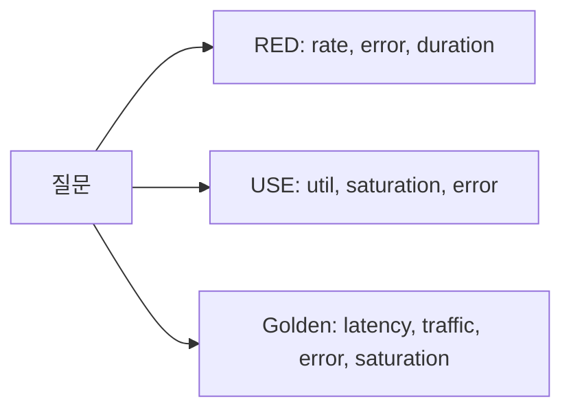

# Dashboard 설계

> Observability 101 시리즈 (6/10)

<!-- a-grade-intro:begin -->

**핵심 질문**: 좋은 dashboard 와 *벽지처럼 의미 없는* dashboard 는 무엇이 다릅니까?

> *좋은 dashboard 는 *하나의 질문* 에 답합니다. *USE* 와 *RED* 같은 패턴을 따르면 panel 이 *의미 단위* 가 됩니다.*

<!-- a-grade-intro:end -->

## 이 글에서 배울 것

- *USE* (Utilization, Saturation, Errors)
- *RED* (Rate, Errors, Duration)
- *Golden signals* 의 4가지
- *질문 단위* dashboard 구성
- 흔한 함정 5가지

## 왜 중요한가

대부분의 dashboard 는 *장식* 입니다. 장애 시 *어디를 봐야 할지* 모르면, panel 30개는 *0개* 와 같습니다.

> *Dashboard 는 *답하는 도구* 다. 답이 없으면 지운다.*

## 개념 한눈에 보기



## 핵심 용어 정리

- **USE**: 자원(*resource*) 관점.
- **RED**: 요청(*request*) 관점.
- **Golden signals**: 서비스 *건강* 4축.
- **Heatmap**: 분포의 *시간 변화*.
- **Annotation**: 배포 시점 등의 *마커*.

## Before/After

**Before**: 30개 panel, 모두 *흥미롭지만* 답이 없다.

**After**: 6개 panel, 첫 화면에서 *건강 상태* 가 *바로* 읽힌다.

## 실습: Dashboard 5단계

### 1단계 — RED 패널 (요청)

```promql
# Rate
sum(rate(http_requests_total[1m]))
# Errors
sum(rate(http_requests_total{status=~"5.."}[1m]))
# Duration p95
histogram_quantile(0.95, sum by (le) (rate(http_duration_seconds_bucket[5m])))
```

### 2단계 — USE 패널 (자원)

```promql
# CPU utilization
avg(rate(node_cpu_seconds_total{mode!="idle"}[1m]))
# Memory saturation
1 - node_memory_MemAvailable_bytes / node_memory_MemTotal_bytes
```

### 3단계 — Golden signals 한 행

```text
Row: Service Health
  Panel 1: Latency (p50/p95/p99)
  Panel 2: Traffic (req/s)
  Panel 3: Errors (5xx/min)
  Panel 4: Saturation (queue depth)
```

### 4단계 — Annotation: 배포 마커

```yaml
annotations:
  - name: deploy
    datasource: prometheus
    expr: changes(build_info[1m]) > 0
```

### 5단계 — Variable 로 환경 전환

```text
$env = staging | production
$service = api | worker | scheduler
```

## 이 코드에서 주목할 점

- *RED* 는 *서비스 외부 시각*, *USE* 는 *내부 시각*.
- p95 는 *대부분 사용자 경험*, p99 는 *꼬리*.
- *Annotation* 으로 변화의 *원인* 을 표시.

## 자주 하는 실수 5가지

1. **Panel 30개를 *한 화면*.** 무엇을 *볼지 모름*.
2. **모두 *평균*.** 분포가 사라진다.
3. **단위 표기 *없음*.** 의미 *모호*.
4. **Threshold *없음*.** *위험* 인지 *정상* 인지 모름.
5. **Dashboard 를 *디자인 작품* 으로 본다.** 답을 못한다.

## 실무에서는 이렇게 쓰입니다

가장 자주 보는 *Service Overview* dashboard 가 *RED + USE* 6패널로 압축됩니다. 더 깊은 dashboard 는 *역할별로 분리*.

## 시니어 엔지니어는 이렇게 생각합니다

- *Dashboard 는 *제목이 질문* 이다.*
- *6패널 한 화면 — 그 이상은 *세부 dashboard* 로.*
- *p95/p99 가 평균보다 *진실* 에 가깝다.*
- *배포는 *annotation* 으로 마킹.*
- *답하지 못하는 panel 은 *지운다*.*

## 체크리스트

- [ ] *RED* 4쿼리 를 알고 있다.
- [ ] *USE* 의 의미를 안다.
- [ ] 첫 화면이 *건강 요약*.
- [ ] 배포 *annotation* 이 보인다.

## 연습 문제

1. 한 서비스의 *RED* dashboard 를 만들어 보세요.
2. *USE* 로 host 자원 dashboard 를 만들어 보세요.
3. Annotation 으로 *배포 시점* 을 표시해 보세요.

## 정리 및 다음 단계

질문 단위 dashboard 가 *의사결정 속도* 를 바꿉니다. 다음 글은 *Alert와 On-Call* 입니다.

<!-- toc:begin -->
- [Observability란 무엇인가?](./01-what-is-observability.md)
- [Metric, Log, Trace](./02-metric-log-trace.md)
- [Metric 수집과 시각화](./03-metric-collection.md)
- [구조화된 로깅](./04-structured-logging.md)
- [분산 트레이싱 기초](./05-distributed-tracing.md)
- **Dashboard 설계 (현재 글)**
- Alert와 On-Call (예정)
- SLI와 SLO 기초 (예정)
- Cost와 Cardinality (예정)
- 운영 가능한 Observability 스택 (예정)
<!-- toc:end -->

## 참고 자료

- [Brendan Gregg — USE Method](https://www.brendangregg.com/usemethod.html)
- [Tom Wilkie — RED Method](https://www.weave.works/blog/the-red-method-key-metrics-for-microservices-architecture/)
- [Google SRE — Golden Signals](https://sre.google/sre-book/monitoring-distributed-systems/)
- [Grafana dashboard best practices](https://grafana.com/docs/grafana/latest/best-practices/)

Tags: Observability, Dashboard, Grafana, SRE, Monitoring
