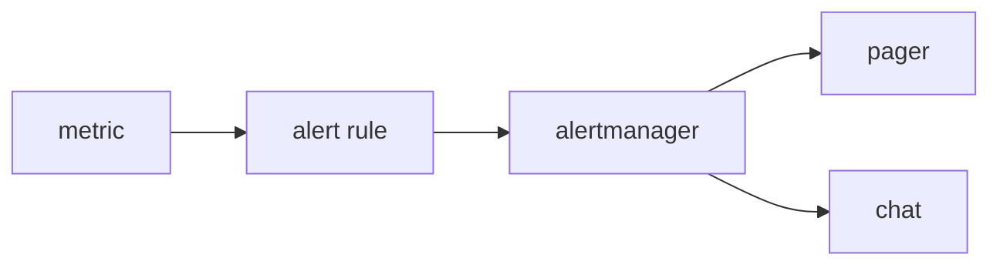

# Alert와 On-Call

> Observability 101 시리즈 (7/10)


## 이 글에서 다룰 문제

Alert 가 너무 많으면 진짜 신호가 묻힙니다. On-call 은 수면과 집중력을 비용으로 치르는 일입니다. 결국 설계가 곧 비용입니다.

> Alert 는 사람을 깨우는 비용을 동반합니다. 그 값을 모르면 운영이 버티기 어려워집니다.

## 전체 흐름


## Before/After

**Before**: alert 가 하루 50개씩 와서 모두 무시되고, 진짜 장애도 놓칩니다.

**After**: alert 가 주 3개 수준으로 줄고, 모두 실제 조치가 필요한 신호만 남습니다.

## Alert 5단계

### 1단계 — Prometheus alert rule

```yaml
groups:
  - name: api
    rules:
      - alert: HighErrorRate
        expr: sum(rate(http_requests_total{status=~"5.."}[5m]))
              / sum(rate(http_requests_total[5m])) > 0.05
        for: 10m
        labels: { severity: page }
        annotations:
          summary: "5xx > 5% for 10m"
          runbook: "https://wiki/runbook/api-error"
```

### 2단계 — `for` 절로 flap 방지

```yaml
for: 10m   # 짧으면 잡음 폭증
```

### 3단계 — Severity 분리

```yaml
labels:
  severity: page    # 새벽에 깨움
  # severity: ticket # 영업시간에 처리
```

### 4단계 — Alertmanager 라우팅

```yaml
route:
  receiver: default
  routes:
    - match: { severity: page }
      receiver: pagerduty
    - match: { severity: ticket }
      receiver: slack-ops
```

### 5단계 — Runbook 링크

```text
모든 alert 에 runbook URL 필수.
runbook 에는: 의미, 첫 행동 3가지, 에스컬레이션, 관련 dashboard
```

## 이 코드에서 주목할 점

- `for: 10m` 으로 지속 조건을 강제합니다.
- `severity` 라벨이 대응 방식을 결정합니다.
- Runbook 없는 alert 는 반쪽짜리에 가깝습니다.

## 자주 하는 실수 5가지

1. **모든 alert 를 page 로 보냅니다.** 새벽 대응이 감당하기 어려워집니다.
2. **Cause 에만 alert 를 겁니다.** 사용자 영향과 분리됩니다.
3. **`for` 절이 없습니다.** flapping 때문에 잡음이 폭증합니다.
4. **Runbook 이 없습니다.** 받은 사람이 첫 행동에서 멈춥니다.
5. **Owner 가 없습니다.** 모두의 alert 가 결국 아무의 alert 도 아니게 됩니다.

## 실무에서는 이렇게 쓰입니다

대부분의 팀은 symptom-based alert (SLO 위반) 을 1순위로 두고, cause-based alert (CPU 95%) 는 보조 수단으로 둡니다. PagerDuty, Opsgenie, Grafana OnCall 같은 도구를 많이 씁니다.

## 체크리스트

- [ ] 각 alert 에 runbook 링크가 있습니다.
- [ ] `severity` 가 `page` 와 `ticket` 으로 나뉩니다.
- [ ] `for` 가 설정되어 있습니다.
- [ ] On-call 교대표가 있습니다.

## 정리 및 다음 단계

좋은 alert 는 팀의 수면을 지켜 줍니다. 다음 글은 SLI 와 SLO 기초입니다.

<!-- toc:begin -->
- [Observability란 무엇인가?](./01-what-is-observability.md)
- [Metric, Log, Trace](./02-metric-log-trace.md)
- [Metric 수집과 시각화](./03-metric-collection.md)
- [구조화된 로깅](./04-structured-logging.md)
- [분산 트레이싱 기초](./05-distributed-tracing.md)
- [Dashboard 설계](./06-dashboard-design.md)
- **Alert와 On-Call (현재 글)**
- SLI와 SLO 기초 (예정)
- Cost와 Cardinality (예정)
- 운영 가능한 Observability 스택 (예정)
<!-- toc:end -->

## 참고 자료

- [Google SRE — Alerting](https://sre.google/sre-book/practical-alerting/)
- [Prometheus alerting rules](https://prometheus.io/docs/prometheus/latest/configuration/alerting_rules/)
- [Alertmanager docs](https://prometheus.io/docs/alerting/latest/alertmanager/)
- [On-call principles](https://increment.com/on-call/when-the-pager-goes-off/)

Tags: Observability, Alerting, SRE, OnCall, Monitoring
