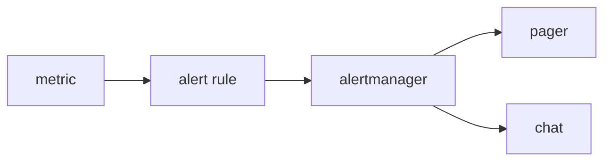

# Alert와 On-Call

> Observability 101 시리즈 (7/10)

<!-- a-grade-intro:begin -->

**핵심 질문**: 새벽 3시에 *깨어날 가치가 있는* alert 와 *그렇지 않은* alert 는 무엇이 다릅니까?

> *좋은 alert 는 *조치 가능* 하고 *사용자 영향* 을 반영합니다. 그렇지 않은 alert 는 *피로* 만 남깁니다.*

<!-- a-grade-intro:end -->

## 이 글에서 배울 것

- *Alert* 의 3가지 조건
- *Alert fatigue* 의 비용
- *Symptom* vs *cause* alert
- *On-call* 운영 기본
- 흔한 함정 5가지

## 왜 중요한가

Alert 가 너무 많으면 *진짜 신호* 가 *묻힙니다*. On-call 은 *수면을 사고* 정신력을 *지불* 합니다. 설계가 곧 비용입니다.

> *Alert 는 *깨우는 비용* 이 있다. 그 값을 모르면 *부도* 난다.*

## 개념 한눈에 보기



## 핵심 용어 정리

- **Alert rule**: 조건과 *지속 시간*.
- **Severity**: *page* vs *ticket*.
- **Routing**: 누가 받을지.
- **Silence**: 일시 *억제*.
- **Runbook**: alert 발생 시 *행동 매뉴얼*.

## Before/After

**Before**: alert 50개/일, 모두 무시. 진짜 장애 *놓침*.

**After**: alert 3개/주, *모두 조치 필요*.

## 실습: Alert 5단계

### 1단계 — Prometheus alert rule

```yaml
groups:
  - name: api
    rules:
      - alert: HighErrorRate
        expr: sum(rate(http_requests_total{status=~"5.."}[5m]))
              / sum(rate(http_requests_total[5m])) > 0.05
        for: 10m
        labels: { severity: page }
        annotations:
          summary: "5xx > 5% for 10m"
          runbook: "https://wiki/runbook/api-error"
```

### 2단계 — `for` 절로 *flap* 방지

```yaml
for: 10m   # 짧으면 잡음 폭증
```

### 3단계 — Severity 분리

```yaml
labels:
  severity: page    # 새벽에 깨움
  # severity: ticket # 영업시간에 처리
```

### 4단계 — Alertmanager 라우팅

```yaml
route:
  receiver: default
  routes:
    - match: { severity: page }
      receiver: pagerduty
    - match: { severity: ticket }
      receiver: slack-ops
```

### 5단계 — Runbook 링크

```text
모든 alert 에 runbook URL 필수.
runbook 에는: 의미, 첫 행동 3가지, 에스컬레이션, 관련 dashboard
```

## 이 코드에서 주목할 점

- `for: 10m` 으로 *지속 조건* 을 강제.
- `severity` 라벨이 *행동* 을 결정.
- *Runbook* 없는 alert 는 *반쪽*.

## 자주 하는 실수 5가지

1. **모든 alert 가 *page*.** 새벽이 *지옥*.
2. ***Cause* 에만 alert.** 사용자 영향과 *분리*.
3. **`for` 없음.** *flapping* 으로 잡음 폭증.
4. ***Runbook* 없음.** 받은 사람이 *멈춘다*.
5. **Owner 없음.** 모두의 alert = *아무의 alert*.

## 실무에서는 이렇게 쓰입니다

대부분의 팀은 *symptom-based alert (SLO 위반)* 을 1순위로, *cause-based alert (CPU 95%)* 를 보조로 둡니다. PagerDuty / Opsgenie / Grafana OnCall 가 흔합니다.

## 시니어 엔지니어는 이렇게 생각합니다

- *Alert 는 *조치 가능* 하지 않으면 지운다.*
- *Symptom > cause. SLO 가 표준.*
- *Page 의 비용은 *수면* 이다.*
- *On-call 은 *근무*, 보상이 필요하다.*
- *Runbook 없는 alert 는 *바로 해체*.*

## 체크리스트

- [ ] 한 alert 에 *runbook 링크* 가 있다.
- [ ] *severity* 가 *page/ticket* 으로 나뉜다.
- [ ] `for` 가 설정되어 있다.
- [ ] On-call *교대표* 가 있다.

## 연습 문제

1. 한 SLO 위반 alert 를 작성해 보세요.
2. *Symptom* 과 *cause* alert 를 각 한 개씩 정리하세요.
3. Runbook 한 페이지를 작성해 보세요.

## 정리 및 다음 단계

좋은 alert 는 *수면을 지킵니다*. 다음 글은 *SLI 와 SLO 기초* 입니다.

<!-- toc:begin -->
- [Observability란 무엇인가?](./01-what-is-observability.md)
- [Metric, Log, Trace](./02-metric-log-trace.md)
- [Metric 수집과 시각화](./03-metric-collection.md)
- [구조화된 로깅](./04-structured-logging.md)
- [분산 트레이싱 기초](./05-distributed-tracing.md)
- [Dashboard 설계](./06-dashboard-design.md)
- **Alert와 On-Call (현재 글)**
- SLI와 SLO 기초 (예정)
- Cost와 Cardinality (예정)
- 운영 가능한 Observability 스택 (예정)
<!-- toc:end -->

## 참고 자료

- [Google SRE — Alerting](https://sre.google/sre-book/practical-alerting/)
- [Prometheus alerting rules](https://prometheus.io/docs/prometheus/latest/configuration/alerting_rules/)
- [Alertmanager docs](https://prometheus.io/docs/alerting/latest/alertmanager/)
- [On-call principles](https://increment.com/on-call/when-the-pager-goes-off/)

Tags: Observability, Alerting, SRE, OnCall, Monitoring
