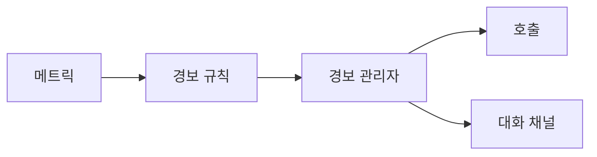

# 경보와 온콜

경보는 많이 울릴수록 안전해질 것 같지만, 실제로는 그 반대가 되기 쉽습니다. 하루에 수십 번 울리는 경보는 결국 아무도 믿지 않게 됩니다. 정말 위험한 상황이 와도 "또 오경보겠지"라는 반응이 먼저 나오면 이미 설계가 잘못된 것입니다.

온콜은 도구 문제가 아니라 사람의 집중력과 수면을 다루는 운영 체계입니다. 그래서 좋은 경보 설계는 기술적 정확성만큼이나 인간 비용을 함께 고려해야 합니다.

이 글은 Observability 101 시리즈의 7번째 글입니다.

## 이 글에서 다룰 문제

- 새벽에 사람을 깨울 만한 경보는 어떤 조건을 가져야 할까요?
- 경보 피로는 왜 생기고 어떻게 줄일 수 있을까요?
- 증상 경보와 원인 경보는 어떻게 다를까요?
- 심각도 분리는 왜 중요할까요?
- 온콜 운영에서 런북은 어떤 역할을 할까요?

> 좋은 경보는 조치 가능하고, 사용자 영향과 연결되며, 누가 받는지 분명합니다. 이 세 가지가 빠지면 경보는 신호가 아니라 소음이 됩니다.

## 왜 중요한가

온콜의 비용은 숫자로만 계산되지 않습니다. 자주 울리는 경보는 수면을 깨고, 집중력을 갉아먹고, 팀의 신뢰를 떨어뜨립니다. 그래서 경보 하나를 추가하는 일은 알림 한 줄을 더 만드는 것이 아니라 운영 비용을 늘리는 결정입니다.

좋은 경보 설계는 반대로 팀을 보호합니다. 사용자 영향이 분명한 문제만 즉시 깨우고, 나머지는 업무 시간 안에 처리할 수 있게 나누면 사람의 에너지를 중요한 문제에 집중시킬 수 있습니다.

## 한눈에 보는 구조



## 핵심 용어

- 경보 규칙: 조건과 지속 시간을 함께 정의한 규칙입니다.
- 심각도: 즉시 호출할지, 업무 시간 티켓으로 보낼지 구분하는 기준입니다.
- 라우팅: 어떤 팀과 채널로 보낼지 정하는 규칙입니다.
- 일시 중지: 유지보수나 이미 처리 중인 상황에서 잠시 억제하는 기능입니다.
- 런북: 경보를 받았을 때 처음 무엇을 해야 하는지 적어 둔 대응 문서입니다.

## 바꾸기 전과 후

바꾸기 전에는 하루에 수십 개 경보가 옵니다. 대부분은 잠깐 튀었다 사라지거나, 이미 알고 있던 원인 신호라서 아무도 적극적으로 보지 않습니다. 그러다 진짜 장애도 같은 소리 속에 섞입니다.

바꾼 뒤에는 새벽 호출용 경보가 극단적으로 줄어듭니다. 대신 사용자 영향이 큰 증상 경보만 남고, 나머지는 티켓이나 채팅으로 분리됩니다. 경보 수는 줄어들지만 신뢰도는 높아집니다.

## 실습: 경보 체계를 다섯 단계로 만들기

### 1단계 — 기본 경보 규칙 쓰기

```yaml
groups:
  - name: api
    rules:
      - alert: HighErrorRate
        expr: sum(rate(http_requests_total{status=~"5.."}[5m]))
              / sum(rate(http_requests_total[5m])) > 0.05
        for: 10m
        labels: { severity: page }
        annotations:
          summary: "5xx > 5% for 10m"
          runbook: "https://wiki/runbook/api-error"
```

좋은 첫 경보는 사용자 영향과 연결된 증상 경보입니다. 에러율처럼 바로 체감되는 지표가 특히 적합합니다.

### 2단계 — 지속 시간 넣기

```yaml
for: 10m   # too short and noise explodes
```

지속 시간이 없으면 잠깐 튄 수치에도 경보가 바로 울립니다. `for`는 흔들림을 거르고, 실제로 지속된 문제만 남기는 첫 번째 필터입니다.

### 3단계 — 심각도 나누기

```yaml
labels:
  severity: page    # wakes you up
  # severity: ticket # business hours
```

모든 경보가 사람을 깨우면 시스템은 곧 망가집니다. 즉시 대응이 필요한 것과 업무 시간 처리로 충분한 것을 분리해야 온콜이 버틸 수 있습니다.

### 4단계 — 경보 라우팅하기

```yaml
route:
  receiver: default
  routes:
    - match: { severity: page }
      receiver: pagerduty
    - match: { severity: ticket }
      receiver: slack-ops
```

경보는 누구에게 가는지가 명확해야 합니다. 수신자가 불분명하면 결국 아무도 책임지지 않게 됩니다.

### 5단계 — 런북 연결하기

```text
Every alert MUST have a runbook URL.
The runbook covers: meaning, first 3 actions, escalation, related dashboards.
```

경보가 울린 뒤 처음 세 행동을 적어 두지 않으면, 받는 사람은 매번 처음부터 생각해야 합니다. 경보 없는 런북도 약하지만, 런북 없는 경보는 더 위험합니다.

## 이 코드에서 먼저 봐야 할 점

- `for: 10m`은 순간 튐을 줄이는 핵심 장치입니다.
- `severity` 라벨은 경보의 행동 방식을 결정합니다.
- 런북이 없으면 경보는 절반만 만들어진 상태입니다.

## 자주 하는 실수 다섯 가지

1. 모든 경보를 새벽 호출로 보냅니다. 결국 아무도 경보를 신뢰하지 않게 됩니다.
2. 원인 경보만 만들고 증상 경보를 놓칩니다. 사용자 영향과 멀어집니다.
3. `for` 없이 즉시 울리게 만듭니다. 소음이 폭증합니다.
4. 런북이 없습니다. 경보를 받은 사람이 얼어붙습니다.
5. 소유 팀이 없습니다. 모두의 경보가 아무의 경보도 아니게 됩니다.

## 실무에서는 이렇게 생각한다

강한 팀은 먼저 증상 경보를 세웁니다. 서비스 수준 목표 위반, 높은 에러율, 긴 지연 시간처럼 사용자 경험과 연결된 신호가 우선입니다. CPU 95% 같은 원인 경보는 보조 역할로 두는 편이 낫습니다.

또한 온콜을 노동으로 다룹니다. 교대, 보상, 인수인계, 런북, 경보 품질 리뷰가 함께 있어야 장기 운영이 가능합니다. 경보 설계는 결국 사람을 보호하는 설계이기도 합니다.

## 체크리스트

- [ ] 모든 경보에 런북 링크가 있습니다.
- [ ] 심각도가 즉시 호출과 업무 시간 대응으로 나뉩니다.
- [ ] `for` 값이 설정되어 있습니다.
- [ ] 온콜 교대와 소유 팀이 정해져 있습니다.

## 연습 문제

1. 서비스 수준 목표 위반을 감지하는 경보 하나를 작성해 보세요.
2. 증상 경보와 원인 경보를 각각 하나씩 골라 보세요.
3. 한 장짜리 런북을 직접 써 보세요.

## 정리

좋은 경보는 사람을 자주 깨우지 않고도 중요한 문제를 놓치지 않게 만듭니다. 조치 가능성, 사용자 영향, 명확한 소유자가 경보 설계의 핵심입니다. 다음 글에서는 경보의 기준이 되는 수치 약속, 곧 서비스 수준 지표와 목표를 살펴보겠습니다.

<!-- toc:begin -->
- [관측성이란 무엇인가?](./01-what-is-observability.md)
- [메트릭, 로그, 트레이스](./02-metric-log-trace.md)
- [메트릭 수집과 시각화](./03-metric-collection.md)
- [구조화된 로깅](./04-structured-logging.md)
- [분산 트레이싱 기초](./05-distributed-tracing.md)
- [대시보드 설계](./06-dashboard-design.md)
- **경보와 온콜 (현재 글)**
- 서비스 수준 지표와 목표 기초 (예정)
- 비용과 카디널리티 (예정)
- 운영 가능한 관측성 스택 (예정)
<!-- toc:end -->

## 참고 자료

- [Google SRE — Alerting](https://sre.google/sre-book/practical-alerting/)
- [Prometheus alerting rules](https://prometheus.io/docs/prometheus/latest/configuration/alerting_rules/)
- [Alertmanager docs](https://prometheus.io/docs/alerting/latest/alertmanager/)
- [On-call principles](https://increment.com/on-call/when-the-pager-goes-off/)

Tags: Observability, Alerting, SRE, OnCall, Monitoring
