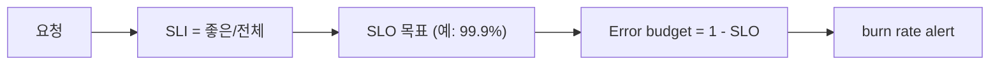

# SLI와 SLO 기초

> Observability 101 시리즈 (8/10)


## 이 글에서 다룰 문제

"안정적" 이라는 말은 주관에 머물기 쉽습니다. 반면 99.9% 는 팀이 합의한 숫자입니다. SLO 가 있으면 기능과 안정성 사이의 갈등을 데이터로 풀 수 있습니다.

> SLO 는 엔지니어링과 비즈니스가 함께 쓰는 공통 언어입니다.

## 전체 흐름


## Before/After

**Before**: "느려요" "빨라요" 같은 말만 오가며 논쟁이 길어집니다.

**After**: "이번 달 가용성 99.87%, SLO 99.9% 미달"처럼 숫자로 바로 정리됩니다.

## SLO 5단계

### 1단계 — SLI 정의

```promql
# Availability SLI = good / total
sli_good = sum(rate(http_requests_total{status!~"5.."}[5m]))
sli_total = sum(rate(http_requests_total[5m]))
sli = sli_good / sli_total
```

### 2단계 — SLO 목표

```text
SLO: 30일 가용성 99.9%
즉 30 * 24 * 60 * 0.001 = 43.2 분/월 허용
```

### 3단계 — Error budget

```promql
1 - (sli_good / sli_total)         # 현재 실패율
# 30일 budget 잔량 = 0.001 * total - errors
```

### 4단계 — Burn rate alert (multi-window)

```yaml
- alert: FastBurn
  expr: error_rate_5m > 14.4 * 0.001
        and error_rate_1h > 14.4 * 0.001
  for: 2m
  labels: { severity: page }
```

### 5단계 — 월간 SLO 리포트

```text
- 가용성: 99.92% (목표 99.9% ✅)
- 지연: p95 320ms (목표 ≤ 500ms ✅)
- Budget 소진: 38%
```

## 이 코드에서 주목할 점

- SLI 는 항상 비율로 정의합니다.
- Burn rate 는 짧은 창과 긴 창을 함께 봐야 합니다.
- Budget 이 남으면 배포를 더 빠르게 가져가고, 부족하면 동결을 검토합니다.

## 자주 하는 실수 5가지

1. **SLO 를 100% 로 둡니다.** 현실적으로 달성하기 어렵습니다.
2. **SLI 를 내부 지표로만 잡습니다.** 사용자 경험과 분리됩니다.
3. **Burn rate 없이 임계치만 봅니다.** 점진적 소진을 놓칩니다.
4. **Budget 을 기능 결정에 쓰지 않습니다.** SLO 가 장식으로 남습니다.
5. **여러 SLO 를 동시에 깨뜨립니다.** 우선순위가 불명확해집니다.

## 실무에서는 이렇게 쓰입니다

대부분의 회사는 가용성과 지연 두 SLO 로 시작하고, 이를 배포나 기능 추가 같은 제품 결정의 기준으로 사용합니다.

## 체크리스트

- [ ] SLI 하나를 정의합니다.
- [ ] SLO 하나를 합의합니다.
- [ ] Error budget 을 계산합니다.
- [ ] Burn rate alert 를 하나 둡니다.

## 정리 및 다음 단계

SLO 는 팀의 공통 언어입니다. 다음 글은 Cost와 Cardinality입니다.

<!-- toc:begin -->
- [Observability란 무엇인가?](./01-what-is-observability.md)
- [Metric, Log, Trace](./02-metric-log-trace.md)
- [Metric 수집과 시각화](./03-metric-collection.md)
- [구조화된 로깅](./04-structured-logging.md)
- [분산 트레이싱 기초](./05-distributed-tracing.md)
- [Dashboard 설계](./06-dashboard-design.md)
- [Alert와 On-Call](./07-alert-and-oncall.md)
- **SLI와 SLO 기초 (현재 글)**
- Cost와 Cardinality (예정)
- 운영 가능한 Observability 스택 (예정)
<!-- toc:end -->

## 참고 자료

- [Google SRE — SLO chapter](https://sre.google/sre-book/service-level-objectives/)
- [The SRE Workbook — Implementing SLOs](https://sre.google/workbook/implementing-slos/)
- [Multi-window burn rate](https://sre.google/workbook/alerting-on-slos/)
- [Sloth — SLO generator](https://sloth.dev/)

Tags: Observability, SLO, SLI, SRE, Reliability
