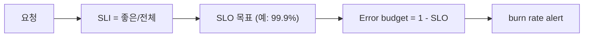

# SLI와 SLO 기초

> Observability 101 시리즈 (8/10)

<!-- a-grade-intro:begin -->

**핵심 질문**: *얼마나 안정적이어야 하는가* 라는 질문에 *숫자* 로 답할 수 있습니까?

> *SLI 는 *측정한 신뢰성*, SLO 는 *약속한 신뢰성*, error budget 은 *허용된 실패의 양* 입니다.*

<!-- a-grade-intro:end -->

## 이 글에서 배울 것

- *SLI* 의 정의 ("좋은 / 전체")
- *SLO* 가 만드는 *언어*
- *Error budget* 의 의미
- *Burn rate* alert
- 흔한 함정 5가지

## 왜 중요한가

"안정적" 은 *주관* 입니다. 99.9% 는 *합의* 입니다. SLO 가 있으면 *기능 vs 안정* 의 갈등이 *데이터로* 풀립니다.

> *SLO 는 *엔지니어와 비즈니스의 공통 언어* 다.*

## 개념 한눈에 보기



## 핵심 용어 정리

- **SLI**: *측정 가능한 비율* (예: success rate).
- **SLO**: *목표 값* (예: 99.9%).
- **SLA**: *계약*, 위반 시 *벌금*.
- **Error budget**: 허용된 *실패의 양*.
- **Burn rate**: 예산 *소진 속도*.

## Before/After

**Before**: "느려요" "빨라요" 의 *말싸움*.

**After**: "이번 달 가용성 *99.87%*, SLO *99.9%* 미달" — *논의 끝*.

## 실습: SLO 5단계

### 1단계 — SLI 정의

```promql
# Availability SLI = good / total
sli_good = sum(rate(http_requests_total{status!~"5.."}[5m]))
sli_total = sum(rate(http_requests_total[5m]))
sli = sli_good / sli_total
```

### 2단계 — SLO 목표

```text
SLO: 30일 가용성 99.9%
즉 30 * 24 * 60 * 0.001 = 43.2 분/월 허용
```

### 3단계 — Error budget

```promql
1 - (sli_good / sli_total)         # 현재 실패율
# 30일 budget 잔량 = 0.001 * total - errors
```

### 4단계 — Burn rate alert (multi-window)

```yaml
- alert: FastBurn
  expr: error_rate_5m > 14.4 * 0.001
        and error_rate_1h > 14.4 * 0.001
  for: 2m
  labels: { severity: page }
```

### 5단계 — 월간 SLO 리포트

```text
- 가용성: 99.92% (목표 99.9% ✅)
- 지연: p95 320ms (목표 ≤ 500ms ✅)
- Budget 소진: 38%
```

## 이 코드에서 주목할 점

- *SLI* 는 항상 *비율*.
- *Burn rate* 는 *짧은 창 + 긴 창* 둘 다 본다.
- Budget 이 *남으면 배포 가속*, 적으면 *동결*.

## 자주 하는 실수 5가지

1. **SLO 를 *100%* 로 둔다.** 달성 *불가능*.
2. **SLI 를 *내부 지표* 로.** 사용자 경험과 *분리*.
3. **Burn rate 없이 *임계치만*.** 점진적 소진을 *놓침*.
4. **Budget 을 *기능 결정* 에 안 쓴다.** SLO 가 *장식*.
5. **여러 SLO 를 *동시에* 깬다.** 우선순위 *불명*.

## 실무에서는 이렇게 쓰입니다

대부분의 회사는 *가용성 + 지연* 두 SLO 로 시작해, *제품 결정* (배포 / 기능 추가) 의 *기준* 으로 사용합니다.

## 시니어 엔지니어는 이렇게 생각합니다

- *100% 는 *불가능*. 99.9% 는 *선택*.*
- *SLI 는 *사용자 시점*.*
- *Budget 은 *예산*. 다 쓰면 *멈춤*.*
- *Burn rate 는 *조기경보*.*
- *SLO 가 없으면 *우선순위* 도 없다.*

## 체크리스트

- [ ] SLI 한 개를 *정의* 한다.
- [ ] SLO 한 개를 *합의* 한다.
- [ ] Error budget 을 *계산* 한다.
- [ ] Burn rate alert 한 개.

## 연습 문제

1. 한 서비스의 *Availability SLI* 를 PromQL 로.
2. SLO 99.9% 의 *월간 budget* (분).
3. Burn rate 빠른/느린 alert 두 개를 작성.

## 정리 및 다음 단계

SLO 는 *공통 언어* 입니다. 다음 글은 *Cost와 Cardinality* 입니다.

<!-- toc:begin -->
- [Observability란 무엇인가?](./01-what-is-observability.md)
- [Metric, Log, Trace](./02-metric-log-trace.md)
- [Metric 수집과 시각화](./03-metric-collection.md)
- [구조화된 로깅](./04-structured-logging.md)
- [분산 트레이싱 기초](./05-distributed-tracing.md)
- [Dashboard 설계](./06-dashboard-design.md)
- [Alert와 On-Call](./07-alert-and-oncall.md)
- **SLI와 SLO 기초 (현재 글)**
- Cost와 Cardinality (예정)
- 운영 가능한 Observability 스택 (예정)
<!-- toc:end -->

## 참고 자료

- [Google SRE — SLO chapter](https://sre.google/sre-book/service-level-objectives/)
- [The SRE Workbook — Implementing SLOs](https://sre.google/workbook/implementing-slos/)
- [Multi-window burn rate](https://sre.google/workbook/alerting-on-slos/)
- [Sloth — SLO generator](https://sloth.dev/)

Tags: Observability, SLO, SLI, SRE, Reliability
