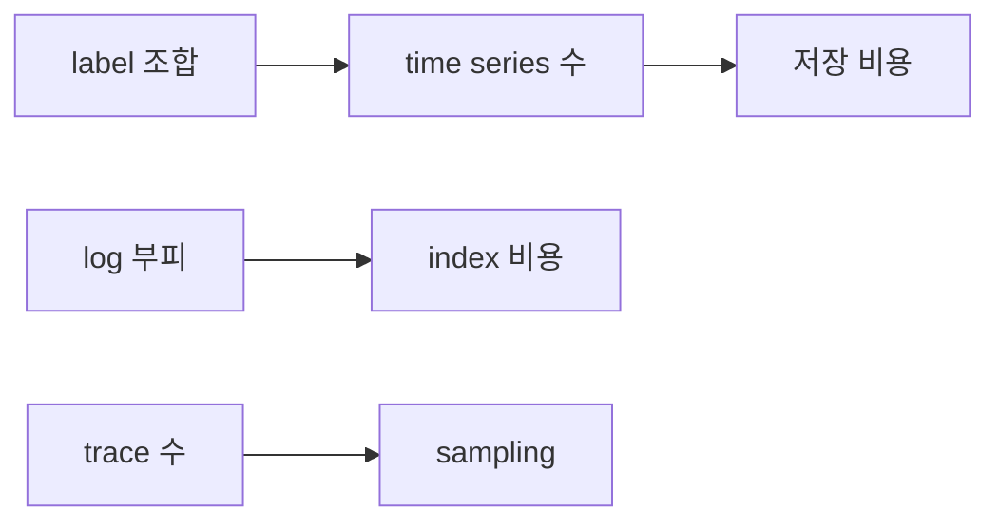

# Cost와 Cardinality

> Observability 101 시리즈 (9/10)


## 이 글에서 다룰 문제

신생 회사에서 AWS 비용 1위가 observability 인 경우가 종종 있습니다. 모니터링 비용이 제품 자체보다 비싸지면 기술 문제가 아니라 조직 문제가 됩니다.

> 측정의 비용을 모르면, 측정 자체가 팀의 적이 될 수 있습니다.

## 전체 흐름


## Before/After

**Before**: `user_id` 를 label 로 넣어 series 가 5천만 개까지 늘고 비용이 폭발합니다.

**After**: `user_id` 는 log 로 보내고 label 은 유한한 차원으로 제한해 비용을 예측 가능하게 만듭니다.

## 비용 통제 5단계

### 1단계 — Cardinality 측정

```promql
count({__name__=~".+"})              # 전체 series 수
topk(20, count by (__name__) (...))   # 상위 metric
```

### 2단계 — 위험 label 제거

```python
# 나쁨: 사용자별 series
http_requests_total{user_id="42", path="/buy"}
# 좋음: 차원 축소
http_requests_total{path="/buy"}      # user_id 는 log 에
```

### 3단계 — Retention tier

```yaml
prometheus:  retention: 15d
thanos:      retention.resolution-raw: 30d
             retention.resolution-5m: 90d
             retention.resolution-1h: 1y
```

### 4단계 — Tail sampling

```yaml
processors:
  tail_sampling:
    policies:
      - name: errors
        type: status_code
        status_code: { status_codes: [ERROR] }
      - name: slow
        type: latency
        latency: { threshold_ms: 500 }
      - name: random
        type: probabilistic
        probabilistic: { sampling_percentage: 5 }
```

### 5단계 — 신호별 예산

```text
metric:  ≤ X 백만 series
log:     ≤ Y GB/일
trace:   샘플링 후 ≤ Z 트레이스/분
```

## 이 코드에서 주목할 점

- Cardinality 는 label 조합이 곱해지면서 빠르게 커집니다.
- Resolution downsampling 으로 오래된 데이터의 부피를 줄일 수 있습니다.
- Tail sampling 은 가치 있는 trace 만 남기는 데 유용합니다.

## 자주 하는 실수 5가지

1. **`user_id`, `request_id` 를 label 로 둡니다.** Cardinality 가 폭발합니다.
2. **모든 신호를 영원히 보관합니다.** 비용이 복리처럼 불어납니다.
3. **Sampling 을 무조건 나쁘게 봅니다.** 예산 통제가 어려워집니다.
4. **Log 에 바이너리를 그대로 넣습니다.** 저장 부피가 급격히 커집니다.
5. **비용을 팀 단위로 보지 않습니다.** 책임이 분산됩니다.

## 실무에서는 이렇게 쓰입니다

대부분의 회사는 팀별 cardinality budget, retention tier, tail sampling 을 조합해 예측 가능한 observability 비용 구조를 만듭니다.

## 체크리스트

- [ ] Cardinality 상위 metric 을 알고 있습니다.
- [ ] Retention tier 가 단계화되어 있습니다.
- [ ] Trace 에 sampling 이 적용되어 있습니다.
- [ ] 팀별 비용 예산이 있습니다.

## 정리 및 다음 단계

비용을 모르면 observability 가 오히려 발목을 잡습니다. 다음 글은 운영 가능한 스택입니다.

<!-- toc:begin -->
- [Observability란 무엇인가?](./01-what-is-observability.md)
- [Metric, Log, Trace](./02-metric-log-trace.md)
- [Metric 수집과 시각화](./03-metric-collection.md)
- [구조화된 로깅](./04-structured-logging.md)
- [분산 트레이싱 기초](./05-distributed-tracing.md)
- [Dashboard 설계](./06-dashboard-design.md)
- [Alert와 On-Call](./07-alert-and-oncall.md)
- [SLI와 SLO 기초](./08-sli-and-slo.md)
- **Cost와 Cardinality (현재 글)**
- 운영 가능한 Observability 스택 (예정)
<!-- toc:end -->

## 참고 자료

- [Cardinality is the enemy](https://www.robustperception.io/cardinality-is-key/)
- [Thanos downsampling](https://thanos.io/tip/components/compact.md/)
- [OpenTelemetry tail sampling](https://opentelemetry.io/docs/collector/configuration/#processors)
- [Honeycomb on cost](https://www.honeycomb.io/blog/observability-cost)

Tags: Observability, Cost, Cardinality, Metrics, Sampling
