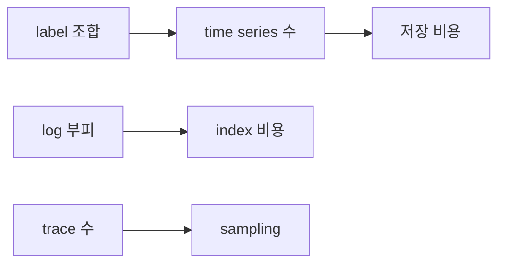

# Cost와 Cardinality

> Observability 101 시리즈 (9/10)


## 이 글에서 다룰 문제

신생 회사의 *AWS 비용 1위* 가 종종 *observability* 입니다. 모니터링이 *제품보다 비싸지면* 정치 문제가 됩니다.

> *측정의 비용을 모르면 *측정이 적이 된다*.*

## 개념 한눈에 보기



## Before/After

**Before**: `user_id` 가 label, *5천만 series*, 비용 *폭발*.

**After**: `user_id` 는 *log* 로, label 은 *유한 차원*, 비용 *예측 가능*.

## 실습: 비용 통제 5단계

### 1단계 — Cardinality 측정

```promql
count({__name__=~".+"})              # 전체 series 수
topk(20, count by (__name__) (...))   # 상위 metric
```

### 2단계 — 위험 label 제거

```python
# 나쁨: 사용자별 series
http_requests_total{user_id="42", path="/buy"}
# 좋음: 차원 축소
http_requests_total{path="/buy"}      # user_id 는 log 에
```

### 3단계 — Retention tier

```yaml
prometheus:  retention: 15d
thanos:      retention.resolution-raw: 30d
             retention.resolution-5m: 90d
             retention.resolution-1h: 1y
```

### 4단계 — Tail sampling

```yaml
processors:
  tail_sampling:
    policies:
      - name: errors
        type: status_code
        status_code: { status_codes: [ERROR] }
      - name: slow
        type: latency
        latency: { threshold_ms: 500 }
      - name: random
        type: probabilistic
        probabilistic: { sampling_percentage: 5 }
```

### 5단계 — 신호별 예산

```text
metric:  ≤ X 백만 series
log:     ≤ Y GB/일
trace:   샘플링 후 ≤ Z 트레이스/분
```

## 이 코드에서 주목할 점

- *Cardinality* 는 *label 곱셈* 으로 폭발.
- *Resolution downsampling* 으로 *오래된 데이터* 부피 축소.
- *Tail sampling* 은 *가치 있는 trace* 만 보관.

## 자주 하는 실수 5가지

1. **`user_id`, `request_id` 를 *label* 로.** Cardinality 폭발.
2. **모든 신호 *영원히 보관*.** 비용 *복리*.
3. **Sampling 을 *나쁘게 본다*.** 부도 위험.
4. **Log 에 *바이너리* 를 박는다.** 부피 폭발.
5. **비용을 *팀 단위* 로 안 본다.** 책임이 *분산*.

## 실무에서는 이렇게 쓰입니다

대부분의 회사는 *팀별 cardinality budget*, *retention tier*, *tail sampling* 을 조합해 *예측 가능한* observability 비용을 만듭니다.

## 체크리스트

- [ ] *Cardinality* 상위 metric 을 안다.
- [ ] *Retention tier* 가 단계화되어 있다.
- [ ] Trace 에 *sampling* 이 있다.
- [ ] 팀별 *비용 예산* 이 있다.

## 정리 및 다음 단계

비용을 모르면 *observability 가 적* 이 됩니다. 다음 글은 *운영 가능한 스택* 입니다.

<!-- toc:begin -->
- [Observability란 무엇인가?](./01-what-is-observability.md)
- [Metric, Log, Trace](./02-metric-log-trace.md)
- [Metric 수집과 시각화](./03-metric-collection.md)
- [구조화된 로깅](./04-structured-logging.md)
- [분산 트레이싱 기초](./05-distributed-tracing.md)
- [Dashboard 설계](./06-dashboard-design.md)
- [Alert와 On-Call](./07-alert-and-oncall.md)
- [SLI와 SLO 기초](./08-sli-and-slo.md)
- **Cost와 Cardinality (현재 글)**
- 운영 가능한 Observability 스택 (예정)
<!-- toc:end -->

## 참고 자료

- [Cardinality is the enemy](https://www.robustperception.io/cardinality-is-key/)
- [Thanos downsampling](https://thanos.io/tip/components/compact.md/)
- [OpenTelemetry tail sampling](https://opentelemetry.io/docs/collector/configuration/#processors)
- [Honeycomb on cost](https://www.honeycomb.io/blog/observability-cost)

Tags: Observability, Cost, Cardinality, Metrics, Sampling
