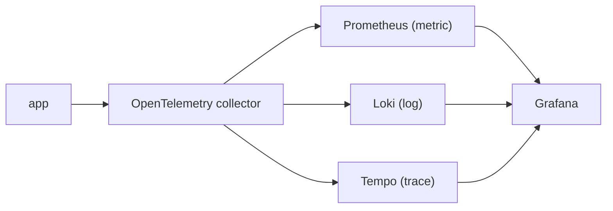

# 운영 가능한 Observability 스택

> Observability 101 시리즈 (10/10)


## 이 글에서 다룰 문제

작은 팀에 완벽한 스택은 없습니다. 운영 가능하고 교체 가능한 스택이 가장 현실적입니다. 특정 벤더에 과하게 묶이지 않는 선에서 지금 바로 시작하는 편이 낫습니다.

> 완벽한 스택을 기다리기보다, 오늘 운영 가능한 스택을 만드는 편이 낫습니다.

## 전체 흐름


## Before/After

**Before**: 도구는 5개인데 서로 연결되지 않아 화면 다섯 개를 오가야 합니다.

**After**: Grafana 한 곳에서 클릭만으로 trace, log, metric 을 오갈 수 있습니다.

## 베이스라인 스택 5단계

### 1단계 — Collector

```yaml
receivers:
  otlp: { protocols: { grpc: {}, http: {} } }
exporters:
  prometheus:    { endpoint: ":9464" }
  loki:          { endpoint: http://loki:3100/loki/api/v1/push }
  otlp/tempo:    { endpoint: tempo:4317, tls: { insecure: true } }
service:
  pipelines:
    metrics:  { receivers: [otlp], exporters: [prometheus] }
    logs:     { receivers: [otlp], exporters: [loki] }
    traces:   { receivers: [otlp], exporters: [otlp/tempo] }
```

### 2단계 — Docker Compose

```yaml
services:
  otel-collector: { image: otel/opentelemetry-collector }
  prometheus:     { image: prom/prometheus }
  loki:           { image: grafana/loki }
  tempo:          { image: grafana/tempo }
  grafana:        { image: grafana/grafana, ports: ["3000:3000"] }
```

### 3단계 — App 송신

```python
from opentelemetry.exporter.otlp.proto.grpc.metric_exporter import OTLPMetricExporter
from opentelemetry.exporter.otlp.proto.grpc.trace_exporter import OTLPSpanExporter
# OTEL_EXPORTER_OTLP_ENDPOINT=http://otel-collector:4317
```

### 4단계 — Grafana 상관

```text
Datasources: Prometheus, Loki, Tempo
Tempo → Loki: derived field "trace_id" → log search
Loki → Tempo: log "trace_id" → trace view
```

### 5단계 — 운영자 SLO 5가지

```text
1) /metrics scrape 성공률 > 99.5%
2) Loki ingest p95 < 5s
3) Tempo trace 도달율 > 99%
4) Grafana dashboard p95 < 2s
5) Alertmanager 전송 지연 < 30s
```

## 이 코드에서 주목할 점

- Collector 를 통일하면 수집 방식이 표준화됩니다.
- `trace_id` 상관관계를 잡아 두면 한 화면에서 디버깅하기 쉬워집니다.
- Exemplar 를 쓰면 metric 에서 trace 로 바로 점프할 수 있습니다.

## 자주 하는 실수 5가지

1. **각 신호마다 다른 collector 를 둡니다.** 운영 부담이 몇 배로 커집니다.
2. **상관관계를 설정하지 않습니다.** 화면을 계속 오가게 됩니다.
3. **백업과 보존 정책이 없습니다.** 비용을 예측하기 어렵습니다.
4. **벤더 lock-in 이 너무 깊습니다.** 나중에 교체하기 어려워집니다.
5. **운영자 SLO 가 없습니다.** observability 시스템 자체가 블랙박스가 됩니다.

## 실무에서는 이렇게 쓰입니다

작은 팀은 OTel + LGTM (Loki/Grafana/Tempo/Mimir) 조합으로 시작하는 경우가 많습니다. 규모가 커지면 Grafana Cloud, Datadog, Honeycomb 같은 managed 서비스로 이동하기도 합니다.

## 체크리스트

- [ ] OTel collector 한 개로 수집을 통일합니다.
- [ ] Grafana 에서 세 신호가 모두 보입니다.
- [ ] Trace ↔ log 점프가 동작합니다.
- [ ] 운영자 SLO 다섯 개를 정의했습니다.

## 정리 및 다음 단계

작은 팀의 첫 스택은 나중에 교체할 수 있어야 합니다. 다음 단계는 Incident response, Capacity planning, Cost FinOps 입니다.

<!-- toc:begin -->
- [Observability란 무엇인가?](./01-what-is-observability.md)
- [Metric, Log, Trace](./02-metric-log-trace.md)
- [Metric 수집과 시각화](./03-metric-collection.md)
- [구조화된 로깅](./04-structured-logging.md)
- [분산 트레이싱 기초](./05-distributed-tracing.md)
- [Dashboard 설계](./06-dashboard-design.md)
- [Alert와 On-Call](./07-alert-and-oncall.md)
- [SLI와 SLO 기초](./08-sli-and-slo.md)
- [Cost와 Cardinality](./09-cost-and-cardinality.md)
- **운영 가능한 Observability 스택 (현재 글)**
<!-- toc:end -->

## 참고 자료

- [OpenTelemetry Collector](https://opentelemetry.io/docs/collector/)
- [Grafana LGTM stack](https://grafana.com/oss/)
- [Tempo docs](https://grafana.com/docs/tempo/latest/)
- [Loki docs](https://grafana.com/docs/loki/latest/)

Tags: Observability, SRE, OpenTelemetry, Grafana, Prometheus
