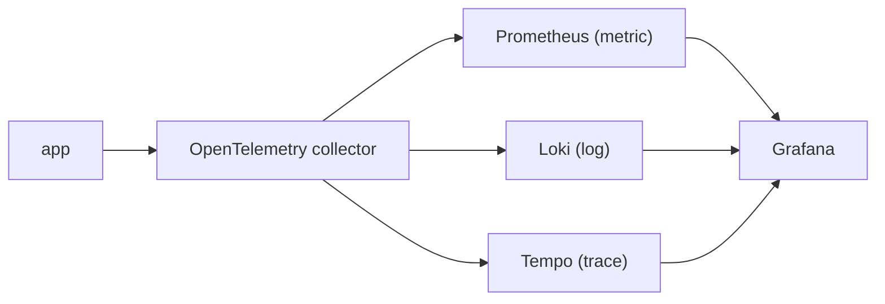

# 운영 가능한 Observability 스택

> Observability 101 시리즈 (10/10)


## 이 글에서 다룰 문제

작은 팀에 *완벽한* 스택은 없습니다. *운영 가능* 하고 *교체 가능* 한 스택이 *최선* 입니다. 종속을 피하면서 *지금 바로* 시작합시다.

> *완벽한 스택은 *내일도 안 온다*. 운영 가능한 스택을 *오늘* 만든다.*

## 전체 흐름


## Before/After

**Before**: 도구 5개, *서로 안 통한다*. 화면 *5개* 를 동시에.

**After**: Grafana *한 곳*, 클릭으로 *trace ↔ log ↔ metric*.

## 베이스라인 스택 5단계

### 1단계 — Collector

```yaml
receivers:
  otlp: { protocols: { grpc: {}, http: {} } }
exporters:
  prometheus:    { endpoint: ":9464" }
  loki:          { endpoint: http://loki:3100/loki/api/v1/push }
  otlp/tempo:    { endpoint: tempo:4317, tls: { insecure: true } }
service:
  pipelines:
    metrics:  { receivers: [otlp], exporters: [prometheus] }
    logs:     { receivers: [otlp], exporters: [loki] }
    traces:   { receivers: [otlp], exporters: [otlp/tempo] }
```

### 2단계 — Docker Compose

```yaml
services:
  otel-collector: { image: otel/opentelemetry-collector }
  prometheus:     { image: prom/prometheus }
  loki:           { image: grafana/loki }
  tempo:          { image: grafana/tempo }
  grafana:        { image: grafana/grafana, ports: ["3000:3000"] }
```

### 3단계 — App 송신

```python
from opentelemetry.exporter.otlp.proto.grpc.metric_exporter import OTLPMetricExporter
from opentelemetry.exporter.otlp.proto.grpc.trace_exporter import OTLPSpanExporter
# OTEL_EXPORTER_OTLP_ENDPOINT=http://otel-collector:4317
```

### 4단계 — Grafana 상관

```text
Datasources: Prometheus, Loki, Tempo
Tempo → Loki: derived field "trace_id" → log search
Loki → Tempo: log "trace_id" → trace view
```

### 5단계 — 운영자 SLO 5가지

```text
1) /metrics scrape 성공률 > 99.5%
2) Loki ingest p95 < 5s
3) Tempo trace 도달율 > 99%
4) Grafana dashboard p95 < 2s
5) Alertmanager 전송 지연 < 30s
```

## 이 코드에서 주목할 점

- *Collector 통일* 로 *수집 표준화*.
- *Trace_id 상관* 으로 한 화면 디버깅.
- *Exemplar* 로 metric → trace 점프.

## 자주 하는 실수 5가지

1. **각 신호별 *다른 collector*.** 운영 부담 *3배*.
2. **상관 미설정.** 화면을 *왔다갔다*.
3. **백업 / 보존 정책 없음.** 비용 *예측 불가*.
4. ***벤더 lock-in* 깊게.** 교체 *불가능*.
5. **운영자 SLO 없음.** observability 자체가 *블랙박스*.

## 실무에서는 이렇게 쓰입니다

작은 팀은 *OTel + LGTM (Loki/Grafana/Tempo/Mimir)* 로 시작합니다. 규모가 커지면 *managed* (Grafana Cloud, Datadog, Honeycomb) 로 이동하기도 합니다.

## 체크리스트

- [ ] OTel collector 한 개로 수집 통일.
- [ ] Grafana 에서 *세 신호* 가 보인다.
- [ ] Trace ↔ log 점프가 동작한다.
- [ ] 운영자 SLO 5개를 정의했다.

## 정리 및 다음 단계

작은 팀의 첫 스택은 *교체 가능* 해야 합니다. 다음 단계는 *Incident response*, *Capacity planning*, *Cost FinOps* 입니다.

<!-- toc:begin -->
- [Observability란 무엇인가?](./01-what-is-observability.md)
- [Metric, Log, Trace](./02-metric-log-trace.md)
- [Metric 수집과 시각화](./03-metric-collection.md)
- [구조화된 로깅](./04-structured-logging.md)
- [분산 트레이싱 기초](./05-distributed-tracing.md)
- [Dashboard 설계](./06-dashboard-design.md)
- [Alert와 On-Call](./07-alert-and-oncall.md)
- [SLI와 SLO 기초](./08-sli-and-slo.md)
- [Cost와 Cardinality](./09-cost-and-cardinality.md)
- **운영 가능한 Observability 스택 (현재 글)**
<!-- toc:end -->

## 참고 자료

- [OpenTelemetry Collector](https://opentelemetry.io/docs/collector/)
- [Grafana LGTM stack](https://grafana.com/oss/)
- [Tempo docs](https://grafana.com/docs/tempo/latest/)
- [Loki docs](https://grafana.com/docs/loki/latest/)

Tags: Observability, SRE, OpenTelemetry, Grafana, Prometheus
