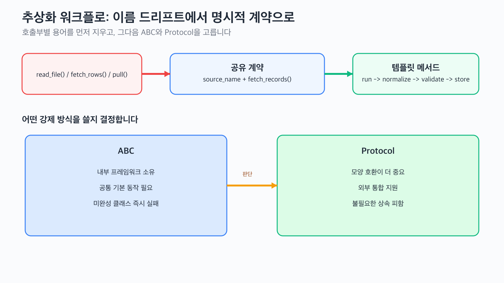

# 추상화

추상화가 진짜 필요해지는 순간은 구현체가 두세 개로 늘어나면서 호출부가 어떤 메서드 이름을 불러야 할지 추측하기 시작할 때입니다. 이 글은 OOP 101 시리즈의 6번째 글입니다.

Python에서 추상화는 이론 용어로 끝나지 않습니다. 어떤 메서드를 반드시 구현해야 하는지, 어떤 단계는 부모가 공통으로 가져가야 하는지, 어디까지를 팀의 계약으로 강제할지를 정하는 실무 설계 문제에 더 가깝습니다.

## 이 글에서 다룰 문제

> 추상화는 구현을 지우는 작업이 아니라, 하나의 워크플로를 여러 구현체가 안전하게 공유할 수 있도록 최소 계약을 먼저 선명하게 만드는 작업입니다.

- 덕 타이핑 관례만으로는 언제부터 부족해질까요?
- 추상 클래스는 어떤 메서드와 프로퍼티를 반드시 강제해야 할까요?
- 템플릿 메서드 패턴은 부모가 흐름을 지키고 자식이 세부 구현을 맡게 만드는 데 어떻게 도움이 될까요?
- 외부 라이브러리까지 모두 상속시킬 수 없다면 언제 ABC 대신 Protocol로 넘어가야 할까요?

## 핵심 개념 잡기


*호출부마다 다른 메서드 이름을 먼저 없애고, 그다음 명시적 상속이 필요한 계약인지 구조적 호환이면 충분한지 결정하면 추상화가 훨씬 실무적으로 보입니다.*

계약이 없으면 어떤 구현체는 `read_file()`을 쓰고, 다른 구현체는 `fetch_rows()`를 쓰고, 또 다른 구현체는 `pull()`을 씁니다. 그러면 오케스트레이터는 구현체별 분기문 덩어리가 됩니다. 추상화의 첫 목적은 그 분기문을 없애는 공통 언어를 정하는 데 있습니다.

## 핵심 개념

| 용어 | 설명 |
|------|------|
| 추상 클래스 | 직접 인스턴스화할 수 없고 하위 클래스에 특정 멤버 구현을 강제하는 클래스입니다 |
| `@abstractmethod` | 하위 클래스가 반드시 구현해야 하는 메서드나 프로퍼티를 표시합니다 |
| ABC | `abc` 모듈이 제공하는 명시적 계약 메커니즘입니다 |
| 템플릿 메서드 패턴 | 부모가 워크플로 골격을 가지고, 자식이 가변 단계를 채우는 패턴입니다 |
| Protocol | 상속 없이도 필요한 모양을 만족하면 되는 구조적 계약입니다 |

## 전후 비교

이 글에서 바꾸려는 핵심은 작지만 실무적입니다.

```python
# before: 호출부가 구현체마다 다른 사적 용어를 알아야 합니다
class CsvFeed:
    def read_file(self, path: str) -> list[dict]:
        return [{"email": "alice@example.com", "active": True}]


class WarehouseFeed:
    def fetch_rows(self, table: str) -> list[dict]:
        return [{"email": "bob@example.com", "active": False}]
```

```python
# after: 모든 구현체가 하나의 계약을 공유합니다
from abc import ABC, abstractmethod


class FeedSource(ABC):
    @property
    @abstractmethod
    def source_name(self) -> str: ...

    @abstractmethod
    def fetch_records(self) -> list[dict]: ...
```

## 하나의 워크플로로 보는 추상화 설계

### 1단계: 호출부가 어디서부터 깨지는지 확인합니다

하나의 고객 적재 파이프라인을 만들고 있는데, 각 개발자가 소스 클래스를 제각각 만들었다고 가정해 보겠습니다.

```python
class CsvFeed:
    def read_file(self, path: str) -> list[dict]:
        return [{"email": "alice@example.com", "active": True}]


class WarehouseFeed:
    def fetch_rows(self, table: str) -> list[dict]:
        return [{"email": "bob@example.com", "active": False}]


class PartnerApiFeed:
    def pull(self) -> list[dict]:
        return [{"email": "carol@example.com", "active": True}]


def ingest(source: object) -> list[dict]:
    return source.fetch_records()  # 호출부는 존재하지 않는 메서드를 가정합니다


ingest(CsvFeed())
```

#### 실패 신호

```text
AttributeError: 'CsvFeed' object has no attribute 'fetch_records'
```

이 문제의 본질은 메서드 하나가 빠진 것이 아니라, 워크플로 전체에 공통 언어가 없다는 데 있습니다.

### 2단계: ABC로 팀 계약을 고정합니다

이 시점의 다음 선택은 `if isinstance(...)` 분기를 더 늘리는 것이 아니라, 최소 계약을 명시적으로 고정하는 것입니다.

```python
from abc import ABC, abstractmethod


class FeedSource(ABC):
    @property
    @abstractmethod
    def source_name(self) -> str:
        """로그와 메트릭에서 사용할 이름입니다."""

    @abstractmethod
    def fetch_records(self) -> list[dict]:
        """이 소스의 원시 고객 레코드를 반환합니다."""


class CsvFeed(FeedSource):
    @property
    def source_name(self) -> str:
        return "csv"

    def fetch_records(self) -> list[dict]:
        return [{"email": "alice@example.com", "active": True}]


class WarehouseFeed(FeedSource):
    @property
    def source_name(self) -> str:
        return "warehouse"

    def fetch_records(self) -> list[dict]:
        return [{"email": "bob@example.com", "active": False}]
```

여기서 추상화는 두 가지를 해냅니다.

- 메서드 이름과 반환 모양을 하나로 고정합니다.
- 반쪽 구현체가 조용히 인스턴스화되는 일을 막습니다.

### 3단계: 템플릿 메서드로 공통 흐름을 부모에 둡니다

여러 소스가 같은 적재 단계를 공유한다면, 각 구현체가 매번 같은 순서를 다시 쓰게 두지 말고 부모가 골격을 가져가야 합니다.

```python
from abc import ABC, abstractmethod


class IngestionPipeline(ABC):
    def run(self) -> list[dict]:
        raw = self.fetch_records()
        normalized = [self.normalize(row) for row in raw]
        valid = [row for row in normalized if self.is_valid(row)]
        self.store(valid)
        print(f"[{self.source_name}] loaded {len(valid)} records")
        return valid

    @property
    @abstractmethod
    def source_name(self) -> str: ...

    @abstractmethod
    def fetch_records(self) -> list[dict]: ...

    def normalize(self, row: dict) -> dict:
        return {
            "email": row["email"].strip().lower(),
            "active": bool(row["active"]),
        }

    def is_valid(self, row: dict) -> bool:
        return "@" in row["email"]

    @abstractmethod
    def store(self, rows: list[dict]) -> None: ...


class CsvCustomerPipeline(IngestionPipeline):
    @property
    def source_name(self) -> str:
        return "csv"

    def fetch_records(self) -> list[dict]:
        return [
            {"email": " Alice@example.com ", "active": 1},
            {"email": "broken-email", "active": 1},
        ]

    def store(self, rows: list[dict]) -> None:
        for row in rows:
            print(f"store -> {row}")


class PartnerApiPipeline(IngestionPipeline):
    @property
    def source_name(self) -> str:
        return "partner-api"

    def fetch_records(self) -> list[dict]:
        return [{"email": "Carol@Example.com", "active": True}]

    def store(self, rows: list[dict]) -> None:
        for row in rows:
            print(f"store -> {row}")
```

이제 자식 클래스는 달라지는 부분만 설명합니다. 데이터를 어디서 가져오는지, 어디에 저장하는지만 다르고, 정규화·검증·적재 순서는 부모가 책임집니다.

### 4단계: 수정할 수 없는 외부 구현체를 연결합니다

워크플로는 괜찮지만 클래스가 외부 라이브러리 소유라면 상속을 강제하기 어려울 수 있습니다.

```python
from abc import ABC, abstractmethod


class FeedSource(ABC):
    @abstractmethod
    def fetch_records(self) -> list[dict]: ...


class VendorSnapshot:
    """실제로는 외부 패키지에 있다고 가정합니다."""

    def fetch_records(self) -> list[dict]:
        return [{"email": "vendor@example.com", "active": True}]


FeedSource.register(VendorSnapshot)

snapshot = VendorSnapshot()
print(isinstance(snapshot, FeedSource))
print(snapshot.fetch_records())
```

`register()`는 외부 클래스의 모양을 신뢰하고 런타임 검사에만 포함시키고 싶을 때 유용합니다.

### 5단계: ABC와 Protocol 중 무엇을 쓸지 명시적으로 결정합니다

모든 통합 지점에 상속을 강제할 필요는 없습니다.

```python
from abc import ABC, abstractmethod
from typing import Protocol


class InternalFeed(ABC):
    @abstractmethod
    def fetch_records(self) -> list[dict]: ...


class FeedLike(Protocol):
    def fetch_records(self) -> list[dict]: ...


class BackfillExport:
    def fetch_records(self) -> list[dict]:
        return [{"email": "backfill@example.com", "active": True}]


def preview(feed: FeedLike) -> int:
    return len(feed.fetch_records())


print(preview(BackfillExport()))
```

- **ABC**는 내부 프레임워크처럼 명시적 상속, 공통 기본 동작, 인스턴스화 시점 검사가 필요할 때 적합합니다.
- **Protocol**은 필요한 모양만 맞으면 되는 통합 지점, 특히 외부 라이브러리 호환성에 더 적합합니다.

## 실행·검증·실패 경로

### 실행

3단계 코드를 `abstraction_workflow.py`에 넣고 실행합니다.

```bash
python abstraction_workflow.py
```

예상 출력은 다음과 같습니다.

```text
store -> {'email': 'alice@example.com', 'active': True}
[csv] loaded 1 records
store -> {'email': 'carol@example.com', 'active': True}
[partner-api] loaded 1 records
```

### 검증

실행 후에는 세 가지를 확인합니다.

1. `normalize()`가 대소문자와 공백을 정리했는가
2. `is_valid()`가 잘못된 이메일을 걸러냈는가
3. 원본 소스는 달라도 최종 출력 계약은 동일한가

### 실패 경로 1: 필수 메서드를 빼먹은 경우

```python
class BrokenPipeline(IngestionPipeline):
    @property
    def source_name(self) -> str:
        return "broken"

    def fetch_records(self) -> list[dict]:
        return []


BrokenPipeline()
```

예상 실패:

```text
TypeError: Can't instantiate abstract class BrokenPipeline with abstract method store
```

이 오류는 불편한 것이 아니라 유용합니다. 팀이 반쪽짜리 구현체를 배포하지 못하게 막아 주기 때문입니다.

### 실패 경로 2: 잘못된 계약 스타일을 고른 경우

외부 라이브러리가 이미 `fetch_records()` 모양을 안정적으로 제공하고 있다면, 그 객체에 우리 ABC 상속을 강제하는 순간 불필요한 래핑 비용이 생깁니다. 그 지점이 바로 Protocol 기반 경계가 더 단순한 순간입니다.

다음 기준으로 판단하면 됩니다.

| 질문 | 예라면 | 더 적합한 선택 |
|------|--------|----------------|
| 구현체를 우리가 대부분 소유하는가 | 예 | ABC |
| 공통 기본 동작이 필요한가 | 예 | ABC |
| 모양 호환만 있으면 되는가 | 예 | Protocol |
| 외부 라이브러리 구현체인가 | 예 | Protocol 또는 `register()` |

## 이 워크플로에서 주목할 점

- 첫 번째 추상화 문제는 "추상 클래스를 어떻게 쓰지?"가 아니라 "왜 호출부가 구현체별 사전 용어를 다 알아야 하지?"였습니다.
- `@abstractmethod`는 팀 협업이 시작되는 시점에서 특히 가치가 커집니다.
- 템플릿 메서드 패턴은 워크플로 순서를 고정하면서 소스별 차이만 열어 둡니다.
- `register()`와 Protocol은 둘 다 호환성 문제를 풀지만, 해결하는 상황은 다릅니다.

## 자주 하는 실수 5가지

| 실수 | 왜 문제인가 | 더 나은 선택 |
|------|------------|--------------|
| 모든 인터페이스를 ABC로 만듦 | 외부 통합까지 불필요한 상속을 강제합니다 | 모양 호환이면 Protocol을 사용합니다 |
| 부모 클래스에 로직을 너무 많이 넣음 | 추상 클래스가 거대한 god object가 됩니다 | 진짜 공통 단계만 부모에 둡니다 |
| 추상 멤버 없는 ABC 사용 | 계약이 실제로 아무것도 강제하지 않습니다 | 최소 하나의 필수 메서드나 프로퍼티를 둡니다 |
| 자식마다 같은 책임의 메서드 이름을 바꿈 | 호출부가 구현 상세에 분기합니다 | 먼저 공통 어휘를 고정합니다 |
| 출력 계약을 검증하지 않음 | 적재는 됐지만 행 모양이 서로 달라집니다 | 실행 후 정규화된 결과를 확인합니다 |

## 실무에서 이렇게 쓰입니다

- 표준 라이브러리의 `collections.abc`는 명시적 컨테이너 계약을 제공합니다.
- Django 클래스 기반 뷰는 템플릿 메서드 스타일 흐름을 자주 보여 줍니다.
- 플러그인 시스템은 내부에서는 ABC, 외부 경계에서는 Protocol을 함께 쓰는 경우가 많습니다.
- ETL 파이프라인은 하나의 적재 골격에 소스별 어댑터를 붙이는 구조가 흔합니다.

## 현업 개발자는 이렇게 생각합니다

현업에서는 코드를 "더 객체지향적으로 보이게" 하려고 추상화를 요구하지 않습니다. 구현체가 여러 개로 늘어나면서 호출부가 그 대가를 치르기 시작했기 때문에 추상화를 꺼내 듭니다. 좋은 추상화는 가장 작은 계약으로 구현체의 드리프트를 멈추게 합니다.

그래서 Python 코드베이스에서는 두 방식을 자주 섞습니다. 팀이 소유한 내부 프레임워크에는 ABC를 쓰고, 외부 호환이 중요한 경계에는 Protocol을 둡니다.

## 체크리스트

- [ ] 구현체마다 다른 메서드 이름이 왜 워크플로 문제인지 설명할 수 있다
- [ ] 필수 프로퍼티 1개와 필수 메서드 1개를 가진 ABC를 설계할 수 있다
- [ ] 템플릿 메서드 패턴으로 공통 흐름을 부모에 둘 수 있다
- [ ] 외부 클래스에는 언제 `register()`만으로 충분한지 판단할 수 있다
- [ ] 구조적 호환이 필요할 때 ABC 대신 Protocol을 선택할 수 있다

## 정리 및 다음 글 안내

추상화는 하나의 워크플로에 여러 구현체가 들어오는 순간부터 가치가 커집니다. 팀 계약과 공통 기본 동작이 중요하면 ABC를 쓰고, 상속보다 호환성이 중요하면 Protocol을 선택하면 됩니다. 다음 글에서는 합성과 상속을 비교하면서, 이 계약을 어디에 배치하는 것이 더 자연스러운지 이어서 살펴봅니다.

<!-- toc:begin -->
- [객체지향이란 무엇인가?](./01-what-is-oop.md)
- [클래스와 인스턴스](./02-classes-and-instances.md)
- [캡슐화](./03-encapsulation.md)
- [상속](./04-inheritance.md)
- [다형성](./05-polymorphism.md)
- **추상화 (현재 글)**
- 합성과 상속 (예정)
- SOLID 원칙 기초 (예정)
- 객체지향 설계 예제 (예정)
- 객체지향을 언제 피해야 할까? (예정)
<!-- toc:end -->

## 참고 자료

- [Python 공식 문서 — abc 모듈](https://docs.python.org/3/library/abc.html)
- [PEP 544 — Protocols: Structural Subtyping](https://peps.python.org/pep-0544/)
- [Python collections.abc 문서](https://docs.python.org/3/library/collections.abc.html)
- [Fluent Python — Chapter 13: Interfaces, Protocols, and ABCs](https://www.oreilly.com/library/view/fluent-python-2nd/9781492056348/)

Tags: Python, OOP, 추상화, ABC, 인터페이스
