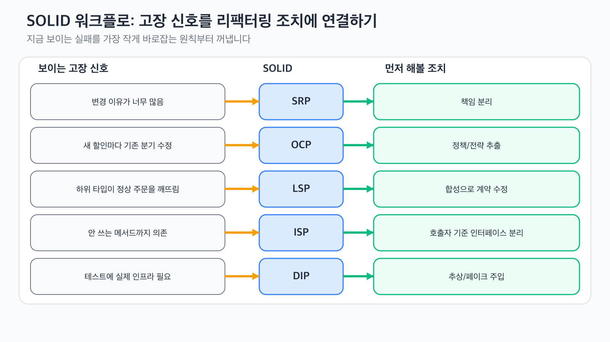

# SOLID 원칙 기초

SOLID가 진짜 와닿는 순간은 서비스 하나가 계속 커지면서 새로운 요구사항이 들어올 때마다 엉뚱한 코드까지 함께 흔들릴 때입니다. 이 글은 OOP 101 시리즈의 8번째 글입니다.

이번 글에서는 SOLID를 다섯 개의 슬로건으로 따로 외우지 않습니다. 하나의 주문 결제 워크플로를 단계적으로 리팩터링하면서, 각 원칙이 어떤 고장 신호에 대응하는지 연결해서 보겠습니다.

## 이 글에서 다룰 문제

> SOLID는 암기용 약자가 아니라, 반복해서 깨지는 워크플로를 보고 "이번에는 어떤 설계 질문을 먼저 꺼내야 하지?"를 판단하게 해 주는 기준입니다.

- 지금 보이는 증상에 어떤 원칙이 연결되는지 어떻게 판단할까요?
- SRP를 적용하면 무엇이 바뀌고, 무엇은 그대로여야 할까요?
- OCP, LSP, ISP, DIP는 서로 경쟁하는 규칙이 아니라 어떻게 한 워크플로 위에서 이어질까요?
- 코드가 아직 작을 때 SOLID를 너무 일찍 적용하면 왜 과한 설계가 될까요?

## 핵심 개념 잡기


*보이는 고장 모양을 먼저 잡고, 그다음 해당 원칙과 가장 작은 리팩터링 조치를 연결하면 SOLID를 훨씬 실무적으로 사용할 수 있습니다.*

중요한 것은 약자를 외우는 것이 아니라, 눈앞의 실패 모양을 하나의 설계 교정과 연결하는 일입니다. 서비스가 너무 많은 이유로 자주 바뀐다면 SRP부터, 새 규칙이 생길 때마다 기존 분기문을 계속 고쳐야 한다면 OCP부터, 테스트를 위해 실제 인프라를 같이 띄워야 한다면 DIP부터 보는 식입니다.

## 핵심 개념

| 용어 | 설명 |
|------|------|
| SRP | 클래스는 한 번에 하나의 이유로만 바뀌어야 합니다 |
| OCP | 안정된 흐름은 그대로 두고, 새로운 동작은 주로 확장으로 들어와야 합니다 |
| LSP | 하위 타입은 부모 계약이 약속한 동작 기대를 깨면 안 됩니다 |
| ISP | 클라이언트는 자신이 실제로 쓰는 메서드에만 의존해야 합니다 |
| DIP | 상위 정책은 구체 도구가 아니라 추상에 의존해야 합니다 |

## 전후 비교

이번 글의 출발점은 과하게 많은 일을 떠안은 결제 서비스이고, 끝점은 더 얇은 워크플로 조정자입니다.

```python
# before: 검증, 가격 계산, 저장, 알림을 한 클래스가 모두 맡습니다
class OrderService:
    def checkout(self, order: dict) -> int:
        if not order["items"]:
            raise ValueError("order must contain items")
        total = sum(item["price"] for item in order["items"])
        if order["customer_tier"] == "vip":
            total = int(total * 0.8)
        print(f"saving order for {order['customer_email']}")
        print(f"emailing receipt for {total}")
        return total
```

```python
# after: 결제 흐름은 더 작은 협력 객체와 추상에 의존합니다
class CheckoutService:
    def __init__(self, validator, pricer, repository, notifier) -> None:
        self.validator = validator
        self.pricer = pricer
        self.repository = repository
        self.notifier = notifier
```

## 하나의 워크플로로 보는 SOLID 리팩터링

### 1단계: SRP — 바뀌는 이유를 분리합니다

먼저 깨지기 쉬운 출발점을 봅니다.

```python
class OrderService:
    def checkout(self, order: dict) -> int:
        if not order["items"]:
            raise ValueError("order must contain items")

        total = sum(item["price"] for item in order["items"])

        if order["customer_tier"] == "vip":
            total = int(total * 0.8)

        print(f"saving order for {order['customer_email']}")
        print(f"emailing receipt for {total}")
        return total
```

이 클래스는 검증 규칙이 바뀌어도, 할인 정책이 바뀌어도, 저장 방식이 바뀌어도, 알림 채널이 바뀌어도 수정됩니다. 변경 이유 네 가지가 한곳에 들어와 있습니다.

먼저 책임을 분리합니다.

```python
class OrderValidator:
    def validate(self, order: dict) -> None:
        if not order["items"]:
            raise ValueError("order must contain items")


class OrderPricer:
    def calculate_total(self, order: dict) -> int:
        return sum(item["price"] for item in order["items"])


class OrderRepository:
    def save(self, order: dict, total: int) -> None:
        print(f"saving order for {order['customer_email']} -> {total}")


class ReceiptNotifier:
    def send(self, email: str, total: int) -> None:
        print(f"emailing receipt to {email} for {total}")


class CheckoutService:
    def __init__(self) -> None:
        self.validator = OrderValidator()
        self.pricer = OrderPricer()
        self.repository = OrderRepository()
        self.notifier = ReceiptNotifier()

    def checkout(self, order: dict) -> int:
        self.validator.validate(order)
        total = self.pricer.calculate_total(order)
        self.repository.save(order, total)
        self.notifier.send(order["customer_email"], total)
        return total
```

#### 검증

```python
order = {
    "customer_email": "kim@example.com",
    "customer_tier": "regular",
    "items": [{"price": 12000}, {"price": 8000}],
}

print(CheckoutService().checkout(order))
```

예상 출력:

```text
saving order for kim@example.com -> 20000
emailing receipt to kim@example.com for 20000
20000
```

바뀐 것: 책임이 분리되었습니다. 그대로인 것: `checkout()`은 여전히 총액 하나를 반환합니다.

#### 리팩터링 전 실패 신호

팀이 Slack 알림을 추가하자고 했을 때 원래 클래스는 가격 계산과 무관한 변경에도 같이 수정됩니다. 이 신호가 SRP가 이미 무너지고 있다는 뜻입니다.

### 2단계: OCP — 할인 규칙을 확장 지점 뒤로 보냅니다

아직도 결제 흐름은 새 할인 정책이 들어올 때마다 가격 계산 코드를 직접 수정해야 해서 취약합니다.

```python
from typing import Protocol


class DiscountPolicy(Protocol):
    def apply(self, subtotal: int, order: dict) -> int: ...


class NoDiscount:
    def apply(self, subtotal: int, order: dict) -> int:
        return subtotal


class VipDiscount:
    def apply(self, subtotal: int, order: dict) -> int:
        return int(subtotal * 0.8) if order["customer_tier"] == "vip" else subtotal


class ThresholdDiscount:
    def __init__(self, minimum: int, amount: int) -> None:
        self.minimum = minimum
        self.amount = amount

    def apply(self, subtotal: int, order: dict) -> int:
        return subtotal - self.amount if subtotal >= self.minimum else subtotal


class OrderPricer:
    def __init__(self, discount: DiscountPolicy) -> None:
        self.discount = discount

    def calculate_total(self, order: dict) -> int:
        subtotal = sum(item["price"] for item in order["items"])
        return self.discount.apply(subtotal, order)
```

#### 검증

```python
order = {
    "customer_email": "kim@example.com",
    "customer_tier": "vip",
    "items": [{"price": 12000}, {"price": 8000}],
}

print(OrderPricer(NoDiscount()).calculate_total(order))
print(OrderPricer(VipDiscount()).calculate_total(order))
print(OrderPricer(ThresholdDiscount(minimum=15000, amount=3000)).calculate_total(order))
```

예상 출력:

```text
20000
16000
17000
```

바뀐 것: 가격 규칙이 교체 가능한 확장 지점이 되었습니다. 그대로인 것: 호출자는 여전히 총액 하나만 받습니다.

#### 리팩터링 전 실패 신호

프로모션이 늘어날 때마다 하나의 메서드에 `if` 분기가 계속 늘어난다면 OCP가 필요한 시점입니다.

### 3단계: LSP — 하위 타입이 계약을 속이지 않게 합니다

확장 지점은 하위 타입이 같은 약속을 지킬 때만 안전합니다. 다음은 깨진 하위 타입입니다.

```python
class PickupOnlyDiscount:
    def apply(self, subtotal: int, order: dict) -> int:
        if order["delivery"] != "pickup":
            raise ValueError("pickup-only discount cannot handle delivery orders")
        return subtotal - 2000
```

메서드 시그니처는 맞지만, 결제 흐름은 모든 유효한 주문에 대해 할인 정책이 총액을 돌려주리라고 기대합니다. 이 하위 타입은 그 기대를 깨뜨립니다.

특수 조건은 상속이 아니라 합성으로 옮깁니다.

```python
class EligibilityRule(Protocol):
    def allows(self, order: dict) -> bool: ...


class PickupEligibility:
    def allows(self, order: dict) -> bool:
        return order["delivery"] == "pickup"


class FixedAmountDiscount:
    def __init__(self, amount: int) -> None:
        self.amount = amount

    def apply(self, subtotal: int, order: dict) -> int:
        return max(0, subtotal - self.amount)


class ConditionalDiscount:
    def __init__(self, rule: EligibilityRule, inner: DiscountPolicy) -> None:
        self.rule = rule
        self.inner = inner

    def apply(self, subtotal: int, order: dict) -> int:
        if not self.rule.allows(order):
            return subtotal
        return self.inner.apply(subtotal, order)
```

#### 검증

```python
pickup_order = {"delivery": "pickup", "items": [{"price": 10000}], "customer_tier": "regular"}
delivery_order = {"delivery": "courier", "items": [{"price": 10000}], "customer_tier": "regular"}

policy = ConditionalDiscount(PickupEligibility(), FixedAmountDiscount(2000))
print(policy.apply(10000, pickup_order))
print(policy.apply(10000, delivery_order))
```

예상 출력:

```text
8000
10000
```

바뀐 것: 비대상 주문도 정상 흐름으로 남습니다. 그대로인 것: 할인 정책 계약은 언제나 총액을 돌려줍니다.

#### 리팩터링 전 실패 신호

특정 자식 구현체만 정상적인 부모 사용 경로에서 예외를 던진다면, 그 상속 계층은 거짓말을 하고 있는 것입니다. 이것이 LSP 문제입니다.

### 4단계: ISP — 각 클라이언트가 필요한 인터페이스만 보게 합니다

이제 결제 워크플로는 어떤 백엔드 도구가 가진 모든 기능을 알 필요가 없습니다.

```python
from typing import Protocol


class OrderGateway(Protocol):
    def save(self, order: dict, total: int) -> None: ...
    def send_receipt(self, email: str, total: int) -> None: ...
    def export_daily_report(self) -> str: ...
```

이 인터페이스는 `CheckoutService`에 너무 넓습니다. 결제 흐름은 리포트 내보내기를 쓰지 않습니다.

```python
class OrderWriter(Protocol):
    def save(self, order: dict, total: int) -> None: ...


class ReceiptSender(Protocol):
    def send_receipt(self, email: str, total: int) -> None: ...


class OrderRepository:
    def save(self, order: dict, total: int) -> None:
        print(f"saving order for {order['customer_email']} -> {total}")


class EmailNotifier:
    def send_receipt(self, email: str, total: int) -> None:
        print(f"emailing receipt to {email} for {total}")


class CheckoutService:
    def __init__(self, writer: OrderWriter, sender: ReceiptSender, pricer: OrderPricer, validator: OrderValidator) -> None:
        self.writer = writer
        self.sender = sender
        self.pricer = pricer
        self.validator = validator
```

#### 검증

바뀐 것: 결제 서비스는 더 이상 자신이 쓰지 않는 리포팅 메서드에 의존하지 않습니다. 그대로인 것: 필요한 것은 저장과 영수증 발송 두 가지뿐입니다.

#### 리팩터링 전 실패 신호

테스트 더블이 타입을 맞추기 위해 쓰지도 않는 메서드까지 구현해야 한다면, 인터페이스는 이미 너무 넓습니다.

### 5단계: DIP — 상위 정책이 구체 도구에 매이지 않게 합니다

마지막 단계는 상위 결제 정책이 구체 인프라에 직접 묶이지 않게 만드는 것입니다.

```python
from typing import Protocol


class OrderWriter(Protocol):
    def save(self, order: dict, total: int) -> None: ...


class ReceiptSender(Protocol):
    def send_receipt(self, email: str, total: int) -> None: ...


class CheckoutService:
    def __init__(self, validator: OrderValidator, pricer: OrderPricer, writer: OrderWriter, sender: ReceiptSender) -> None:
        self.validator = validator
        self.pricer = pricer
        self.writer = writer
        self.sender = sender

    def checkout(self, order: dict) -> int:
        self.validator.validate(order)
        total = self.pricer.calculate_total(order)
        self.writer.save(order, total)
        self.sender.send_receipt(order["customer_email"], total)
        return total


class FakeWriter:
    def __init__(self) -> None:
        self.saved: list[tuple[str, int]] = []

    def save(self, order: dict, total: int) -> None:
        self.saved.append((order["customer_email"], total))


class FakeSender:
    def __init__(self) -> None:
        self.messages: list[str] = []

    def send_receipt(self, email: str, total: int) -> None:
        self.messages.append(f"{email}:{total}")


writer = FakeWriter()
sender = FakeSender()
service = CheckoutService(
    validator=OrderValidator(),
    pricer=OrderPricer(VipDiscount()),
    writer=writer,
    sender=sender,
)

order = {
    "customer_email": "kim@example.com",
    "customer_tier": "vip",
    "delivery": "courier",
    "items": [{"price": 12000}, {"price": 8000}],
}

total = service.checkout(order)
print(total)
print(writer.saved)
print(sender.messages)
```

#### 검증

예상 출력:

```text
16000
[('kim@example.com', 16000)]
['kim@example.com:16000']
```

바뀐 것: 상위 워크플로를 데이터베이스와 이메일 시스템 없이 테스트할 수 있습니다. 그대로인 것: 서비스는 여전히 같은 결제 정책을 조정합니다.

#### 리팩터링 전 실패 신호

정책 로직을 검증하려고 실제 인프라까지 같이 띄워야 한다면 DIP가 빠져 있는 것입니다.

## 실행과 최종 검증

5단계의 최종 코드를 `solid_checkout.py`로 저장하고 실행합니다.

```bash
python solid_checkout.py
```

최종 점검은 다음 순서로 합니다.

1. 빈 주문은 여전히 검증에서 막히는가
2. 할인 정책은 `CheckoutService` 수정 없이 바꿀 수 있는가
3. 비대상 주문이 하위 타입 예외로 깨지지 않는가
4. 저장소와 알림 채널을 테스트 더블로 바꿔도 정책 테스트가 가능한가

## 원칙이 서로 어떻게 이어지는가

| 원칙 | 우리가 본 고장 신호 | 리팩터링 조치 |
|------|---------------------|---------------|
| SRP | 한 클래스가 검증, 가격, 저장, 알림 때문에 모두 바뀜 | 변경 이유별로 협력 객체 분리 |
| OCP | 새 할인 규칙마다 가격 계산 코드 수정 | `DiscountPolicy` 도입 |
| LSP | 특정 하위 타입이 정상 주문에서 예외 발생 | 취약한 상속 가정을 합성으로 교체 |
| ISP | 결제 서비스가 쓰지 않는 메서드까지 의존 | 큰 게이트웨이를 작은 인터페이스로 분리 |
| DIP | 정책 코드가 구체 도구에 직접 의존 | 추상과 테스트 더블 주입 |

## 자주 하는 실수 5가지

| 실수 | 왜 아픈가 | 더 나은 선택 |
|------|----------|--------------|
| 아픔도 없는데 다섯 원칙을 한꺼번에 적용 | 설계가 추상적이기만 하고 보상이 없습니다 | 보이는 실패 모양에서 시작합니다 |
| OCP를 "절대 기존 코드를 수정하지 않기"로 이해 | 간접 계층이 가치보다 빨리 늘어납니다 | 실제로 자주 바뀌는 규칙만 뽑습니다 |
| 시그니처만 맞으면 LSP라고 생각 | 런타임에서 여전히 호출자를 깨뜨립니다 | 동작 기대까지 확인합니다 |
| 편하다고 거대한 인터페이스 유지 | 클라이언트가 불필요한 메서드까지 구현합니다 | 호출자 기준으로 쪼갭니다 |
| 내부에서 구체 구현을 직접 생성하고도 DIP라고 부름 | 테스트와 교체 비용이 그대로 남습니다 | 외부에서 추상을 주입합니다 |

## 실무에서 이렇게 쓰입니다

- 결제, 배송, 알림 규칙은 OCP 확장 지점이 되기 쉽습니다.
- DIP가 적용되면 서비스 레이어 테스트가 훨씬 가벼워집니다.
- ISP는 인프라성 거대 인터페이스를 호출자 기준으로 정리할 때 특히 효과적입니다.
- 대부분의 리팩터링은 SRP나 DIP에서 먼저 시작합니다.

## 현업 개발자는 이렇게 생각합니다

현업에서는 "SOLID 다섯 가지를 다 적용했나?"보다 "같은 실패가 반복되는데, 가장 작은 수정으로 어디를 바로잡을까?"를 더 자주 묻습니다. SOLID의 가치는 형식이 아니라, 변경에 대해 더 날카롭게 사고하게 만드는 데 있습니다.

그래서 실용적인 리팩터링은 보통 SRP나 DIP부터 시작하고, 실제 변동성이 보이는 지점에만 OCP를 더합니다. LSP와 ISP는 그렇게 만든 추상이 거짓말을 하지 않게 붙는 안전장치입니다.

## 체크리스트

- [ ] 각 SOLID 원칙을 눈에 보이는 고장 신호와 연결해 설명할 수 있다
- [ ] 큰 서비스를 변경 이유 기준으로 분리할 수 있다
- [ ] 안정된 흐름은 두고 확장 지점을 도입할 수 있다
- [ ] 하위 타입이 동작 기대를 깨는 순간을 식별할 수 있다
- [ ] 추상 주입으로 상위 워크플로를 테스트할 수 있다

## 정리 및 다음 글 안내

SOLID는 다섯 슬로건을 따로 암기할 때보다, 하나의 취약한 워크플로에 순서대로 적용할 때 실용성이 훨씬 커집니다. 이번 결제 예제에서는 SRP가 책임을 나누고, OCP가 할인 규칙을 확장 가능하게 만들고, LSP가 계약을 정직하게 지키게 하고, ISP가 의존을 좁히고, DIP가 정책 테스트를 쉽게 만들었습니다. 다음 글에서는 이런 기준을 더 큰 설계 예제에 한 번에 적용해 봅니다.

<!-- toc:begin -->
- [객체지향이란 무엇인가?](./01-what-is-oop.md)
- [클래스와 인스턴스](./02-classes-and-instances.md)
- [캡슐화](./03-encapsulation.md)
- [상속](./04-inheritance.md)
- [다형성](./05-polymorphism.md)
- [추상화](./06-abstraction.md)
- [합성과 상속](./07-composition-vs-inheritance.md)
- **SOLID 원칙 기초 (현재 글)**
- 객체지향 설계 예제 (예정)
- 객체지향을 언제 피해야 할까? (예정)
<!-- toc:end -->

## 참고 자료

- [PEP 544 — Protocols: Structural Subtyping](https://peps.python.org/pep-0544/)
- [Python 공식 문서 — abc 모듈](https://docs.python.org/3/library/abc.html)
- [Real Python — SOLID Principles in Python](https://realpython.com/solid-principles-python/)
- [Agile Software Development, Principles, Patterns, and Practices in C# — Robert C. Martin](https://www.oreilly.com/library/view/agile-software-development/0135974445/)

Tags: Python, OOP, SOLID, 설계 원칙, 클린 코드
