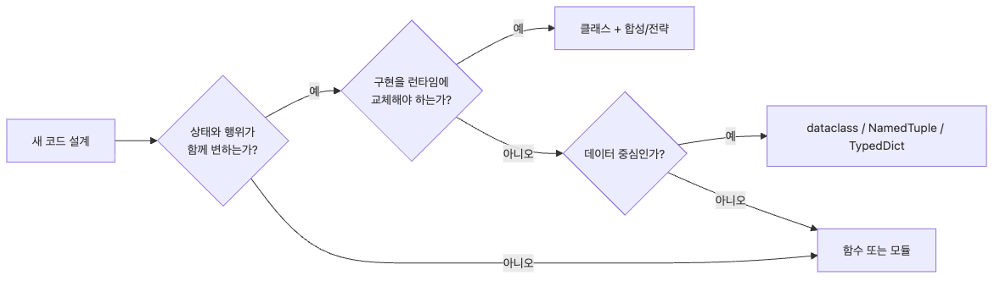

# 객체지향을 언제 피해야 할까?

가장 어려운 객체지향 결정은 종종 "어떤 클래스를 더 만들까?"가 아니라 "이걸 정말 클래스여야 하나?"입니다. 이 글은 OOP 101 시리즈의 마지막 글입니다.

Python이 함수, 모듈, `dataclass`, `NamedTuple`, `TypedDict`, 콜러블을 함께 주는 이유가 있습니다. 이번 글에서는 클래스가 과하게 많은 리포트 미니 앱을 단계적으로 단순화하고, 다시 클래스를 도입해야 하는 임계점까지 분명하게 잡아 보겠습니다.

## 이 글에서 다룰 문제

> 좋은 설계는 클래스를 얼마나 많이 만들었는지가 아니라, 상태와 생명주기가 무겁지 않은 문제를 함수와 가벼운 데이터 구조로 어디까지 깔끔하게 끝낼 수 있는지에서 드러납니다.

- 어떤 신호가 보이면 클래스 기반 설계가 대부분 의식적인 장식에 가깝다고 판단할 수 있을까요?
- 어떤 종류의 클래스가 함수, `dataclass`, `NamedTuple`, `TypedDict`로 더 잘 바뀔까요?
- 전략 클래스 전체 대신 콜백 하나면 충분한 순간은 언제일까요?
- 함수 중심 설계가 너무 멀리 가서 다시 클래스로 올려야 하는 지점은 어떻게 판단할까요?

## 핵심 개념 잡기


*목표는 클래스를 영원히 피하는 것이 아니라, 상태·불변식·협력 수명주기가 실제로 함께 움직이는 지점에만 클래스를 남겨 두는 것입니다.*

실무적인 질문은 단순합니다. 이 동작이 정말 상태와 수명주기 조정을 필요로 하는가, 아니면 대부분 데이터 변환 파이프라인인가? 후자라면 클래스는 종종 추가 무게일 뿐입니다.

## 핵심 개념

| 용어 | 설명 |
|------|------|
| 다중 패러다임 | Python은 절차, 객체지향, 함수형 스타일을 함께 지원합니다 |
| 빈혈 클래스 | 데이터 보관이나 단일 메서드 래핑에 가까운 얇은 클래스입니다 |
| `dataclass` | 데이터 중심 구조를 간결하게 표현하는 기능입니다 |
| 고차 함수 | 다른 함수를 인자로 받거나 반환하는 함수입니다 |
| 재도입 임계점 | 상태, 검증, 수명주기 조정이 강해져 다시 클래스가 유리해지는 시점입니다 |

## 전후 비교

이번 글의 핵심은 "클래스는 나쁘다"가 아니라 "설계 의도를 지키는 가장 가벼운 도구를 먼저 쓰자"입니다.

```python
# before: 상태 없는 헬퍼와 단순 데이터도 모두 클래스로 감쌉니다
class TitleCleaner:
    def clean(self, title: str) -> str:
        return title.strip().title()


class ScoreFilter:
    def keep(self, score: int, minimum: int) -> bool:
        return score >= minimum
```

```python
# after: 함수와 데이터 구조가 같은 워크플로를 더 직접적으로 표현합니다
def clean_title(title: str) -> str:
    return title.strip().title()


def keep_score(score: int, minimum: int) -> bool:
    return score >= minimum
```

## 하나의 워크플로로 보는 클래스 줄이기

### 출발점: 너무 많은 작은 클래스

주간 캠페인 리포트를 만드는 팀이 모든 단계를 각각 클래스로 감쌌다고 가정해 보겠습니다.

```python
class TitleCleaner:
    def clean(self, title: str) -> str:
        return title.strip().title()


class ScoreFilter:
    def keep(self, score: int, minimum: int) -> bool:
        return score >= minimum


class CurrencyFormatter:
    def format(self, value: int) -> str:
        return f"${value:,.0f}"


class ReportRow:
    def __init__(self, title: str, score: int, spend: int) -> None:
        self.title = title
        self.score = score
        self.spend = spend


class ReportConfig:
    def __init__(self, minimum_score: int, currency: str) -> None:
        self.minimum_score = minimum_score
        self.currency = currency
```

각 클래스는 이해 가능하지만, 전체 설계는 문제에 비해 무겁습니다.

### 1단계: 상태 없는 헬퍼 클래스를 함수로 바꿉니다

인스턴스 상태도 없고 수명주기도 없는 코드는 모듈 함수가 더 분명한 경우가 많습니다.

```python
def clean_title(title: str) -> str:
    return title.strip().title()


def keep_score(score: int, minimum: int) -> bool:
    return score >= minimum


def format_currency(value: int) -> str:
    return f"${value:,.0f}"
```

#### 실행

```python
print(clean_title("  spring launch "))
print(keep_score(82, 80))
print(format_currency(12500))
```

예상 출력:

```text
Spring Launch
True
$12,500
```

#### 점검

바뀐 것: 인스턴스 생성이 사라졌습니다. 그대로인 것: 각 변환은 여전히 이름이 분명하고 역할이 하나입니다.

### 2단계: 데이터 보관용 boilerplate를 `dataclass`와 `TypedDict`로 바꿉니다

원래 `ReportRow`, `ReportConfig`는 대부분 필드 저장만 하고 있었습니다. 이때는 가벼운 데이터 구조가 더 적합합니다.

```python
from dataclasses import dataclass
from typing import TypedDict


@dataclass(frozen=True)
class ReportRow:
    title: str
    score: int
    spend: int


class ReportConfig(TypedDict):
    minimum_score: int
    channel: str


config: ReportConfig = {"minimum_score": 80, "channel": "email"}
row = ReportRow(title="Spring Launch", score=82, spend=12500)

print(row)
print(config["channel"])
```

예상 출력:

```text
ReportRow(title='Spring Launch', score=82, spend=12500)
email
```

#### 점검

바뀐 것: 생성자와 표현용 boilerplate가 사라졌습니다. 그대로인 것: 워크플로는 여전히 이름 있는 행 타입과 명시적 설정 키를 가집니다.

#### 실패 경로

`config["chnanel"]`처럼 dict 키를 잘못 쓰면 런타임에 늦게 실패합니다. 얕고 단순한 설정에서는 감수할 수 있지만, 나중에 더 풍부한 객체가 필요해지는 첫 신호이기도 합니다.

### 3단계: 사소한 전략 클래스를 콜러블로 바꿉니다

많은 전략 클래스는 사실상 이름 붙은 포매팅 함수 하나에 가깝습니다.

```python
from typing import Callable


def format_currency(value: int) -> str:
    return f"${value:,.0f}"


def format_points(value: int) -> str:
    return f"{value} pts"


def render_value(value: int, formatter: Callable[[int], str]) -> str:
    return formatter(value)


print(render_value(12500, format_currency))
print(render_value(82, format_points))
```

예상 출력:

```text
$12,500
82 pts
```

#### 점검

바뀐 것: 전략 추상이 호출자가 실제로 필요한 것, 즉 콜러블 하나로 줄었습니다. 그대로인 것: 포매팅 교체는 여전히 자연스럽습니다.

#### 실패 경로

각 포매터가 나중에 공통 설정, 캐시, 보조 메서드를 필요로 하기 시작하면 콜백만으로는 관련 동작이 흩어집니다. 그 순간이 클래스를 다시 고려할 한 기준입니다.

### 4단계: 리포트를 함수 파이프라인으로 조립합니다

이제 미니 앱은 작은 껍데기 클래스 모음 대신 읽기 쉬운 파이프라인이 될 수 있습니다.

```python
from dataclasses import dataclass
from typing import Callable, TypedDict


@dataclass(frozen=True)
class ReportRow:
    title: str
    score: int
    spend: int


class ReportConfig(TypedDict):
    minimum_score: int
    channel: str


def clean_title(title: str) -> str:
    return title.strip().title()


def format_currency(value: int) -> str:
    return f"${value:,.0f}"


def normalize_rows(rows: list[dict]) -> list[ReportRow]:
    return [
        ReportRow(
            title=clean_title(row["title"]),
            score=row["score"],
            spend=row["spend"],
        )
        for row in rows
    ]


def filter_rows(rows: list[ReportRow], minimum_score: int) -> list[ReportRow]:
    return [row for row in rows if row.score >= minimum_score]


def sort_rows(rows: list[ReportRow]) -> list[ReportRow]:
    return sorted(rows, key=lambda row: row.score, reverse=True)


def render_report(rows: list[ReportRow], money: Callable[[int], str]) -> list[str]:
    return [f"{row.title} | score={row.score} | spend={money(row.spend)}" for row in rows]


def build_report(raw_rows: list[dict], config: ReportConfig, money: Callable[[int], str]) -> list[str]:
    rows = normalize_rows(raw_rows)
    rows = filter_rows(rows, config["minimum_score"])
    rows = sort_rows(rows)
    return render_report(rows, money)


raw_rows = [
    {"title": "  spring launch ", "score": 82, "spend": 12500},
    {"title": "retargeting", "score": 76, "spend": 4000},
    {"title": "summer promo", "score": 91, "spend": 18000},
]
config: ReportConfig = {"minimum_score": 80, "channel": "email"}

for line in build_report(raw_rows, config, format_currency):
    print(line)
```

#### 실행

```bash
python report_pipeline.py
```

예상 출력:

```text
Summer Promo | score=91 | spend=$18,000
Spring Launch | score=82 | spend=$12,500
```

#### 점검

다음 세 가지를 확인합니다.

1. 정규화, 필터링, 정렬, 렌더링이 각각 독립 함수로 테스트되기 쉬운가
2. 데이터 보관 구조가 가볍지만 충분히 명시적인가
3. 리포트 파이프라인이 인스턴스 조정 노이즈 없이 위에서 아래로 읽히는가

#### 실패 경로: 함수만으로 두었더니 느슨해지는 순간

함수 파이프라인은 규칙과 공유 상태가 함께 움직이기 시작할 때부터 흔들립니다. 예를 들면 다음과 같습니다.

```python
config = {"minimum_score": 80, "chnanel": "email"}  # dict 키 오타가 숨어 있습니다
```

또는 각 포매터가 통화 기호 설정, 로케일 반올림 규칙, 환율 캐시 조회를 함께 필요로 한다고 해 보겠습니다. 그 시점에는 맨몸의 콜러블이 더 이상 가장 분명한 추상이 아닐 수 있습니다.

## 다시 클래스를 도입할지 판단하는 기준

다음 항목 중 두 개 이상이 동시에 보이면 클래스 쪽으로 되돌아갈 이유가 생깁니다.

| 신호 | 왜 클래스가 도움이 되기 시작하는가 |
|------|----------------------------------|
| 같은 필드 묶음이 여러 함수 사이를 반복해서 같이 이동 | 더 풍부한 도메인 객체가 불변식과 동작을 한곳에 묶을 수 있습니다 |
| 검증 규칙과 상태 전이가 함께 반복 | 메서드와 캡슐화된 상태가 더 추론하기 쉬워집니다 |
| 포매터나 전략이 설정, 캐시 같은 지속 상태를 가짐 | 매번 인자를 늘리는 것보다 상태 객체가 분명해집니다 |
| 파이프라인이 재시도, 훅, 공유 협력 객체를 요구 | 조정자 객체가 횡단 관심사를 맡기 쉬워집니다 |

목표는 "순수 함수형"을 지키는 것이 아닙니다. 더 무거운 구조가 자기 값을 벌어들일 때까지 미루는 것입니다.

## 이 워크플로에서 주목할 점

- 상태 없는 변환 로직은 메서드 하나짜리 클래스보다 함수가 더 읽기 쉬운 경우가 많습니다.
- `dataclass`와 `TypedDict`는 이름 있는 구조를 유지하면서도 객체 ceremony를 줄여 줍니다.
- 단순한 교체 가능 동작은 콜러블 하나로 충분한 경우가 많습니다.
- 함수 파이프라인은 상태, 불변식, 수명주기 조정이 반복되기 전까지 강력합니다.

## 자주 하는 실수 5가지

| 실수 | 왜 아픈가 | 더 나은 선택 |
|------|----------|--------------|
| 모든 헬퍼를 클래스화 | 단순한 파이프라인이 객체 노이즈에 가려집니다 | 모듈 함수로 시작합니다 |
| 평범한 데이터에 수제 클래스를 사용 | boilerplate가 가치보다 빨리 늘어납니다 | `dataclass`, `NamedTuple`, `TypedDict`를 봅니다 |
| 함수 하나 감싼 전략 클래스를 유지 | 상태 없는 간접 계층만 남습니다 | 콜러블을 전달합니다 |
| 함수 중심 설계를 이념처럼 밀어붙임 | 상태와 검증이 흩어집니다 | 불변식이 반복되면 클래스를 재도입합니다 |
| dict 기반 설정을 너무 오래 방치 | 오타와 기본값 누락이 늦게 드러납니다 | 설정 복잡도가 커지면 더 풍부한 객체로 올립니다 |

## 실무에서 이렇게 쓰입니다

- CLI 유틸리티는 함수 중심 모듈이 가장 잘 맞는 경우가 많습니다.
- 데이터 정리와 변환 코드는 파이프라인 형태가 자연스럽습니다.
- `dataclass`는 내부 DTO나 불변 페이로드에 특히 적합합니다.
- 반대로 상태가 있는 API 클라이언트나 캐시 서비스는 클래스를 다시 정당화합니다.

## 현업 개발자는 이렇게 생각합니다

현업 개발자는 클래스가 나빠서 클래스를 피하지 않습니다. 상태와 계층 구조의 무게가 실제로는 데이터 변환 문제에 불필요하게 올라타고 있기 때문에 피합니다. 좋은 질문은 "가장 싸면서도 워크플로를 보호하는 추상이 무엇인가?"입니다.

그래서 많은 Python 코드베이스는 함수로 시작하고, 상태·불변식·조정 책임이 쌓이는 지점만 클래스로 올립니다. 절제가 설계 능력의 일부입니다.

## 체크리스트

- [ ] 상태 없는 헬퍼 함수를 얇게 감싼 클래스를 식별할 수 있다
- [ ] boilerplate 데이터 보관 클래스를 `dataclass`나 `TypedDict`로 바꿀 수 있다
- [ ] 사소한 전략 클래스 대신 콜러블을 사용할 수 있다
- [ ] 변환 중심 코드를 읽기 쉬운 함수 파이프라인으로 만들 수 있다
- [ ] 상태와 불변식이 커질 때 클래스를 다시 도입해야 하는 이유를 설명할 수 있다

## 정리 및 다음 글 안내

객체지향을 피해야 하는 순간은 클래스가 보호보다 의식을 더 많이 늘릴 때입니다. 이번 리포트 워크플로에서는 상태 없는 헬퍼를 함수로, 데이터 보관용 클래스를 가벼운 구조로, 사소한 전략을 콜러블로 바꾸면서 전체를 직접적인 파이프라인으로 만들었습니다. 동시에 상태와 불변식이 함께 움직이기 시작하면 다시 클래스로 올라가야 하는 기준도 얻었습니다.

<!-- toc:begin -->
- [객체지향이란 무엇인가?](./01-what-is-oop.md)
- [클래스와 인스턴스](./02-classes-and-instances.md)
- [캡슐화](./03-encapsulation.md)
- [상속](./04-inheritance.md)
- [다형성](./05-polymorphism.md)
- [추상화](./06-abstraction.md)
- [합성과 상속](./07-composition-vs-inheritance.md)
- [SOLID 원칙 기초](./08-solid-principles.md)
- [객체지향 설계 예제](./09-oop-design-example.md)
- **객체지향을 언제 피해야 할까? (현재 글)**
<!-- toc:end -->

## 참고 자료

- [Python 공식 문서 — dataclasses](https://docs.python.org/3/library/dataclasses.html)
- [Python 공식 문서 — typing.NamedTuple / TypedDict / Callable](https://docs.python.org/3/library/typing.html)
- [Python 공식 문서 — functools](https://docs.python.org/3/library/functools.html)
- [Stop Writing Classes — PyCon Talk by Jack Diederich](https://www.youtube.com/watch?v=o9pEzgHorH0)

Tags: Python, OOP, 함수형 프로그래밍, dataclass, 설계 판단
