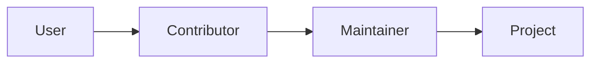

# What Is Open Source

This is the first post in the Open Source 101 series.

> Open Source 101 series (1/10)

<!-- a-grade-intro:begin -->

**Core question**: If *open source* is not just *free code*, what *is* it?

> A *culture* where *sharing* meets *contribution*.

<!-- a-grade-intro:end -->

## What You Will Learn

- A definition of *open source*
- *Free* versus *libre*
- Forms of *contribution*
- The shape of the *ecosystem*
- The path to your *first contribution*

## Why It Matters

Most *modern software* runs on top of *open source*.

## Concept at a Glance



## Key Terms

- **open source**: *Source-available* software.
- **free software**: *Libre* software.
- **upstream**: The *original repository*.
- **fork**: A *cloned repository*.
- **contributor**: A *contributor*.

## Before/After

**Before**: "*Open source* is *free*."

**After**: "*Open source* is the *right* to *read, modify, and share*."

## Hands-on: Exploring Open Source

### Step 1 — Find a repository

```bash
gh search repos --language python --topic open-source
```

### Step 2 — Check the license

```bash
gh repo view fastapi/fastapi --json licenseInfo
```

### Step 3 — Contributors

```bash
gh api repos/fastapi/fastapi/contributors --jq '.[].login' | head
```

### Step 4 — Browse issues

```bash
gh issue list --repo fastapi/fastapi --label "good first issue"
```

### Step 5 — Star the repo

```bash
gh repo star fastapi/fastapi
```

## What to Notice in This Code

- The *license* defines the *rights*.
- *Contributors* are *co-authors*.
- *good first issue* is the *entrance*.

## Five Common Mistakes

1. **Not reading the *license*.**
2. **Confusing a *fork* with the *upstream*.**
3. **Ignoring the *code of conduct*.**
4. **Using *issues* as a *help desk*.**
5. **Sending a *first PR* that is *too big*.**

## How This Shows Up in Production

Company code runs on top of *open source libraries* and follows their *licenses*.

## How a Senior Engineer Thinks

- Open source is a *right*.
- *Contribution* is more than code.
- *Docs, translation, design* count too.
- *Small PRs* drive *big change*.
- *Community* is an *asset*.

## Checklist

- [ ] *License* checked.
- [ ] *Code of conduct* read.
- [ ] One *good first issue* found.
- [ ] *Contributing guide* read.

## Practice Problems

1. Write the definition of *open source* in one line.
2. Write the meaning of *upstream* in one line.
3. Write the definition of *contributor* in one line.

## Wrap-up and Next Steps

The next post is *Understanding Licenses*.

<!-- toc:begin -->
- **What Is Open Source (current)**
- Understanding Licenses (upcoming)
- Reading Issues (upcoming)
- Creating Pull Requests (upcoming)
- A Good README (upcoming)
- Release and Versioning (upcoming)
- Community Management (upcoming)
- The Maintainer Role (upcoming)
- An Open Source Portfolio (upcoming)
- My First Open Source Project (upcoming)
<!-- toc:end -->

## References

- [Open Source Initiative](https://opensource.org/osd)
- [Free Software Foundation - GNU Project](https://www.gnu.org/philosophy/free-sw.html)
- [Open Source Guides - GitHub](https://opensource.guide/)
- [The Cathedral and the Bazaar - Eric Raymond](http://www.catb.org/~esr/writings/cathedral-bazaar/)

Tags: OpenSource, GitHub, Community, Contribution, Beginner
