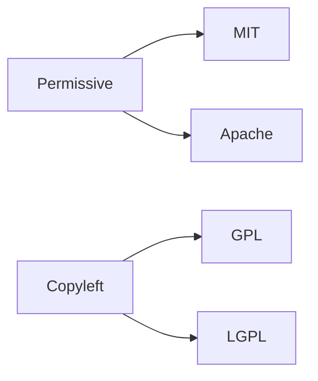

# Understanding Licenses

This is post 2 in the Open Source 101 series.

> Open Source 101 series (2/10)

<!-- a-grade-intro:begin -->

**Core question**: What *risk* do you take when you use code without reading its *license*?

> The *legal liability* lands on *you*.

<!-- a-grade-intro:end -->

## What You Will Learn

- *Permissive* vs *copyleft*
- *MIT, Apache, GPL* compared
- The meaning of *public domain*
- *Dual* licensing
- Checking *compatibility*

## Why It Matters

The *license* shapes the *future* of the project.

## Concept at a Glance



## Key Terms

- **permissive**: A *permissive* license.
- **copyleft**: A *copyleft* license.
- **public domain**: The *public domain*.
- **dual license**: A *dual license*.
- **SPDX**: A *license identifier standard*.

## Before/After

**Before**: "*MIT* and *GPL* are both just *open source*."

**After**: "You can *sell* MIT code; *GPL* requires *source disclosure*."

## Hands-on: Comparing Licenses

### Step 1 — MIT essentials

```text
Allows: use, modify, distribute, sell
Requires: keep the copyright notice
```

### Step 2 — Apache 2.0 essentials

```text
Allows: same as MIT
Adds: explicit patent grant
```

### Step 3 — GPL v3 essentials

```text
Allows: use, modify, distribute
Requires: derivative works share their source
```

### Step 4 — SPDX identifier

```yaml
license: MIT
```

### Step 5 — License file

```bash
curl -O https://choosealicense.com/licenses/mit/
```

## What to Notice in This Code

- *Permissive* is *flexible*.
- *Copyleft* is *contagious*.
- *SPDX* is the *standard identifier*.

## Five Common Mistakes

1. **Just *copying* the license.**
2. **Stripping the *copyright notice*.**
3. **Mixing *GPL* code into *proprietary* products.**
4. **Misreading a *dual license*.**
5. **No *SPDX* identifier.**

## How This Shows Up in Production

Companies run *license scanners* (FOSSA, Snyk) to check *compatibility* automatically.

## How a Senior Engineer Thinks

- A *license* is *law*.
- *MIT* means *minimal friction*.
- *GPL* enforces *sharing*.
- *Apache* is *patent-safe*.
- *Dual licensing* is a *strategy*.

## Checklist

- [ ] *LICENSE* file present.
- [ ] *SPDX* identifier set.
- [ ] *Copyright* notice kept.
- [ ] *Compatibility* checked.

## Practice Problems

1. Write the difference between *permissive* and *copyleft* in one line.
2. Write the meaning of *SPDX* in one line.
3. Write an example of a *dual license* in one line.

## Wrap-up and Next Steps

The next post is *Reading Issues*.

<!-- toc:begin -->
- [What Is Open Source](./01-what-is-open-source.md)
- **Understanding Licenses (current)**
- Reading Issues (upcoming)
- Creating Pull Requests (upcoming)
- A Good README (upcoming)
- Release and Versioning (upcoming)
- Community Management (upcoming)
- The Maintainer Role (upcoming)
- An Open Source Portfolio (upcoming)
- My First Open Source Project (upcoming)
<!-- toc:end -->

## References

- [Choose a License](https://choosealicense.com/)
- [SPDX License List](https://spdx.org/licenses/)
- [Open Source Initiative Licenses](https://opensource.org/licenses)
- [tl;dr Legal](https://www.tldrlegal.com/)

Tags: OpenSource, License, MIT, GPL, Beginner
