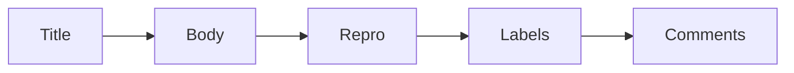

# Reading Issues

> Open Source 101 series (3/10)

<!-- a-grade-intro:begin -->

**Core question**: How should you *read* an *issue* to find a *real entry point* for contribution?

> Read *title*, *labels*, then *comments* — in that order.

<!-- a-grade-intro:end -->

## What You Will Learn

- The *anatomy* of an issue
- The *label* system
- Finding *good first issue* tasks
- Verifying *reproduction steps*
- Following the *comment thread*

## Why It Matters

A misread issue produces a misaligned PR.

## Concept at a Glance



## Key Terms

- **issue**: A reported problem or proposal.
- **label**: A classification tag.
- **triage**: The act of sorting issues.
- **repro**: Reproduction steps.
- **assignee**: The owner of the work.

## Before/After

**Before**: "I do not know what an issue is asking for."

**After**: "I follow title, body, labels, comments to build context."

## Hands-on: Analyze an Issue

### Step 1 — Read the Title

```text
[Bug] login fails on Safari 15
```

### Step 2 — Inspect Labels

```text
labels: bug, good first issue, help wanted
```

### Step 3 — Verify Repro Steps

```markdown
1. open https://example.com/login
2. enter valid credentials
3. click submit
expected: dashboard
actual: 500 error
```

### Step 4 — Follow Comments

```text
maintainer: can you share browser version?
reporter: Safari 15.1 on macOS 12
```

### Step 5 — Decide Whether to Contribute

```text
- label has good first issue ✓
- repro reproducible ✓
- no assignee ✓
→ attempt the contribution
```

## What to Notice in This Code

- The title is a summary.
- Labels carry context.
- Comments record agreement.

## Five Common Mistakes

1. **Opening a PR after reading only the title.**
2. **Skipping reproduction steps.**
3. **Working on an issue that has an assignee.**
4. **Ignoring labels.**
5. **Missing decisions buried in comments.**

## How This Shows Up in Production

Internal trackers also run a triage rotation to prioritize issues weekly.

## How a Senior Engineer Thinks

- An issue is an agreement.
- A label is a protocol.
- Repro is evidence.
- An assignee is responsibility.
- Comments are history.

## Checklist

- [ ] Title read.
- [ ] Repro confirmed.
- [ ] Labels checked.
- [ ] Assignee checked.

## Practice Problems

1. One line: meaning of the *good first issue* label.
2. One line: define triage.
3. One line: the risk of an issue with no repro.

## Wrap-up and Next Steps

Next post covers *Creating Pull Requests*.

<!-- toc:begin -->
- [What Is Open Source](./01-what-is-open-source.md)
- [Understanding Licenses](./02-understanding-licenses.md)
- **Reading Issues (current)**
- Creating Pull Requests (upcoming)
- A Good README (upcoming)
- Release and Versioning (upcoming)
- Community Management (upcoming)
- The Maintainer Role (upcoming)
- An Open Source Portfolio (upcoming)
- My First Open Source Project (upcoming)
<!-- toc:end -->

## References

- [GitHub Issues docs](https://docs.github.com/en/issues)
- [good first issue](https://github.blog/2020-01-22-how-we-built-good-first-issues/)
- [Triage guide](https://opensource.guide/best-practices/)
- [Issue templates](https://docs.github.com/en/communities/using-templates-to-encourage-useful-issues-and-pull-requests)

Tags: OpenSource, Issues, GitHub, Triage, Beginner
