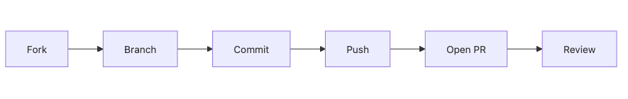

# Creating Pull Requests

In open source, the pull request is the most visible output of contribution. That is why beginners often feel like the work is done once the PR is open. From a maintainer's point of view, though, a pull request is not a blob of code. It is a change proposal that must be easy to review, easy to trust, and safe to merge.

This is post 4 in the Open Source 101 series.

Here, we will walk through the full contribution path from fork and branch to commit history, description, review response, and post-merge cleanup.

## Questions this chapter answers

- What does a pull request that maintainers welcome actually look like?
- Why should fork, branch, commit, and PR each stay separate?
- What roles do commit messages and the PR description play?
- What should you explain, and what should you change, when review feedback arrives?
- Why does cleanup after merge still count as part of contribution?

> A pull request is not a button for uploading code. It is the conversation channel where you package a change into a reviewable unit.

## Why It Matters

Correct code can still produce slow review if the pull request is hard to read. On the other hand, even a modest change becomes easier to merge when the branch is scoped well, the description is clear, and the verification path is obvious. For beginners, collaboration habits are often judged before technical depth.

The same is true inside companies. Pull requests are the default unit of code review in many teams. The ability to take a small change and explain it as a crisp story travels well between open source and production work.

## Put the Flow in Your Head First



*The contribution flow from fork to review that keeps a change small, isolated, and reviewable*
If you treat that flow as paperwork, every step feels annoying. If you see the role split, it starts to make sense. The fork is your private workspace. The branch is the change boundary. The commit is the history unit. The pull request is the request for review. Keeping them separate lowers confusion.

Good pull requests are not only well implemented. They are well shaped. When the branch is isolated, the scope is small, the related issue is linked, and the test path is visible, review gets much easier.

## Five Concepts Worth Knowing

A *fork* is your safe personal copy of the upstream repository. A *branch* is a single-purpose change line. A *commit* is the smallest reliable history unit. A *pull request* is the formal request to merge into upstream. *Review* is not only correctness checking. It is also a check for clarity, safety, and fit with the repository's direction.

Once those concepts click, opening pull requests stops feeling mysterious.

## How Your Mental Model Should Change

At first, it may seem simpler to work directly on `main`. Open source contribution works better when you optimize for reviewability instead. That means forking, branching, committing in small units, and opening a pull request with clear context every time.

That habit gives even a beginner's first contribution a higher trust baseline.

## Hands-on: Open Your First Clean Pull Request

### Step 1 — Fork and Clone

Separate your workspace from the upstream repository. That keeps failure local and experimentation safe.

```bash
gh repo fork owner/repo --clone
cd repo
```

### Step 2 — Create a Branch

Try to make the branch name reveal the intent of the change. One bug or one feature per branch is usually a healthy default.

```bash
git checkout -b fix/login-safari
```

### Step 3 — Commit

Commit messages matter because they become part of both the history and the review context. Intent beats vagueness.

```bash
git commit -m "fix: handle Safari 15 cookie quirk"
```

### Step 4 — Push

Push is not just an upload step. It is the point where you publish a reviewable state. The more trimmed your local history is before this step, the better.

```bash
git push origin fix/login-safari
```

### Step 5 — Open the PR

The title is the summary. The body is the context. Link the issue so maintainers can recover the earlier discussion quickly.

```bash
gh pr create --title "fix: Safari 15 login" \
  --body "Closes #42"
```

## A Practical PR Body Template

```markdown
## Summary

- Fix Safari 15 login failure caused by cookie handling

## Why this change

- Existing login flow worked in Chrome but failed in Safari 15

## Verification

- Added regression test for Safari cookie branch
- Confirmed login works in local manual test

Closes #42
```

## What to Notice in This Walkthrough

Small branches create small reviews. Commit messages and pull request titles may look similar, but they do different jobs. One becomes history. The other guides the reviewer. A linked issue saves the reviewer from reconstructing the earlier problem statement.

That is the real convenience you provide. Maintainers are often seeing the code for the first time. A well-shaped PR lowers their context-switch cost before they even read the diff.

## Five Common Mistakes

1. Working directly on `main`.
2. Writing commit messages that do not explain intent.
3. Opening a PR with no test or verification story.
4. Forgetting to link the related issue.
5. Ignoring review feedback instead of responding clearly.

## How This Shows Up in Production

Senior engineers treat pull requests as collaboration interfaces, not upload events. If the scope is too large, review slows down. If the context is missing, reviewers become defensive because they have to infer too much. Small PRs, explicit verification, and quick feedback response reduce that cost.

Review is not an exam you either pass or fail. A good review conversation is about finding the choice that fits the repository's existing direction best. Beginners usually earn more trust through clarity and fast iteration than through self-defense.

## How a Senior Engineer Thinks

- A PR is a review conversation.
- Scope is a design choice.
- Tests and commands are evidence.
- Description is part of engineering quality.
- Review is how repository norms become visible.

## Checklist

- [ ] I created a separate working branch.
- [ ] My commit history explains the change.
- [ ] I prepared a test result or verification method.
- [ ] My PR body explains context and links the related issue.

## Practice Problems

1. Explain the difference between *fork* and *clone* in one sentence.
2. Explain what `Closes #N` does in one sentence.
3. Explain why a small pull request is easier to merge.

## Wrap-up and Next Steps

In this post, we reframed pull requests as reviewable change proposals rather than code uploads. Well-shaped pull requests reduce collaboration cost before anyone debates implementation details.

Next, we will move into README quality. In a repository that expects contributors, documentation is often as important as the code itself.

<!-- toc:begin -->
- [What Is Open Source](./01-what-is-open-source.md)
- [Understanding Licenses](./02-understanding-licenses.md)
- [Reading Issues](./03-reading-issues.md)
- **Creating Pull Requests (current)**
- A Good README (upcoming)
- Release and Versioning (upcoming)
- Community Management (upcoming)
- The Maintainer Role (upcoming)
- An Open Source Portfolio (upcoming)
- My First Open Source Project (upcoming)
<!-- toc:end -->

## References

- [GitHub PR docs](https://docs.github.com/en/pull-requests)
- [Conventional Commits](https://www.conventionalcommits.org/)
- [How to write a Git commit message](https://cbea.ms/git-commit/)
- [gh CLI](https://cli.github.com/manual/gh_pr_create)
- [GitHub pull request templates](https://github.com/github/docs/tree/main/.github)

Tags: OpenSource, PullRequest, Git, GitHub, Beginner
