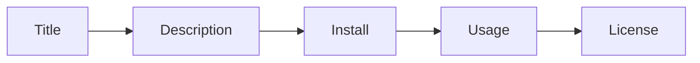

# A Good README

This is post 5 in the Open Source 101 series.

> Open Source 101 series (5/10)

<!-- a-grade-intro:begin -->

**Core question**: What does a first-time visitor need to *start* using your project in *five minutes*?

> Title, one-line summary, install, usage, license.

<!-- a-grade-intro:end -->

## What You Will Learn

- The *five core sections* of a README
- Using *badges* well
- Writing *runnable code samples*
- Automating the *table of contents*
- A *translation* strategy

## Why It Matters

The README is the face of your project.

## Concept at a Glance



## Key Terms

- **README**: Entry-point document.
- **badge**: Status indicator.
- **TOC**: Table of contents.
- **quickstart**: Fast getting-started path.
- **CONTRIBUTING**: Contribution guide.

## Before/After

**Before**: "The README is empty."

**After**: "A user can install and run within five minutes."

## Hands-on: Build a README

### Step 1 — Title and One-Line Summary

```markdown
# my-project

> A tiny tool that does X in one command.
```

### Step 2 — Badges

```markdown

```

### Step 3 — Install

```markdown
## Install

\`\`\`bash
pip install my-project
\`\`\`
```

### Step 4 — Usage Example

```markdown
## Usage

\`\`\`bash
my-project --help
\`\`\`
```

### Step 5 — License

```markdown
## License

MIT © 2026 Author Name
```

## What to Notice in This Code

- The title is unambiguous.
- The example actually runs.
- The license is explicit.

## Five Common Mistakes

1. **Forgetting the install command.**
2. **Examples that no longer run.**
3. **Screenshots with no explanation.**
4. **Skipping the license.**
5. **A README that is too long.**

## How This Shows Up in Production

Companies use the README of internal libraries as onboarding documentation.

## How a Senior Engineer Thinks

- A README is an advertisement.
- Five minutes is the target.
- Examples are king.
- Short sentences are kindness.
- Links provide depth.

## Checklist

- [ ] Title plus one-line summary.
- [ ] Install command.
- [ ] Usage example.
- [ ] License section.

## Practice Problems

1. One line: target time for a quickstart.
2. One line: purpose of a badge.
3. One line: why CONTRIBUTING.md is a separate file.

## Wrap-up and Next Steps

Next post covers *Release and Versioning*.

<!-- toc:begin -->
- [What Is Open Source](./01-what-is-open-source.md)
- [Understanding Licenses](./02-understanding-licenses.md)
- [Reading Issues](./03-reading-issues.md)
- [Creating Pull Requests](./04-creating-pull-requests.md)
- **A Good README (current)**
- Release and Versioning (upcoming)
- Community Management (upcoming)
- The Maintainer Role (upcoming)
- An Open Source Portfolio (upcoming)
- My First Open Source Project (upcoming)
<!-- toc:end -->

## References

- [Make a README](https://www.makeareadme.com/)
- [GitHub README guide](https://docs.github.com/en/repositories/managing-your-repositorys-settings-and-features/customizing-your-repository/about-readmes)
- [Awesome README](https://github.com/matiassingers/awesome-readme)
- [Shields.io](https://shields.io/)

Tags: OpenSource, README, Documentation, GitHub, Beginner
