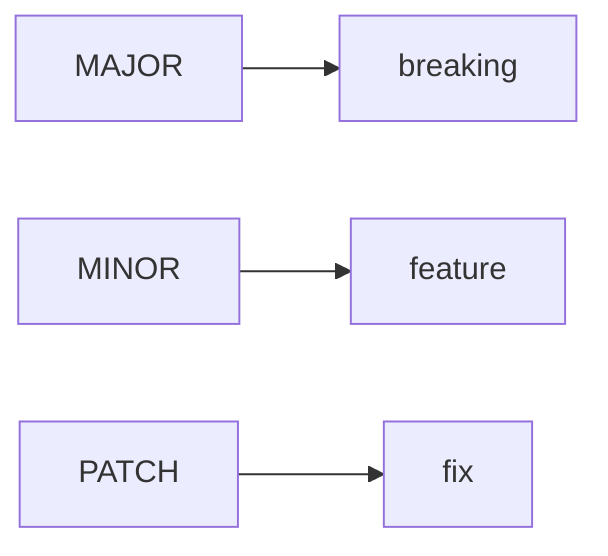

# Release and Versioning

> Open Source 101 series (6/10)

<!-- a-grade-intro:begin -->

**Core question**: When and how should you bump a version so users stay *safe*?

> Use *SemVer* together with a *changelog*.

<!-- a-grade-intro:end -->

## What You Will Learn

- The *three numbers* of SemVer
- *Pre-release* tags
- Writing a *changelog*
- Using *git tag*
- An *automated release* workflow

## Why It Matters

A wobbling version number breaks the ecosystem around you.

## Concept at a Glance



## Key Terms

- **SemVer**: MAJOR.MINOR.PATCH.
- **breaking**: A backward-incompatible change.
- **changelog**: Record of changes.
- **tag**: Immutable reference.
- **pre-release**: Trial version.

## Before/After

**Before**: "I tag versions by date."

**After**: "I use SemVer to communicate scope of impact."

## Hands-on: A Release Procedure

### Step 1 — Decide the Version

```text
1.2.3 → 1.3.0 (new feature)
1.2.3 → 2.0.0 (breaking change)
1.2.3 → 1.2.4 (bug fix)
```

### Step 2 — Update the Changelog

```markdown
## [1.3.0] - 2026-05-04
### Added
- new --json flag
```

### Step 3 — Create the Tag

```bash
git tag -a v1.3.0 -m "v1.3.0"
git push origin v1.3.0
```

### Step 4 — Publish Release Notes

```bash
gh release create v1.3.0 --notes-file CHANGELOG.md
```

### Step 5 — Automate

```yaml
on:
  push:
    tags: ['v*']
jobs:
  release:
    runs-on: ubuntu-latest
```

## What to Notice in This Code

- MAJOR is a warning.
- MINOR is additive.
- PATCH is a fix.

## Five Common Mistakes

1. **Shipping a breaking change as MINOR.**
2. **No changelog.**
3. **Tag and version mismatched.**
4. **Skipping pre-release labels.**
5. **Empty release notes.**

## How This Shows Up in Production

Internal libraries at companies also use SemVer to manage dependencies.

## How a Senior Engineer Thinks

- SemVer is a contract.
- The changelog is memory.
- Tags make builds reproducible.
- MAJOR rarely.
- PATCH often.

## Checklist

- [ ] Version chosen.
- [ ] Changelog updated.
- [ ] Tag pushed.
- [ ] Release published.

## Practice Problems

1. One line: example of a breaking change.
2. One line: example of a pre-release tag.
3. One line: difference between a tag and a branch.

## Wrap-up and Next Steps

Next post covers *Community Management*.

<!-- toc:begin -->
- [What Is Open Source](./01-what-is-open-source.md)
- [Understanding Licenses](./02-understanding-licenses.md)
- [Reading Issues](./03-reading-issues.md)
- [Creating Pull Requests](./04-creating-pull-requests.md)
- [A Good README](./05-good-readme.md)
- **Release and Versioning (current)**
- Community Management (upcoming)
- The Maintainer Role (upcoming)
- An Open Source Portfolio (upcoming)
- My First Open Source Project (upcoming)
<!-- toc:end -->

## References

- [Semantic Versioning](https://semver.org/)
- [Keep a Changelog](https://keepachangelog.com/)
- [GitHub Releases](https://docs.github.com/en/repositories/releasing-projects-on-github)
- [git tag docs](https://git-scm.com/docs/git-tag)

Tags: OpenSource, SemVer, Release, Changelog, Beginner
