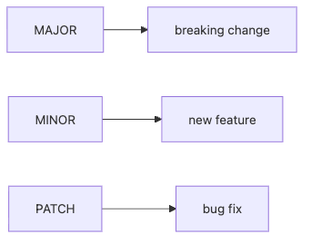

# Release and Versioning

When a project is new, it is easy to think that working code is enough. As soon as users appear, a new problem shows up. Does this release break compatibility? Is it only a bug fix? Is it safe to upgrade now? How do you communicate those answers clearly?

This is post 6 in the Open Source 101 series.

Here, we will connect semantic versioning, changelogs, tags, and release notes into one practical release discipline that users can actually trust.

## Questions this chapter answers

- What do the three numbers in semantic versioning actually signal to users?
- When should you use pre-release labels, and why does skipping them create risk?
- How should changelogs and release notes work together?
- Why is a tag different from a branch, and why does that difference matter for reproducibility?
- At what point does release automation stop being optional?

> The version number tells users how large the change is. The changelog tells them what the change actually contains.

## Why It Matters

When version numbers are inconsistent, users become afraid to upgrade. If a breaking change ships as PATCH, or a new feature lands with no explanation, the project loses trust faster than it gains functionality. Ecosystems remember predictability.

The same is true for internal libraries. As dependencies increase, versioning and change history become collaboration tools rather than cosmetic metadata. A version string is a contract with your users.

## The Basic Release Map



*The basic map showing how MAJOR, MINOR, and PATCH communicate different levels of upgrade risk*
Memorizing semantic versioning as a formula is not enough. The more useful framing is user-centered. MAJOR means “be careful.” MINOR means “new capability without breaking the main path.” PATCH means “small fix, lower upgrade anxiety.”

Then the changelog makes the numbers concrete. Users use the version to estimate impact and the changelog to inspect the actual content. Both are necessary.

## Five Concepts Worth Knowing

Semantic versioning expresses change with `MAJOR.MINOR.PATCH`. A *breaking change* no longer preserves the earlier usage contract. A *changelog* is the structured history of changes by version. A *tag* is an immutable pointer to a specific commit. A *pre-release* is a trial build before the official release.

If you have versions but no changelog, users lose the why. If you have a changelog but no tag, you lose the exact release state. Trustworthy releases need both.

## How Your Mental Model Should Change

At first, it can feel harmless to version by date or intuition. Once users depend on your project, a version stops being an internal note and becomes a public signal.

That is the better framing: the version communicates impact, and the changelog explains substance. If that contract becomes noisy, confidence drops before the code quality does.

## Hands-on: A Repeatable Release Procedure

### Step 1 — Decide the version

Decide first whether the release adds features, fixes bugs, or breaks compatibility. That decision drives everything else.

```text
1.2.3 → 1.3.0 (new feature)
1.2.3 → 2.0.0 (breaking change)
1.2.3 → 1.2.4 (bug fix)
```

### Step 2 — Update the changelog

Do not rely on memory after the release is out. Write the changes before publishing so additions, fixes, and removals stay visible.

```markdown
## [1.3.0] - 2026-05-04
### Added
- new --json flag
```

### Step 3 — Create the tag

The tag freezes the release state. When a bug appears later, you can still point to the exact shipped commit.

```bash
git tag -a v1.3.0 -m "v1.3.0"
git push origin v1.3.0
```

### Step 4 — Publish release notes

GitHub Releases is where the changelog becomes readable release communication. Do not stop at pushing the tag.

```bash
gh release create v1.3.0 --notes-file CHANGELOG.md
```

### Step 5 — Automate repeatable releases

As releases become frequent, manual steps become a source of omission. Triggering release jobs from tags improves reproducibility.

```yaml
on:
  push:
    tags: ['v*']
jobs:
  release:
    runs-on: ubuntu-latest
```

## Two Extra Signals Worth Adding

Pre-release tags such as `v2.0.0-beta.1` tell users that the interface is still being tested. Changelog sections such as `Added`, `Changed`, `Fixed`, and `Removed` help people scan faster than free-form prose.

## What to Notice in This Walkthrough

MAJOR is a warning signal. MINOR expands capability. PATCH should feel small and safe. Changelogs and tags are what turn those assumptions into something a user can verify.

Releases are communication as much as deployment. Users need to know what to expect, what to worry about, and which exact state to roll back to if necessary.

## Five Common Mistakes

1. Shipping a breaking change as MINOR.
2. Publishing without updating the changelog.
3. Letting the version string and the tag diverge.
4. Skipping pre-release labels for unstable builds.
5. Leaving release notes empty.

## How This Shows Up in Production

Senior engineers use version numbers as communication tools. Accurate versioning speeds upgrade decisions. A clean changelog lowers support cost. Opaque releases make users stick to old versions longer than they should.

Internal packages follow the same rule. The audience may be an internal team rather than the public, but the value of version contracts and explicit change history does not change.

## How a Senior Engineer Thinks

- SemVer is a contract.
- Changelogs preserve project memory.
- Tags make builds reproducible.
- Breaking changes deserve loud signals.
- Small safe patches should be easy to ship.

## Checklist

- [ ] I chose a version that matches the impact.
- [ ] I updated the changelog before release.
- [ ] I created or planned the release tag.
- [ ] I know how release notes will be published.

## Practice Problems

1. Give one example of a breaking change.
2. Write one example of a pre-release tag.
3. Explain the difference between a tag and a branch in one sentence.

## Wrap-up and Next Steps

In this post, we treated release and versioning as user trust management rather than pure deployment mechanics. When semantic versioning and change history move together, your project becomes easier to adopt and safer to upgrade.

Next, we will move into community management. Once the code is public and releases are real, the project also needs an environment where people can keep participating.

<!-- toc:begin -->
- [What Is Open Source](./01-what-is-open-source.md)
- [Understanding Licenses](./02-understanding-licenses.md)
- [Reading Issues](./03-reading-issues.md)
- [Creating Pull Requests](./04-creating-pull-requests.md)
- [A Good README](./05-good-readme.md)
- **Release and Versioning (current)**
- Community Management (upcoming)
- The Maintainer Role (upcoming)
- An Open Source Portfolio (upcoming)
- My First Open Source Project (upcoming)
<!-- toc:end -->

## References

- [Semantic Versioning](https://semver.org/)
- [Keep a Changelog](https://keepachangelog.com/)
- [GitHub Releases](https://docs.github.com/en/repositories/releasing-projects-on-github)
- [git tag docs](https://git-scm.com/docs/git-tag)
- [semver/semver repository](https://github.com/semver/semver)

Tags: OpenSource, SemVer, Release, Changelog, Beginner
