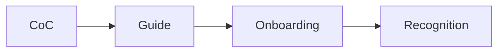

# Community Management

This is post 7 in the Open Source 101 series.

> Open Source 101 series (7/10)

<!-- a-grade-intro:begin -->

**Core question**: What does it take to keep contributors *around* for the long run?

> A clear code of conduct and friendly responses.

<!-- a-grade-intro:end -->

## What You Will Learn

- *Code of Conduct*
- *CONTRIBUTING.md*
- Using *Discussions*
- Managing *response time*
- Onboarding *new contributors*

## Why It Matters

A project survives only as long as its community does.

## Concept at a Glance



## Key Terms

- **CoC**: Code of Conduct.
- **CONTRIBUTING**: Contribution guide.
- **Discussions**: A conversation space.
- **maintainer**: Project owner.
- **first-time contributor**: Newcomer.

## Before/After

**Before**: "Issue comments turn aggressive."

**After**: "A CoC makes the boundaries explicit."

## Hands-on: Community Docs

### Step 1 — Code of Conduct

```bash
curl -O https://www.contributor-covenant.org/version/2/1/code_of_conduct.md
```

### Step 2 — CONTRIBUTING.md

```markdown
## How to contribute

1. Fork
2. Branch
3. Test
4. PR
```

### Step 3 — Issue Templates

```yaml
name: Bug Report
about: Report a bug
labels: bug
```

### Step 4 — Discussions

```text
- Q&A
- Show and tell
- Ideas
```

### Step 5 — Welcome Automation

```yaml
- uses: actions/first-interaction@v1
  with:
    pr-message: "Thanks for your first PR!"
```

## What to Notice in This Code

- The CoC sets the boundary.
- Templates are guidance.
- A welcome is onboarding.

## Five Common Mistakes

1. **No CoC.**
2. **Slow responses.**
3. **Ignoring first-time contributors.**
4. **Mixing discussions with issues.**
5. **No expressions of appreciation.**

## How This Shows Up in Production

DevRel teams run internal channels using the same playbook as healthy open source communities.

## How a Senior Engineer Thinks

- Community is an asset.
- Kindness is a competitive edge.
- Response speed is trust.
- Explicit rules are safety.
- Recognition is motivation.

## Checklist

- [ ] CoC adopted.
- [ ] CONTRIBUTING written.
- [ ] Issue templates set.
- [ ] Discussions enabled.

## Practice Problems

1. One line: what is the Contributor Covenant?
2. One line: difference between good first issue and help wanted.
3. One line: role of DevRel.

## Wrap-up and Next Steps

Next post covers *The Maintainer Role*.

<!-- toc:begin -->
- [What Is Open Source](./01-what-is-open-source.md)
- [Understanding Licenses](./02-understanding-licenses.md)
- [Reading Issues](./03-reading-issues.md)
- [Creating Pull Requests](./04-creating-pull-requests.md)
- [A Good README](./05-good-readme.md)
- [Release and Versioning](./06-release-and-versioning.md)
- **Community Management (current)**
- The Maintainer Role (upcoming)
- An Open Source Portfolio (upcoming)
- My First Open Source Project (upcoming)
<!-- toc:end -->

## References

- [Contributor Covenant](https://www.contributor-covenant.org/)
- [Open Source Guides — Building Communities](https://opensource.guide/building-community/)
- [GitHub Discussions](https://docs.github.com/en/discussions)
- [first-interaction action](https://github.com/actions/first-interaction)

Tags: OpenSource, Community, CodeOfConduct, Governance, Beginner
