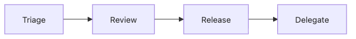

# The Maintainer Role

When people first look at open source, they often think a maintainer is simply the person who knows the code best. Technical judgment is part of the job, but the real role is wider. Maintainers triage issues, review contributions, cut releases, set community boundaries, and grow successors.

This is post 8 in the Open Source 101 series.

Here, we will define the maintainer not as a heroic programmer who does everything alone, but as the operator who keeps project flow and responsibility sustainable over time.

## Questions this chapter answers

- What responsibilities does a maintainer really carry?
- Why should triage, review, and release be seen as one operating loop?
- Why are delegation and successor growth sustainability issues rather than optional extras?
- What boundaries help prevent burnout?
- What does a low bus factor actually put at risk?

> A maintainer is not the developer who handles every task personally. They are closer to the conductor who keeps project flow and responsibility coordinated.

## Why It Matters

The health of a maintainer is often tied directly to the lifespan of the project. When review, release, and community responses all pile onto one person, sustainability breaks before code quality does.

Maintainers also become the reference point for project culture. Review tone, response speed, documentation discipline, and release habits often begin there. So understanding the maintainer role is close to understanding open source operations itself.

## The Maintainer Loop in One Line



*The operating loop where triage, review, release, and delegation keep maintainership sustainable*
That order matters because work accumulates along that path. Weak triage slows review. Slow review delays releases. Delayed releases attract even more demand to the maintainer. Without delegation, the whole loop clogs.

That is why maintainership is not simply “more coding.” It is a separate operating role with boundaries and coordination built into it.

## Five Concepts Worth Knowing

A *maintainer* protects direction and quality. *Triage* sorts incoming work and sets priority. *Review* checks not only correctness but also whether the change fits the project's direction. *Delegation* hands authority and responsibility to trusted people. *Bus factor* describes how dangerous it is if a key person disappears.

Those concepts all sit inside an ordinary maintainer week.

## How Your Mental Model Should Change

At first, it can feel like a “real maintainer” should personally handle every issue and pull request. In practice, that structure rarely lasts.

Projects live longer when authority is distributed, routines are visible, and maintainers are explicit about their boundaries. A strong maintainer is not the one who absorbs infinite work. It is the one who ensures the project is not trapped inside one person.

## Hands-on: Design a Maintainer Routine

### Step 1 — Set triage time

If you react continuously, the queue will always feel chaotic. A small scheduled triage block often works better.

```text
Monday, 30 minutes: label and prioritize
```

### Step 2 — Define first-response expectations

Predictable response is often more important than perfect speed. Contributors can wait more calmly when they understand the rhythm.

```text
Aim for first response within two days
```

### Step 3 — Create a release rhythm

Regular patch and minor release expectations stabilize user trust.

```text
Patch weekly, minor monthly
```

### Step 4 — Delegate permissions

Delegation is not a shortcut for laziness. It is a way to lower project risk. Review, labels, and docs are often good starting points.

```text
GitHub Org → Teams → write permission
```

### Step 5 — Announce time off

If you hide empty capacity, contributors may read silence as rejection. Visible boundaries are often more respectful than vague absence.

```markdown
> Maintainer is on vacation Aug 1-14.
```

## A Simple Responsibility Table

| Task | One maintainer only | Safe to delegate early |
| --- | --- | --- |
| Labeling and triage | No | Yes |
| Docs review | No | Yes |
| Release tag creation | Sometimes | Gradually |
| Final merge rights | Often at first | Later |

## What to Notice in This Walkthrough

Routines reduce fatigue. Delegation is how scale starts. Announcements create boundaries. Lowering bus factor is less about code tricks than about people structure.

The strongest maintainer is not the one who holds every answer. It is the one who makes the project work even when they are not available.

## Five Common Mistakes

1. Reviewing every pull request alone.
2. Not announcing time away.
3. Letting the bus factor stay at 1 for too long.
4. Running without labels or priority rules.
5. Failing to grow a successor.

## How This Shows Up in Production

This looks a lot like the role of a tech lead or platform owner inside a company. Incoming requests need sorting, quality bars need to stay visible, release cadence needs protecting, and people need to grow into more responsibility.

## How a Senior Engineer Thinks

- Maintainer work is systems work.
- Routine preserves energy.
- Delegation is part of architecture.
- Boundaries are part of trust.
- Successors are part of sustainability.

## Checklist

- [ ] I have a regular triage rhythm.
- [ ] I set review response expectations.
- [ ] I know what can be delegated first.
- [ ] I have a plan to raise the bus factor above 1.

## Practice Problems

1. Define *bus factor* in one sentence.
2. Explain the difference between *triage* and *review*.
3. Give one way to grow a successor.

## Wrap-up and Next Steps

In this post, we reframed the maintainer as an operating owner rather than only a strong developer. Sustainable open source needs people who can divide work, set boundaries, and keep project flow healthy.

Next, we will turn that experience back toward your own career and discuss how open source work becomes a real portfolio.

<!-- toc:begin -->
- [What Is Open Source](./01-what-is-open-source.md)
- [Understanding Licenses](./02-understanding-licenses.md)
- [Reading Issues](./03-reading-issues.md)
- [Creating Pull Requests](./04-creating-pull-requests.md)
- [A Good README](./05-good-readme.md)
- [Release and Versioning](./06-release-and-versioning.md)
- [Community Management](./07-community-management.md)
- **The Maintainer Role (current)**
- An Open Source Portfolio (upcoming)
- My First Open Source Project (upcoming)
<!-- toc:end -->

## References

- [Open Source Guides — Maintainer](https://opensource.guide/best-practices/)
- [Bus factor](https://en.wikipedia.org/wiki/Bus_factor)
- [Maintainer Burnout](https://opensource.guide/maintainer-mental-health/)
- [GitHub Teams](https://docs.github.com/en/organizations/organizing-members-into-teams)
- [github/maintainers repository](https://github.com/github/maintainers)

Tags: OpenSource, Maintainer, Triage, Burnout, Beginner
