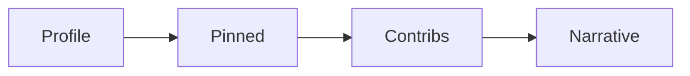

# An Open Source Portfolio

This is post 9 in the Open Source 101 series.

> Open Source 101 series (9/10)

<!-- a-grade-intro:begin -->

**Core question**: How does open source contribution become a *portfolio*?

> Present context, evidence, and a narrative — together.

<!-- a-grade-intro:end -->

## What You Will Learn

- *Profile* optimization
- *Pinned* repositories
- *PR* curation
- A *contribution* narrative
- *Sustained* evidence

## Why It Matters

A portfolio is the proof of your career.

## Concept at a Glance



## Key Terms

- **profile README**: Self-introduction repo.
- **pinned**: Highlighted repos.
- **contributions**: Activity graph.
- **narrative**: Your story.
- **proof of work**: Evidence of effort.

## Before/After

**Before**: "My GitHub is full of forks."

**After**: "Three notable PRs and one original project are pinned."

## Hands-on: Portfolio Cleanup

### Step 1 — Profile README

```bash
gh repo create <username> --public
echo "# Hi, I am ..." > README.md
```

### Step 2 — Choose Six Pinned Items

```text
- 1 original project
- 3 meaningful PRs
- 1 learning notebook
- 1 OSS you contribute to
```

### Step 3 — PR Index

```markdown
## Notable PRs
- pandas#123 — Fix x
- requests#456 — Add y
```

### Step 4 — Contribution Narrative

```markdown
## Story
Started with docs, moved to bugs, now feature work.
```

### Step 5 — Evidence of Sustainment

```text
At least 2 commits per week, three months straight
```

## What to Notice in This Code

- Narrative provides context.
- Pinned items are your face.
- Sustainment builds trust.

## Five Common Mistakes

1. **Stacking only forks.**
2. **An empty profile README.**
3. **Broken PR links.**
4. **Sporadic activity.**
5. **No descriptions.**

## How This Shows Up in Production

Hiring teams check GitHub activity before technical interviews as a baseline reference.

## How a Senior Engineer Thinks

- Narrative beats raw data.
- Three is better than thirty.
- Persistence is talent.
- A PR link is evidence.
- Profile README is the door.

## Checklist

- [ ] Profile README written.
- [ ] Six pinned items chosen.
- [ ] Notable PRs indexed.
- [ ] Three months of activity.

## Practice Problems

1. One line: difference between pinned and fork.
2. One line: purpose of the profile README.
3. One line: example of sustained evidence.

## Wrap-up and Next Steps

Next post covers *My First Open Source Project*.

<!-- toc:begin -->
- [What Is Open Source](./01-what-is-open-source.md)
- [Understanding Licenses](./02-understanding-licenses.md)
- [Reading Issues](./03-reading-issues.md)
- [Creating Pull Requests](./04-creating-pull-requests.md)
- [A Good README](./05-good-readme.md)
- [Release and Versioning](./06-release-and-versioning.md)
- [Community Management](./07-community-management.md)
- [The Maintainer Role](./08-maintainer-role.md)
- **An Open Source Portfolio (current)**
- My First Open Source Project (upcoming)
<!-- toc:end -->

## References

- [GitHub Profile README](https://docs.github.com/en/account-and-profile/setting-up-and-managing-your-github-profile)
- [Pinning items](https://docs.github.com/en/account-and-profile/setting-up-and-managing-your-github-profile/customizing-your-profile/pinning-items-to-your-profile)
- [Open Source Guides — Finding Users](https://opensource.guide/finding-users/)
- [Hiring with GitHub](https://github.com/readme)

Tags: OpenSource, Portfolio, Career, GitHub, Beginner
