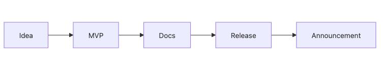

# My First Open Source Project

By this point in the series, you have seen the definition of open source, licenses, issues, pull requests, README quality, releases, community management, and maintainership. The final question is simple and difficult at the same time: what should you actually publish? Many people stop here because the idea feels too small, or because the project does not yet feel “finished enough” to make public.

This is the final post in the Open Source 101 series.

Here, we will walk through the smallest complete path from idea to MVP, docs, first release, and feedback loop for a first open source project.

## Questions this chapter answers

- How large should a first open source project be?
- What order works well for idea, scope, MVP, docs, and release?
- Why do docs and licensing become more important right before publication?
- What should count as the minimum bar before the first release?
- Why is collecting feedback part of the project rather than something that happens after it?

> Your first open source project is not a museum display. It is the process of making one small tool usable by someone else.

## Why It Matters

Learning closes differently once the work is public. There is a big gap between code that runs on your machine and a project that another person can realistically install, understand, and evaluate. README, LICENSE, CHANGELOG, release tags, and a feedback path are what turn code into a shareable artifact.

That process teaches a surprising amount of practical engineering. You practice scoping, documentation priorities, packaging, release discipline, and user feedback collection all at once. For a first project, finishing matters more than scale.

## The Smallest Path to Publication



*The minimum path from idea to docs, release, and announcement for a first public tool*
The key insight is that publication does not happen only at the last second. As soon as you write docs with another user in mind, you have already started preparing for public use.

Small projects benefit the most from respecting that order. Once the scope keeps expanding, shipping becomes harder, and unfinished projects do not create release experience.

## Five Concepts Worth Knowing

An *MVP* is the smallest version that is still useful. *Scope* defines what is in and what is deliberately out. A *roadmap* gives future work a visible home rather than forcing it into the first release. An *announcement* is the public message that introduces the release. A *feedback loop* is the cycle that turns user response into the next improvement.

Those five ideas are what help you escape perfectionism.

## How Your Mental Model Should Change

At first, it can feel like your idea is not big enough to deserve publication. For a first open source project, it does not need to be big at all.

If a small MVP has working docs and a real release, it already qualifies as a meaningful first project. The point is not spectacle. The point is finishing something that another person can genuinely try.

## Hands-on: Publish the First Version

### Step 1 — Decide the idea and the scope

The first question is not only what to build, but also what to exclude from the first version. Small scope is what makes completion possible.

```markdown
- Name: tinytool
- Goal: do X in one command
- Non-goals: GUI, i18n
```

### Step 2 — Build the MVP code

Set up the smallest working structure and confirm that the minimum feature runs locally.

```bash
mkdir tinytool && cd tinytool
git init
python -m venv .venv
```

### Step 3 — Prepare the five basic docs

Without these docs, the project is difficult to try, trust, or extend.

```text
README.md
LICENSE
CONTRIBUTING.md
CODE_OF_CONDUCT.md
CHANGELOG.md
```

### Step 4 — Cut the first release

The first version acts as a baseline as much as a feature bundle. People now know where the usable project begins.

```bash
git tag v0.1.0
gh release create v0.1.0 --generate-notes
```

### Step 5 — Publish and ask for feedback

The project does not end when you push it out. That is when the next learning loop begins.

```markdown
> Released tinytool v0.1.0. Feedback welcome!
```

## A Minimum Publication Gate

| Item | Why it matters |
| --- | --- |
| README | Gives a usable entry path |
| LICENSE | Defines the sharing rules |
| CHANGELOG | Records what changed |
| Tag or release | Marks the first stable checkpoint |
| Feedback channel | Turns users into signal |

## What to Notice in This Walkthrough

First projects are easier to finish when the scope stays small. Documentation is a major part of the product. Release tags create a baseline. Announcements create a surface where people can respond.

The goal is not perfect execution on day one. The goal is to pass through the full cycle of scope, docs, release, and feedback at least once.

## Five Common Mistakes

1. Delaying publication until the project feels perfect.
2. Publishing the repository with no license.
3. Leaving the README too vague for anyone to start.
4. Providing no feedback channel.
5. Forgetting to signal what is intentionally out of scope.

## How This Shows Up in Production

Internal tools also become easier to adopt when they follow the same playbook. Even a small script becomes more reusable once it has a name, a README, a release point, and a change history. Open source habits improve shareability whether the audience is public or internal.

## How a Senior Engineer Thinks

- Small scope increases the chance of shipping.
- Docs are part of the product.
- A release is a baseline, not a trophy.
- Feedback is directional data.
- Finishing a small public tool teaches more than endlessly polishing a private idea.

## Checklist

- [ ] My MVP works.
- [ ] I prepared the five basic docs.
- [ ] I have a first tag or release plan.
- [ ] I know where feedback will be collected.

## Practice Problems

1. Define *MVP* in one sentence.
2. Explain why non-goals are worth writing down.
3. Give one example of a feedback loop.

## Wrap-up and Next Steps

In this final post, we treated a first open source project as a complete publication loop rather than a giant product launch. The important thing is not building something huge. It is carrying one useful tool all the way to a state another person can actually try.

This series ends here. Your next move can be a first pull request or a first release. The key step is not learning one more concept. It is finishing one public unit of work end to end.

<!-- toc:begin -->
- [What Is Open Source](./01-what-is-open-source.md)
- [Understanding Licenses](./02-understanding-licenses.md)
- [Reading Issues](./03-reading-issues.md)
- [Creating Pull Requests](./04-creating-pull-requests.md)
- [A Good README](./05-good-readme.md)
- [Release and Versioning](./06-release-and-versioning.md)
- [Community Management](./07-community-management.md)
- [The Maintainer Role](./08-maintainer-role.md)
- [An Open Source Portfolio](./09-open-source-portfolio.md)
- **My First Open Source Project (current)**
<!-- toc:end -->

## References

- [Open Source Guides — Starting a Project](https://opensource.guide/starting-a-project/)
- [Choose a License](https://choosealicense.com/)
- [GitHub Releases](https://docs.github.com/en/repositories/releasing-projects-on-github)
- [Show HN](https://news.ycombinator.com/showhn.html)
- [github/opensource.guide](https://github.com/github/opensource.guide)

Tags: OpenSource, Project, Capstone, GitHub, Beginner
