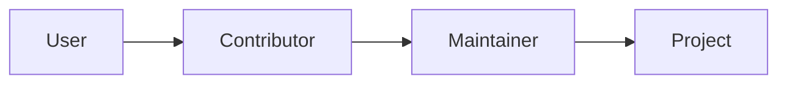

# 오픈소스란 무엇인가

> 오픈소스 101 시리즈 (1/10)


## 이 글에서 다룰 문제

*현대 소프트웨어* 의 *대부분* 이 *오픈소스* 위에서 *동작* 합니다.

## 개념 한눈에 보기



## Before/After

**Before**: "*오픈소스* 는 *공짜* 다."

**After**: "*오픈소스* 는 *읽고, 수정하고, 공유* 할 수 있는 *권리* 다."

## 실습: 오픈소스 탐색

### 1단계 — 저장소 찾기

```bash
gh search repos --language python --topic open-source
```

### 2단계 — 라이선스 확인

```bash
gh repo view fastapi/fastapi --json licenseInfo
```

### 3단계 — Contributors

```bash
gh api repos/fastapi/fastapi/contributors --jq '.[].login' | head
```

### 4단계 — Issue 보기

```bash
gh issue list --repo fastapi/fastapi --label "good first issue"
```

### 5단계 — Star 누르기

```bash
gh repo star fastapi/fastapi
```

## 이 코드에서 주목할 점

- *라이선스* 가 *권리* 를 정한다.
- *Contributors* 가 *공동 저자* 다.
- *good first issue* 가 *입구* 다.

## 자주 하는 실수 5가지

1. ***라이선스* 를 *읽지 않는다*.**
2. ***fork* 를 *upstream* 으로 *오해*.**
3. ***행동 강령* 을 *모른다*.**
4. ***Issue* 를 *질문방* 으로 사용.**
5. ***첫 PR* 이 *너무 크다*.**

## 실무에서는 이렇게 쓰입니다

회사 코드도 *오픈소스 라이브러리* 위에서 동작하며, 그 *라이선스* 를 따릅니다.

## 체크리스트

- [ ] *라이선스* 확인.
- [ ] *행동 강령* 읽기.
- [ ] *good first issue* 1개 찾기.
- [ ] *Contributing 가이드* 읽기.

## 정리 및 다음 단계

다음 글은 *라이선스 이해하기* 입니다.

<!-- toc:begin -->
- **오픈소스란 무엇인가 (현재 글)**
- 라이선스 이해하기 (예정)
- Issue 읽기 (예정)
- PR 만들기 (예정)
- 좋은 README (예정)
- Release 와 Versioning (예정)
- Community 관리 (예정)
- Maintainer 의 역할 (예정)
- 오픈소스 포트폴리오 (예정)
- 내 첫 오픈소스 프로젝트 (예정)
<!-- toc:end -->

## 참고 자료

- [Open Source Initiative](https://opensource.org/osd)
- [Free Software Foundation - GNU Project](https://www.gnu.org/philosophy/free-sw.html)
- [Open Source Guides - GitHub](https://opensource.guide/)
- [The Cathedral and the Bazaar - Eric Raymond](http://www.catb.org/~esr/writings/cathedral-bazaar/)

Tags: OpenSource, GitHub, Community, Contribution, Beginner
