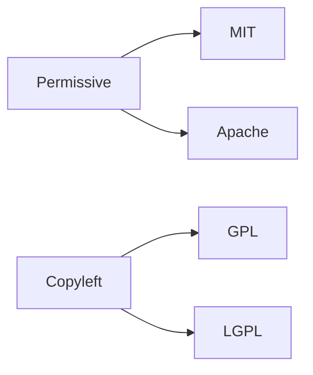

# 라이선스 이해하기

> 오픈소스 101 시리즈 (2/10)

<!-- a-grade-intro:begin -->

**핵심 질문**: *라이선스* 를 *모르고* 코드를 쓰면 *어떤 위험* 이 있나요?

> *법적 책임* 이 *나* 에게 옵니다.

<!-- a-grade-intro:end -->

## 이 글에서 배울 것

- *허용형* 과 *카피레프트* 차이
- *MIT, Apache, GPL* 비교
- *Public Domain* 의 의미
- *듀얼 라이선스*
- *호환성* 점검

## 왜 중요한가

*라이선스* 가 *프로젝트* 의 *미래* 를 결정합니다.

## 개념 한눈에 보기



## 핵심 용어 정리

- **permissive**: *허용형* 라이선스.
- **copyleft**: *카피레프트* 라이선스.
- **public domain**: *공개 영역*.
- **dual license**: *이중 라이선스*.
- **SPDX**: *라이선스 식별자 표준*.

## Before/After

**Before**: "*MIT* 든 *GPL* 이든 다 *오픈소스*."

**After**: "*MIT* 는 *팔아도* 되지만 *GPL* 은 *소스 공개* 가 *필수* 다."

## 실습: 라이선스 비교

### 1단계 — MIT 핵심

```text
허용: 사용, 수정, 배포, 판매
조건: 저작권 표기 유지
```

### 2단계 — Apache 2.0 핵심

```text
허용: MIT 와 동일
추가: 특허 라이선스 명시
```

### 3단계 — GPL v3 핵심

```text
허용: 사용, 수정, 배포
조건: 파생물 소스 공개
```

### 4단계 — SPDX 식별자

```yaml
license: MIT
```

### 5단계 — 라이선스 파일

```bash
curl -O https://choosealicense.com/licenses/mit/
```

## 이 코드에서 주목할 점

- *허용형* 은 *유연*.
- *카피레프트* 는 *전염*.
- *SPDX* 는 *표준 식별자*.

## 자주 하는 실수 5가지

1. ***라이선스* 를 *복사* 만 한다.**
2. ***저작권 표기* 를 *지운다*.**
3. ***GPL* 코드를 *상용* 에 *섞는다*.**
4. ***듀얼 라이선스* 를 *오해*.**
5. ***SPDX* 식별자가 *없다*.**

## 실무에서는 이렇게 쓰입니다

기업은 *라이선스 스캐너* (예: FOSSA, Snyk) 로 *호환성* 을 자동 검사합니다.

## 시니어 엔지니어는 이렇게 생각합니다

- *라이선스* 는 *법* 이다.
- *MIT* 는 *최소 마찰*.
- *GPL* 은 *공유 강제*.
- *Apache* 는 *특허 안전*.
- *듀얼* 은 *전략* 이다.

## 체크리스트

- [ ] *LICENSE* 파일 존재.
- [ ] *SPDX* 식별자 표기.
- [ ] *저작권* 표기 유지.
- [ ] *호환성* 점검.

## 연습 문제

1. *permissive* 와 *copyleft* 차이 한 줄.
2. *SPDX* 의 의미 한 줄.
3. *dual license* 의 예 한 줄.

## 정리 및 다음 단계

다음 글은 *Issue 읽기* 입니다.

<!-- toc:begin -->
- [오픈소스란 무엇인가](./01-what-is-open-source.md)
- **라이선스 이해하기 (현재 글)**
- Issue 읽기 (예정)
- PR 만들기 (예정)
- 좋은 README (예정)
- Release 와 Versioning (예정)
- Community 관리 (예정)
- Maintainer 의 역할 (예정)
- 오픈소스 포트폴리오 (예정)
- 내 첫 오픈소스 프로젝트 (예정)
<!-- toc:end -->

## 참고 자료

- [Choose a License](https://choosealicense.com/)
- [SPDX License List](https://spdx.org/licenses/)
- [Open Source Initiative Licenses](https://opensource.org/licenses)
- [tl;dr Legal](https://www.tldrlegal.com/)

Tags: OpenSource, License, MIT, GPL, Beginner
