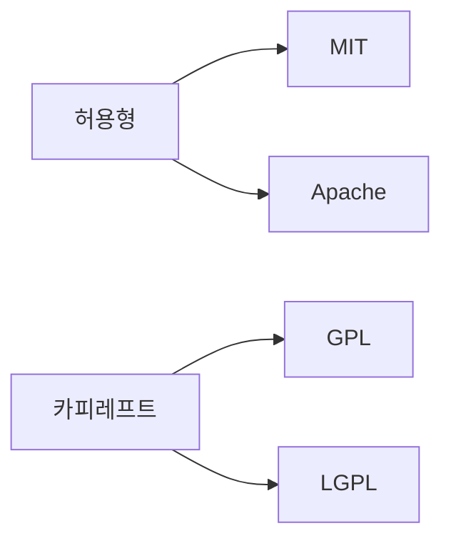

# 라이선스 이해하기

오픈소스를 쓰기 시작한 사람 대부분은 처음에는 기능과 사용성부터 봅니다. 그런데 실제로는 코드보다 먼저 읽어야 하는 문서가 있습니다. 바로 라이선스입니다. 어떤 권한이 허용되는지, 무엇을 남겨야 하는지, 어디까지 재배포할 수 있는지 모두 여기서 결정됩니다.

초보 단계에서는 MIT, Apache, GPL이 다 비슷해 보일 수 있습니다. 모두 오픈소스라는 공통점이 있기 때문입니다. 하지만 실무에서는 이 차이가 굉장히 큽니다. 라이선스를 잘못 이해한 채 제품에 코드를 넣으면, 기술 문제가 아니라 법적 문제를 끌어안게 됩니다.

## 이 글에서 다룰 문제

- permissive와 copyleft는 무엇이 다를까요?
- MIT, Apache 2.0, GPL v3는 각각 어떤 상황에서 부담이 달라질까요?
- SPDX 식별자는 왜 README보다 먼저 정리해야 할 때가 많을까요?
- public domain, dual license 같은 표현은 어떤 맥락에서 읽어야 할까요?
- 회사나 팀이 라이선스 스캐너를 돌리는 이유는 무엇일까요?

## 왜 중요한가

라이선스는 프로젝트의 현재보다 미래를 좌우합니다. 지금 당장 코드를 실행하는 데는 차이가 없어 보여도, 나중에 상용 제품에 포함할지, 수정본을 배포할지, 특허 위험을 어떻게 다룰지 같은 문제는 모두 라이선스 문장에서 갈립니다.

특히 오픈소스는 기술 선택과 법적 선택이 동시에 일어나는 영역입니다. 개발자는 편리한 라이브러리를 골랐다고 생각하지만, 조직 입장에서는 그 순간 배포 정책과 컴플라이언스 비용까지 함께 고른 셈이 됩니다.

## 먼저 잡아둘 멘탈 모델

> 라이선스는 저장소에 붙어 있는 장식이 아니라, 그 코드를 어디까지 어떻게 써도 되는지 적어 둔 사용 계약서입니다.



이 분류를 너무 단순한 선악 구도로 받아들일 필요는 없습니다. 허용형 라이선스는 재사용이 쉽고, 카피레프트 라이선스는 수정과 공유의 의무를 더 강하게 밀어 줍니다. 어느 쪽이 더 낫다기보다 프로젝트 목표와 배포 방식에 따라 부담이 달라진다고 보는 편이 현실적입니다.

## 핵심 개념

- permissive 라이선스는 사용, 수정, 배포, 상용 이용까지 비교적 넓게 허용합니다.
- copyleft 라이선스는 파생 저작물에도 공유 의무를 강하게 연결합니다.
- public domain은 저작권 제한을 사실상 두지 않는 개념이지만, 국가별 해석 차이까지 확인해야 합니다.
- dual license는 하나의 소프트웨어를 두 가지 라이선스 체계로 제공하는 방식입니다. 오픈소스와 상용 모델을 함께 운영할 때 자주 보입니다.
- SPDX는 라이선스를 짧고 일관된 식별자로 표현하는 표준입니다. 자동 검사 도구가 읽기 쉬워서 실무 가치가 큽니다.

중요한 점은 라이선스 이름을 외우는 것보다, 권한과 의무가 어디서 갈리는지 읽는 습관을 들이는 것입니다. 같은 오픈소스라도 판매 가능 여부, 고지 유지 의무, 소스 공개 의무, 특허 조항 유무는 꽤 다릅니다.

## 생각이 어떻게 바뀌는가

Before: MIT든 GPL이든 둘 다 오픈소스다.

After: 둘 다 오픈소스이지만, 재사용 조건과 배포 의무는 전혀 다를 수 있다.

## 직접 따라해 보기: 라이선스 비교 절차

### 1단계 — MIT의 핵심 읽기

MIT는 입문자가 가장 자주 만나는 라이선스입니다. 허용 범위가 넓고 조건이 비교적 단순해서 작은 도구나 라이브러리에서 많이 보입니다.

```text
Allows: use, modify, distribute, sell
Requires: keep the copyright notice
```

### 2단계 — Apache 2.0의 차이 보기

Apache 2.0은 MIT와 비슷해 보여도 특허 조항이 명시된다는 점에서 실무적으로 자주 구분됩니다.

```text
Allows: same as MIT
Adds: explicit patent grant
```

### 3단계 — GPL v3의 의무 읽기

GPL은 공유를 강하게 지키는 라이선스입니다. 사용만 하는 경우와 배포하는 경우를 구분해 읽어야 합니다.

```text
Allows: use, modify, distribute
Requires: derivative works share their source
```

### 4단계 — SPDX 식별자 확인하기

라이선스 파일만 두는 것으로 끝내지 말고, 자동 도구가 읽을 수 있는 식별자도 함께 정리해 두는 편이 좋습니다.

```yaml
license: MIT
```

### 5단계 — 원문 라이선스 가져오기

직접 복사해 붙이는 것보다 검증된 원문을 가져와 사용하는 편이 안전합니다.

```bash
curl -O https://choosealicense.com/licenses/mit/
```

## 이 예시에서 읽어야 할 포인트

- MIT는 마찰이 적은 대신, 공유 의무를 강제하지는 않습니다.
- Apache 2.0은 특허 조항 때문에 기업 환경에서 선호되는 경우가 있습니다.
- GPL은 파생물 공개 의무로 공동체 환원을 강하게 요구합니다.
- SPDX는 사람이 아니라 도구를 위해서도 필요합니다.

## 자주 하는 실수 5가지

1. 라이선스 텍스트를 복사만 하고 의미를 읽지 않습니다.
2. 저작권 고지를 지운 채 재배포합니다.
3. GPL 코드를 상용 제품에 넣고도 배포 의무를 검토하지 않습니다.
4. dual license 문서를 한쪽만 읽고 사용 범위를 오해합니다.
5. SPDX 식별자를 빼먹어 자동 검사 체인을 끊습니다.

## 실무에서는 이렇게 봅니다

기업은 보통 개발자 개인 판단만으로 라이선스를 도입하지 않습니다. FOSSA, Snyk 같은 스캐너로 의존성 트리를 훑고, 금지 목록이나 검토 목록을 따로 둡니다. 이유는 단순합니다. 한 번 릴리스된 제품 안에 들어간 코드의 법적 부담은 나중에 되돌리기 어렵기 때문입니다.

시니어 엔지니어도 라이선스를 법무팀 일로만 미루지 않습니다. 오히려 초기에 어떤 라이선스가 들어왔는지 파악하고, 저장소 문서와 패키지 메타데이터가 일관된지 확인하는 습관이 중요합니다. 나중에 문제를 해결하는 비용보다, 초기에 읽는 비용이 훨씬 싸기 때문입니다.

## 체크리스트

- [ ] LICENSE 파일이 있는지 확인했습니다.
- [ ] SPDX 식별자를 확인하거나 추가할 위치를 파악했습니다.
- [ ] 저작권 고지 유지 의무를 이해했습니다.
- [ ] 사용하려는 프로젝트와 내 프로젝트의 라이선스 호환성을 검토했습니다.

## 연습 문제

1. permissive와 copyleft의 차이를 한 문장으로 적어 보세요.
2. Apache 2.0이 MIT와 구분되는 대표 지점을 한 문장으로 적어 보세요.
3. dual license가 왜 비즈니스 전략이 될 수 있는지 설명해 보세요.

## 마무리

이번 글에서는 라이선스를 저장소의 부속 문서가 아니라 사용 조건을 적어 둔 계약서로 보는 관점을 정리했습니다. 오픈소스를 쓴다는 말은 기능만 가져온다는 뜻이 아니라, 그 코드에 붙어 있는 규칙도 함께 받아들인다는 뜻입니다.

다음 글에서는 이슈를 읽는 법을 다룹니다. 기여를 시작하려면 어떤 문제를 고를지, 그리고 그 문제를 어떻게 해석할지부터 분명해야 합니다.

<!-- toc:begin -->
- [오픈소스란 무엇인가](./01-what-is-open-source.md)
- **라이선스 이해하기 (현재 글)**
- Issue 읽기 (예정)
- PR 만들기 (예정)
- 좋은 README (예정)
- Release 와 Versioning (예정)
- Community 관리 (예정)
- Maintainer 의 역할 (예정)
- 오픈소스 포트폴리오 (예정)
- 내 첫 오픈소스 프로젝트 (예정)
<!-- toc:end -->

## 참고 자료

- [Choose a License](https://choosealicense.com/)
- [SPDX License List](https://spdx.org/licenses/)
- [Open Source Initiative Licenses](https://opensource.org/licenses)
- [tl;dr Legal](https://www.tldrlegal.com/)

Tags: OpenSource, License, MIT, GPL, Beginner
