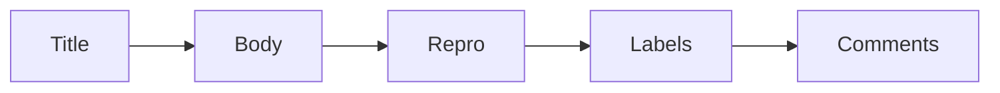

# Issue 읽기

> 오픈소스 101 시리즈 (3/10)


## 이 글에서 다룰 문제

*Issue* 를 *오해* 하면 *PR* 도 *틀어집니다*.

## 전체 흐름


## Before/After

**Before**: "*Issue* 가 *뭐* 라는 *건지* *모르겠다*."

**After**: "*제목 → 본문 → 라벨 → 댓글* 순서로 *맥락* 을 *잡는다*."

## Issue 분석하기

### 1단계 — 제목 읽기

```text
[Bug] login fails on Safari 15
```

### 2단계 — 라벨 확인

```text
labels: bug, good first issue, help wanted
```

### 3단계 — 재현 절차 확인

```markdown
1. open https://example.com/login
2. enter valid credentials
3. click submit
expected: dashboard
actual: 500 error
```

### 4단계 — 댓글 흐름

```text
maintainer: can you share browser version?
reporter: Safari 15.1 on macOS 12
```

### 5단계 — 기여 가능 여부 판단

```text
- 라벨에 good first issue ✓
- 재현 가능 ✓
- 담당자 미지정 ✓
→ 기여 시도
```

## 이 코드에서 주목할 점

- *제목* 은 *요약*.
- *라벨* 은 *맥락*.
- *댓글* 은 *합의*.

## 자주 하는 실수 5가지

1. ***제목* 만 보고 *PR* 을 *연다*.**
2. ***재현 절차* 를 *건너뛴다*.**
3. ***담당자* 가 *있는데* *작업* 한다.**
4. ***라벨* 을 *무시* 한다.**
5. ***댓글* 의 *결정* 을 *놓친다*.**

## 실무에서는 이렇게 쓰입니다

기업 내부 트래커도 *triage rotation* 을 두어 *우선순위* 를 *주간* 으로 정합니다.

## 체크리스트

- [ ] *제목* 읽음.
- [ ] *재현 절차* 확인.
- [ ] *라벨* 확인.
- [ ] *담당자* 확인.

## 정리 및 다음 단계

다음 글은 *PR 만들기* 입니다.

<!-- toc:begin -->
- [오픈소스란 무엇인가](./01-what-is-open-source.md)
- [라이선스 이해하기](./02-understanding-licenses.md)
- **Issue 읽기 (현재 글)**
- PR 만들기 (예정)
- 좋은 README (예정)
- Release 와 Versioning (예정)
- Community 관리 (예정)
- Maintainer 의 역할 (예정)
- 오픈소스 포트폴리오 (예정)
- 내 첫 오픈소스 프로젝트 (예정)
<!-- toc:end -->

## 참고 자료

- [GitHub Issues docs](https://docs.github.com/en/issues)
- [good first issue](https://github.blog/2020-01-22-how-we-built-good-first-issues/)
- [Triage guide](https://opensource.guide/best-practices/)
- [Issue templates](https://docs.github.com/en/communities/using-templates-to-encourage-useful-issues-and-pull-requests)

Tags: OpenSource, Issues, GitHub, Triage, Beginner
