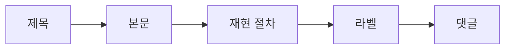

# Issue 읽기

오픈소스 기여를 처음 시도할 때 가장 흔한 실수는 문제를 충분히 이해하기 전에 바로 고치려고 드는 것입니다. 제목만 보고 작업을 시작하거나, 댓글을 끝까지 읽지 않거나, 이미 다른 사람이 맡은 일을 모르고 PR을 여는 경우가 대표적입니다.

좋은 기여는 좋은 코드보다 먼저 정확한 독해에서 시작합니다. 이슈는 단순한 할 일 목록이 아니라 문제 정의, 재현 절차, 우선순위, 프로젝트 내부 합의가 쌓여 있는 문서입니다. 이 글에서는 이슈를 어떻게 읽어야 실제 기여 지점을 찾을 수 있는지 정리하겠습니다.

## 이 글에서 다룰 문제

- GitHub Issue를 제목만 보고 판단하면 왜 자주 엇나갈까요?
- labels, repro, assignee, comments는 각각 어떤 역할을 할까요?
- good first issue 라벨이 붙었다고 무조건 쉬운 일은 아닌 이유는 무엇일까요?
- 댓글 스레드에서 이미 끝난 논의를 다시 반복하지 않으려면 무엇을 봐야 할까요?
- 내가 바로 기여해도 되는 이슈인지 어떻게 판단할 수 있을까요?

## 왜 중요한가

이슈를 잘못 읽으면 PR 방향도 틀어집니다. 문제를 재현하지 못한 채 수정에 들어가면 원인과 증상을 섞기 쉽고, 이미 합의된 해결 방향을 모르고 다른 방법을 제시하면 리뷰 비용만 늘어납니다. 초보자에게는 코드 실력보다 맥락 읽기 실수가 더 자주 발목을 잡습니다.

반대로 이슈를 차분히 읽을 줄 알면 작은 기여도 훨씬 잘 맞아 들어갑니다. 내가 무엇을 고치려는지, 누가 이미 논의했고, 어디까지가 범위인지 분명해지기 때문입니다.

## 먼저 잡아둘 멘탈 모델

> 이슈는 버그 신고서가 아니라 문제에 대한 공동 작업 기록입니다. 제목은 요약이고, 본문은 상황 설명이며, 댓글은 합의의 역사입니다.



읽는 순서가 중요한 이유도 여기 있습니다. 제목만 보면 증상만 보이고, 댓글만 먼저 보면 맥락이 흐려집니다. 기본 정보에서 세부 정보로 내려가는 흐름을 지키는 편이 실수를 줄입니다.

## 핵심 개념

- issue는 버그 보고, 기능 제안, 질문, 작업 요청까지 포함하는 작업 단위입니다.
- label은 문제의 종류와 난이도, 우선순위, 담당 범주를 드러냅니다.
- triage는 이슈를 분류하고 정렬하는 과정입니다.
- repro는 문제를 다시 일으키는 절차입니다. 버그 이슈에서는 거의 증거에 가깝습니다.
- assignee는 현재 작업 책임자가 있는지 보여 줍니다.

이 개념들을 알고 읽으면 이슈가 막연한 게시글처럼 보이지 않고, 어떤 정보가 빠졌는지까지 눈에 들어옵니다.

## 생각이 어떻게 바뀌는가

Before: 이슈가 정확히 무엇을 요구하는지 모르겠다.

After: 제목, 본문, 라벨, 댓글 순서로 읽으면 기여 가능한지 판단할 수 있다.

## 직접 따라해 보기: 이슈 분석 절차

### 1단계 — 제목에서 문제의 종류 파악하기

제목은 가장 짧은 요약입니다. 버그인지, 기능 요청인지, 환경 의존 문제인지 먼저 식별해야 합니다.

```text
[Bug] login fails on Safari 15
```

### 2단계 — 라벨에서 맥락 읽기

라벨은 프로젝트가 이 문제를 어떻게 분류하고 있는지 보여 줍니다. 초보자에게는 본문보다 라벨이 더 직접적인 힌트가 될 때도 많습니다.

```text
labels: bug, good first issue, help wanted
```

### 3단계 — 재현 절차 확인하기

버그 이슈라면 재현 가능 여부가 가장 중요합니다. 재현되지 않는 문제는 고치는 방향도 흐려집니다.

```markdown
1. open https://example.com/login
2. enter valid credentials
3. click submit
expected: dashboard
actual: 500 error
```

### 4단계 — 댓글 스레드 따라가기

메인테이너가 추가 정보를 요청했는지, 이미 해결 방향이 정해졌는지, 비슷한 PR이 있는지 댓글에서 확인해야 합니다.

```text
maintainer: can you share browser version?
reporter: Safari 15.1 on macOS 12
```

### 5단계 — 지금 참여해도 되는지 판단하기

good first issue가 붙어 있어도 담당자가 있거나 재현이 불가능하면 당장 들어가기 어렵습니다. 마지막에는 기여 가능 여부를 냉정하게 판단해야 합니다.

```text
- label has good first issue ✓
- repro reproducible ✓
- no assignee ✓
→ attempt the contribution
```

## 이 예시에서 읽어야 할 포인트

- 제목은 증상을 압축한 요약입니다.
- 라벨은 프로젝트 내부 분류 체계입니다.
- 재현 절차는 버그를 논의 가능한 상태로 바꿔 줍니다.
- 댓글은 이미 지나간 의사결정의 기록입니다.

결국 이슈를 잘 읽는다는 말은 텍스트를 훑는다는 뜻이 아니라, 문제 정의가 완성되었는지 확인한다는 뜻입니다.

## 자주 하는 실수 5가지

1. 제목만 읽고 곧바로 PR을 엽니다.
2. 재현 절차를 직접 실행해 보지 않습니다.
3. assignee가 있는 이슈를 확인 없이 가져갑니다.
4. 라벨 체계를 무시하고 난이도를 오판합니다.
5. 댓글 안에 숨어 있는 결정 사항을 놓칩니다.

## 실무에서는 이렇게 봅니다

회사 내부 이슈 트래커도 결국 같은 원리로 움직입니다. 제목은 요약, 본문은 상황 설명, 댓글은 의사결정 기록이라는 구조는 GitHub 이슈와 크게 다르지 않습니다. 그래서 오픈소스 이슈를 잘 읽는 습관은 그대로 실무 triage 감각으로 이어집니다.

시니어 엔지니어는 이슈를 해결 목록이 아니라 합의 문서로 봅니다. 누가 어떤 근거로 우선순위를 정했는지, 왜 이 문제를 지금 고치는지, 수정 범위가 어디까지인지 먼저 읽고 움직입니다. 이 단계가 탄탄하면 구현은 오히려 빨라집니다.

## 체크리스트

- [ ] 제목과 본문을 끝까지 읽었습니다.
- [ ] 재현 절차를 확인하거나 직접 따라해 보았습니다.
- [ ] 라벨과 assignee 상태를 확인했습니다.
- [ ] 댓글에서 이미 정리된 합의가 있는지 확인했습니다.

## 연습 문제

1. good first issue 라벨의 의미를 한 문장으로 적어 보세요.
2. triage를 한 문장으로 설명해 보세요.
3. 재현 절차가 없는 버그 이슈의 위험을 한 문장으로 적어 보세요.

## 마무리

이번 글에서는 이슈를 읽는 순서와 기준을 정리했습니다. 중요한 점은 이슈를 문제 제기 글이 아니라 공동 작업 기록으로 보는 시각입니다. 이 관점이 생기면 어떤 이슈를 골라야 할지, 어디까지 준비한 뒤에 기여를 시작해야 할지가 훨씬 분명해집니다.

다음 글에서는 이렇게 읽어 낸 문제를 실제 PR로 연결하는 과정을 다룹니다. 작은 변경을 어떻게 깔끔한 기여 단위로 만들지 이어서 보겠습니다.

<!-- toc:begin -->
- [오픈소스란 무엇인가](./01-what-is-open-source.md)
- [라이선스 이해하기](./02-understanding-licenses.md)
- **Issue 읽기 (현재 글)**
- PR 만들기 (예정)
- 좋은 README (예정)
- Release 와 Versioning (예정)
- Community 관리 (예정)
- Maintainer 의 역할 (예정)
- 오픈소스 포트폴리오 (예정)
- 내 첫 오픈소스 프로젝트 (예정)
<!-- toc:end -->

## 참고 자료

- [GitHub Issues docs](https://docs.github.com/en/issues)
- [good first issue](https://github.blog/2020-01-22-how-we-built-good-first-issues/)
- [Triage guide](https://opensource.guide/best-practices/)
- [Issue templates](https://docs.github.com/en/communities/using-templates-to-encourage-useful-issues-and-pull-requests)

Tags: OpenSource, Issues, GitHub, Triage, Beginner
