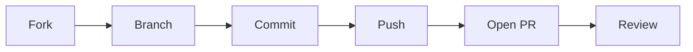

# PR 만들기

> 오픈소스 101 시리즈 (4/10)


## 이 글에서 다룰 문제

*PR* 의 *품질* 이 *기여* 의 *수락 여부* 를 *결정* 합니다.

## 개념 한눈에 보기



## Before/After

**Before**: "*main* 에 *바로* *push* 한다."

**After**: "*fork → branch → PR* 흐름을 *지킨다*."

## 실습: 첫 PR 만들기

### 1단계 — 포크와 클론

```bash
gh repo fork owner/repo --clone
cd repo
```

### 2단계 — 브랜치 생성

```bash
git checkout -b fix/login-safari
```

### 3단계 — 커밋

```bash
git commit -m "fix: handle Safari 15 cookie quirk"
```

### 4단계 — 푸시

```bash
git push origin fix/login-safari
```

### 5단계 — PR 열기

```bash
gh pr create --title "fix: Safari 15 login" \
  --body "Closes #42"
```

## 이 코드에서 주목할 점

- *커밋* 은 *작게*.
- *제목* 은 *요약*.
- *본문* 은 *맥락*.

## 자주 하는 실수 5가지

1. ***main* 에서 *작업* 한다.**
2. ***커밋 메시지* 가 *모호* 하다.**
3. ***테스트* 없이 *PR* 을 *연다*.**
4. ***Issue* 를 *연결* *하지* *않는다*.**
5. ***리뷰* *피드백* 을 *무시* 한다.**

## 실무에서는 이렇게 쓰입니다

기업도 *trunk-based* 에서 *PR* 을 *기본 단위* 로 *코드 리뷰* 합니다.

## 체크리스트

- [ ] *브랜치* 분리.
- [ ] *테스트* 통과.
- [ ] *Issue* 연결.
- [ ] *설명* 명확.

## 정리 및 다음 단계

다음 글은 *좋은 README* 입니다.

<!-- toc:begin -->
- [오픈소스란 무엇인가](./01-what-is-open-source.md)
- [라이선스 이해하기](./02-understanding-licenses.md)
- [Issue 읽기](./03-reading-issues.md)
- **PR 만들기 (현재 글)**
- 좋은 README (예정)
- Release 와 Versioning (예정)
- Community 관리 (예정)
- Maintainer 의 역할 (예정)
- 오픈소스 포트폴리오 (예정)
- 내 첫 오픈소스 프로젝트 (예정)
<!-- toc:end -->

## 참고 자료

- [GitHub PR docs](https://docs.github.com/en/pull-requests)
- [Conventional Commits](https://www.conventionalcommits.org/)
- [How to write a Git commit message](https://cbea.ms/git-commit/)
- [gh CLI](https://cli.github.com/manual/gh_pr_create)

Tags: OpenSource, PullRequest, Git, GitHub, Beginner
