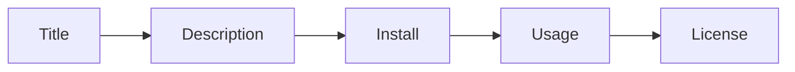

# 좋은 README

> 오픈소스 101 시리즈 (5/10)


## 이 글에서 다룰 문제

*README* 는 *프로젝트* 의 *얼굴* 입니다.

## 개념 한눈에 보기



## Before/After

**Before**: "*README* 가 *비어 있다*."

**After**: "*5분* 안에 *설치 → 실행* 이 *가능* 하다."

## 실습: README 만들기

### 1단계 — 제목과 한 줄 설명

```markdown
# my-project

> A tiny tool that does X in one command.
```

### 2단계 — 배지

```markdown

```

### 3단계 — 설치

```markdown
## Install

\`\`\`bash
pip install my-project
\`\`\`
```

### 4단계 — 사용 예시

```markdown
## Usage

\`\`\`bash
my-project --help
\`\`\`
```

### 5단계 — 라이선스

```markdown
## License

MIT © 2026 Author Name
```

## 이 코드에서 주목할 점

- *제목* 은 *명확*.
- *예시* 는 *실행 가능*.
- *라이선스* 는 *필수*.

## 자주 하는 실수 5가지

1. ***설치 명령* 을 *빠뜨린다*.**
2. ***예시* 가 *실행* 이 *안 된다*.**
3. ***스크린샷* 만 있고 *설명* 이 *없다*.**
4. ***라이선스* 를 *생략* 한다.**
5. ***README* 가 *너무 길다*.**

## 실무에서는 이렇게 쓰입니다

기업도 *내부 라이브러리* 의 *README* 를 *온보딩 문서* 로 *활용* 합니다.

## 체크리스트

- [ ] *제목* + *한 줄*.
- [ ] *설치* 명령.
- [ ] *사용 예시*.
- [ ] *라이선스*.

## 정리 및 다음 단계

다음 글은 *Release 와 Versioning* 입니다.

<!-- toc:begin -->
- [오픈소스란 무엇인가](./01-what-is-open-source.md)
- [라이선스 이해하기](./02-understanding-licenses.md)
- [Issue 읽기](./03-reading-issues.md)
- [PR 만들기](./04-creating-pull-requests.md)
- **좋은 README (현재 글)**
- Release 와 Versioning (예정)
- Community 관리 (예정)
- Maintainer 의 역할 (예정)
- 오픈소스 포트폴리오 (예정)
- 내 첫 오픈소스 프로젝트 (예정)
<!-- toc:end -->

## 참고 자료

- [Make a README](https://www.makeareadme.com/)
- [GitHub README guide](https://docs.github.com/en/repositories/managing-your-repositorys-settings-and-features/customizing-your-repository/about-readmes)
- [Awesome README](https://github.com/matiassingers/awesome-readme)
- [Shields.io](https://shields.io/)

Tags: OpenSource, README, Documentation, GitHub, Beginner
