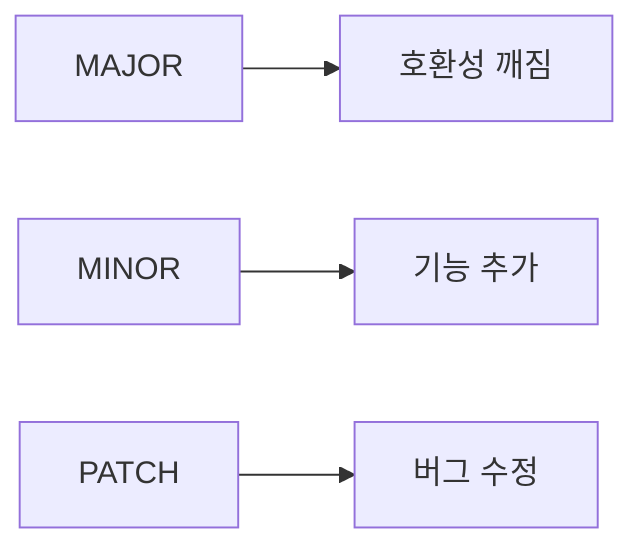

# Release 와 Versioning

프로젝트를 처음 공개할 때는 코드가 돌아가기만 하면 된다고 생각하기 쉽습니다. 그런데 사용자가 생기기 시작하면 다른 문제가 바로 따라옵니다. 이번 배포가 호환성을 깨는지, 버그 수정만 들어갔는지, 지금 업데이트해도 되는지 사용자에게 어떻게 알려 줄 것인지가 중요해집니다.

버전 번호는 단순한 숫자가 아닙니다. 프로젝트가 사용자와 맺는 약속에 가깝습니다. 변경 기록은 그 약속이 실제로 어떻게 바뀌었는지 남기는 문서입니다. 이 둘이 흔들리면 코드보다 신뢰가 먼저 흔들립니다.

## 이 글에서 다룰 문제

- 시맨틱 버전의 세 숫자는 각각 어떤 위험과 변화를 전달할까요?
- 사전 릴리스 태그는 언제 써야 하고, 왜 생략하면 안 될까요?
- 변경 기록은 릴리스 노트와 어떻게 연결될까요?
- 태그는 브랜치와 무엇이 다르고 왜 배포 재현성에 중요할까요?
- 자동 릴리스 파이프라인은 어떤 시점부터 필요해질까요?

## 왜 중요한가

버전 번호가 일관되지 않으면 사용자는 업데이트를 두려워하게 됩니다. 호환성을 깨는 변경이 PATCH로 나가거나, 기능 추가가 아무 설명 없이 배포되면 프로젝트를 믿기 어렵습니다. 생태계는 기능보다 예측 가능성을 더 오래 기억합니다.

오픈소스뿐 아니라 내부 라이브러리도 마찬가지입니다. 의존성이 늘어날수록 버전 표기와 변경 기록은 협업 비용을 줄이는 핵심 수단이 됩니다.

## 먼저 잡아둘 멘탈 모델

> 버전 번호는 릴리스의 크기를 말해 주고, 변경 기록은 그 변화의 내용을 설명해 주는 두 겹의 안내문입니다.



시맨틱 버전을 암기 규칙처럼만 외우면 금방 잊습니다. 대신 사용자 입장에서 이해하면 쉽습니다. MAJOR는 조심하라는 신호이고, MINOR는 새로운 기능이 들어왔다는 신호이며, PATCH는 큰 사용법 변화 없이 안심하고 올릴 가능성이 높다는 신호입니다.

## 핵심 개념

- 시맨틱 버전은 MAJOR.MINOR.PATCH 규칙으로 변화를 표현합니다.
- 호환성 깨짐 변경은 이전 사용법과 맞지 않는 수정입니다.
- 변경 기록은 버전별 변경 이력을 기록하는 문서입니다.
- 태그는 특정 커밋을 고정하는 불변 참조입니다.
- 사전 릴리스는 정식 배포 전 시험판을 뜻합니다.

이 다섯 가지가 함께 돌아가야 릴리스가 읽히는 상태가 됩니다. 버전만 있고 변경 기록이 없으면 이유를 모르고, 변경 기록만 있고 태그가 없으면 정확히 무엇을 배포했는지 재현하기 어렵습니다.

## 생각이 어떻게 바뀌는가

Before: 날짜나 느낌으로 버전을 붙여도 된다.

After: 시맨틱 버전은 사용자에게 영향 범위를 전달하는 신호 체계다.

## 직접 따라해 보기: 릴리스 절차

### 1단계 — 버전 결정하기

이번 변경이 새 기능인지, 버그 수정인지, 호환성을 깨는지부터 판단해야 합니다. 이 판단이 버전 번호의 출발점입니다.

```text
1.2.3 → 1.3.0 (new feature)
1.2.3 → 2.0.0 (breaking change)
1.2.3 → 1.2.4 (bug fix)
```

### 2단계 — 변경 기록 갱신하기

배포 후에 기억을 더듬어 쓰지 말고, 릴리스 직전에 변경점을 정리하는 습관이 좋습니다. 누가 봐도 추가, 수정, 제거가 구분되게 쓰면 더 좋습니다.

```markdown
## [1.3.0] - 2026-05-04
### 추가됨
- new --json flag
```

### 3단계 — 태그 만들기

태그는 배포된 상태를 고정합니다. 나중에 버그가 나도 정확히 어느 커밋이 릴리스였는지 다시 가리킬 수 있습니다.

```bash
git tag -a v1.3.0 -m "v1.3.0"
git push origin v1.3.0
```

### 4단계 — 릴리스 노트 발행하기

GitHub Release는 변경 기록을 사용자에게 전달하는 공개 창구입니다. 태그만 푸시하고 끝내지 말고, 읽을 수 있는 형태로 남기는 편이 좋습니다.

```bash
gh release create v1.3.0 --notes-file CHANGELOG.md
```

### 5단계 — 자동화 연결하기

릴리스가 반복되면 사람 손으로 빠뜨릴 가능성이 커집니다. 태그를 기준으로 배포가 자동으로 열리게 두면 재현성과 일관성이 좋아집니다.

```yaml
on:
  push:
    tags: ['v*']
jobs:
  release:
    runs-on: ubuntu-latest
```

## 이 예시에서 읽어야 할 포인트

- MAJOR는 사용자에게 경고를 보내는 숫자입니다.
- MINOR는 기존 사용 흐름을 유지한 채 기능을 넓힙니다.
- PATCH는 자주, 작게, 안전하게 나가는 편이 좋습니다.
- 변경 기록과 태그가 연결되어야 릴리스를 신뢰할 수 있습니다.

## 자주 하는 실수 5가지

1. 호환성을 깨는 변경을 MINOR로 배포합니다.
2. 변경 기록 없이 릴리스를 밀어 넣습니다.
3. 버전 문자열과 태그가 서로 다릅니다.
4. 시험판 구분을 생략합니다.
5. 릴리스 노트를 비워 둡니다.

## 실무에서는 이렇게 봅니다

시니어 엔지니어는 버전 번호를 기술 장식이 아니라 소통 수단으로 봅니다. 버전 표기가 정확하면 업그레이드 판단이 빨라지고, 변경 기록이 좋으면 지원 비용이 줄어듭니다. 반대로 릴리스가 불투명하면 사용자는 오래된 버전에 머무르기 쉽습니다.

회사 내부 패키지에서도 원리는 같습니다. 배포 대상이 외부 커뮤니티냐 내부 팀이냐만 다를 뿐, 버전 계약과 변경 이력의 중요성은 그대로입니다.

## 체크리스트

- [ ] 이번 변경에 맞는 버전을 골랐습니다.
- [ ] 변경 기록을 업데이트했습니다.
- [ ] 태그를 만들고 푸시할 준비를 했습니다.
- [ ] 릴리스 노트를 공개할 방법을 정했습니다.

## 연습 문제

1. breaking change 예시를 한 문장으로 적어 보세요.
2. 사전 릴리스 태그 예시를 한 줄 적어 보세요.
3. 태그와 브랜치의 차이를 한 문장으로 적어 보세요.

## 마무리

이번 글에서는 릴리스와 버전 관리를 코드 배포 절차가 아니라 사용자와의 약속 관리로 보는 관점을 정리했습니다. 시맨틱 버전과 변경 기록이 함께 움직이면 프로젝트는 훨씬 예측 가능해집니다.

다음 글에서는 커뮤니티 관리를 다룹니다. 코드를 공개하고 릴리스까지 했다면, 이제는 사람들이 오래 머물 수 있는 환경을 만들어야 합니다.

<!-- toc:begin -->
- [오픈소스란 무엇인가](./01-what-is-open-source.md)
- [라이선스 이해하기](./02-understanding-licenses.md)
- [Issue 읽기](./03-reading-issues.md)
- [PR 만들기](./04-creating-pull-requests.md)
- [좋은 README](./05-good-readme.md)
- **Release 와 Versioning (현재 글)**
- Community 관리 (예정)
- Maintainer 의 역할 (예정)
- 오픈소스 포트폴리오 (예정)
- 내 첫 오픈소스 프로젝트 (예정)
<!-- toc:end -->

## 참고 자료

- [Semantic Versioning](https://semver.org/)
- [Keep a Changelog](https://keepachangelog.com/)
- [GitHub Releases](https://docs.github.com/en/repositories/releasing-projects-on-github)
- [git tag docs](https://git-scm.com/docs/git-tag)

Tags: OpenSource, SemVer, Release, Changelog, Beginner
