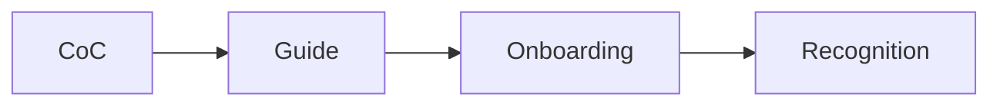

# Community 관리

> 오픈소스 101 시리즈 (7/10)


## 이 글에서 다룰 문제

*커뮤니티* 가 *살아 있어야* *프로젝트* 도 *살아남* 습니다.

## 전체 흐름


## Before/After

**Before**: "*Issue* 댓글이 *공격적* 이다."

**After**: "*행동 강령* 으로 *경계* 를 *명시* 한다."

## 커뮤니티 문서

### 1단계 — Code of Conduct

```bash
curl -O https://www.contributor-covenant.org/version/2/1/code_of_conduct.md
```

### 2단계 — CONTRIBUTING.md

```markdown
## How to contribute

1. Fork
2. Branch
3. Test
4. PR
```

### 3단계 — Issue 템플릿

```yaml
name: Bug Report
about: Report a bug
labels: bug
```

### 4단계 — Discussions

```text
- Q&A
- Show and tell
- Ideas
```

### 5단계 — 인사 자동화

```yaml
- uses: actions/first-interaction@v1
  with:
    pr-message: "Thanks for your first PR!"
```

## 이 코드에서 주목할 점

- *CoC* 는 *경계*.
- *템플릿* 은 *가이드*.
- *환영* 은 *온보딩*.

## 자주 하는 실수 5가지

1. ***CoC* 가 *없다*.**
2. ***응답* 이 *느리다*.**
3. ***신규 기여자* 를 *방치* 한다.**
4. ***토론* 과 *Issue* 를 *섞는다*.**
5. ***인정* 표현이 *없다*.**

## 실무에서는 이렇게 쓰입니다

기업도 *DevRel* 팀이 *외부 커뮤니티* 와 *유사한* *방식* 으로 *내부 채널* 을 *운영* 합니다.

## 체크리스트

- [ ] *CoC* 채택.
- [ ] *CONTRIBUTING* 작성.
- [ ] *Issue* 템플릿.
- [ ] *Discussions* 활성화.

## 정리 및 다음 단계

다음 글은 *Maintainer 의 역할* 입니다.

<!-- toc:begin -->
- [오픈소스란 무엇인가](./01-what-is-open-source.md)
- [라이선스 이해하기](./02-understanding-licenses.md)
- [Issue 읽기](./03-reading-issues.md)
- [PR 만들기](./04-creating-pull-requests.md)
- [좋은 README](./05-good-readme.md)
- [Release 와 Versioning](./06-release-and-versioning.md)
- **Community 관리 (현재 글)**
- Maintainer 의 역할 (예정)
- 오픈소스 포트폴리오 (예정)
- 내 첫 오픈소스 프로젝트 (예정)
<!-- toc:end -->

## 참고 자료

- [Contributor Covenant](https://www.contributor-covenant.org/)
- [Open Source Guides — Building Communities](https://opensource.guide/building-community/)
- [GitHub Discussions](https://docs.github.com/en/discussions)
- [first-interaction action](https://github.com/actions/first-interaction)

Tags: OpenSource, Community, CodeOfConduct, Governance, Beginner
