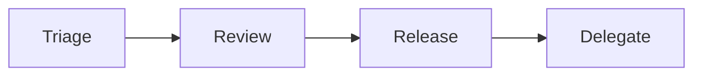

# Maintainer 의 역할

> 오픈소스 101 시리즈 (8/10)

<!-- a-grade-intro:begin -->

**핵심 질문**: *Maintainer* 는 *어떤* *일* 을 *하고* *어떻게* *번아웃* 을 *피할까요*?

> *우선순위*, *위임*, *경계* 가 *답* 입니다.

<!-- a-grade-intro:end -->

## 이 글에서 배울 것

- *Maintainer* 의 *책임*
- *Triage* 루틴
- *위임* 과 *권한*
- *번아웃* *방지*
- *후계자* *육성*

## 왜 중요한가

*Maintainer* 의 *건강* 이 *프로젝트* 의 *수명* 입니다.

## 개념 한눈에 보기



## 핵심 용어 정리

- **maintainer**: *관리자*.
- **triage**: *분류*.
- **review**: *검토*.
- **delegate**: *위임*.
- **bus factor**: *버스 지수*.

## Before/After

**Before**: "*혼자* *모든* *Issue* 를 *처리* 한다."

**After**: "*신뢰* 한 *기여자* 에게 *권한* 을 *나눈다*."

## 실습: Maintainer 루틴

### 1단계 — 주간 Triage

```text
월요일 30분: 라벨링, 우선순위 지정
```

### 2단계 — PR 리뷰

```text
이틀 내 1차 응답을 목표
```

### 3단계 — 릴리스

```text
주 1회 패치, 월 1회 마이너
```

### 4단계 — 위임

```text
GitHub Org → Teams → write 권한
```

### 5단계 — 휴식

```markdown
> Maintainer is on vacation Aug 1-14.
```

## 이 코드에서 주목할 점

- *루틴* 이 *피로* 를 *줄인다*.
- *권한 위임* 이 *지속* *가능*.
- *공지* 가 *기대* *관리*.

## 자주 하는 실수 5가지

1. ***모든* *PR* 을 *혼자* *리뷰* 한다.**
2. ***휴식* 을 *공지* *하지* *않는다*.**
3. ***bus factor = 1* 로 *방치* 한다.**
4. ***라벨* 이 *없다*.**
5. ***후계자* 를 *키우지* *않는다*.**

## 실무에서는 이렇게 쓰입니다

기업의 *Tech Lead* 도 *Maintainer* 와 *유사* 한 *책임* 을 *집니다*.

## 시니어 엔지니어는 이렇게 생각합니다

- *Maintainer* 는 *지휘자*.
- *위임* 이 *규모*.
- *루틴* 이 *체력*.
- *공지* 가 *경계*.
- *후계자* 가 *유산*.

## 체크리스트

- [ ] *주간* *Triage*.
- [ ] *위임* 권한 부여.
- [ ] *휴식* 공지.
- [ ] *bus factor ≥ 2*.

## 연습 문제

1. *bus factor* 한 줄 정의.
2. *triage* 와 *review* 차이 한 줄.
3. *후계자* *육성* 의 *방법* 한 줄.

## 정리 및 다음 단계

다음 글은 *오픈소스 포트폴리오* 입니다.

<!-- toc:begin -->
- [오픈소스란 무엇인가](./01-what-is-open-source.md)
- [라이선스 이해하기](./02-understanding-licenses.md)
- [Issue 읽기](./03-reading-issues.md)
- [PR 만들기](./04-creating-pull-requests.md)
- [좋은 README](./05-good-readme.md)
- [Release 와 Versioning](./06-release-and-versioning.md)
- [Community 관리](./07-community-management.md)
- **Maintainer 의 역할 (현재 글)**
- 오픈소스 포트폴리오 (예정)
- 내 첫 오픈소스 프로젝트 (예정)
<!-- toc:end -->

## 참고 자료

- [Open Source Guides — Maintainer](https://opensource.guide/best-practices/)
- [Bus factor](https://en.wikipedia.org/wiki/Bus_factor)
- [Maintainer Burnout](https://opensource.guide/maintainer-mental-health/)
- [GitHub Teams](https://docs.github.com/en/organizations/organizing-members-into-teams)

Tags: OpenSource, Maintainer, Triage, Burnout, Beginner
