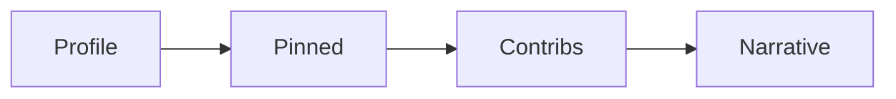

# 오픈소스 포트폴리오

> 오픈소스 101 시리즈 (9/10)

<!-- a-grade-intro:begin -->

**핵심 질문**: *오픈소스* *기여* 가 *어떻게* *포트폴리오* 가 *되나요*?

> *맥락*, *증거*, *서사* 를 *함께* *제시* 합니다.

<!-- a-grade-intro:end -->

## 이 글에서 배울 것

- *프로필* *최적화*
- *Pinned* 저장소
- *PR* 큐레이션
- *기여* *서사*
- *지속* *증거*

## 왜 중요한가

*포트폴리오* 는 *경력* 의 *증거* 입니다.

## 개념 한눈에 보기



## 핵심 용어 정리

- **profile README**: *자기소개* 저장소.
- **pinned**: *고정* 저장소.
- **contributions**: *활동* 그래프.
- **narrative**: *서사*.
- **proof of work**: *작업* *증거*.

## Before/After

**Before**: "*GitHub* 에 *fork* 만 *가득* 하다."

**After**: "*세 개* 의 *대표 PR* 과 *하나* 의 *자작 프로젝트* 가 *고정* 되어 있다."

## 실습: 포트폴리오 정비

### 1단계 — Profile README

```bash
gh repo create <username> --public
echo "# Hi, I am ..." > README.md
```

### 2단계 — Pinned 6개 선정

```text
- 자작 프로젝트 1
- 의미 있는 PR 3
- 학습 노트 1
- 기여한 OSS 1
```

### 3단계 — PR 인덱스

```markdown
## Notable PRs
- pandas#123 — Fix x
- requests#456 — Add y
```

### 4단계 — 기여 서사

```markdown
## Story
Started with docs, moved to bugs, now feature work.
```

### 5단계 — 지속 증거

```text
주 2 commits 이상, 3개월 연속
```

## 이 코드에서 주목할 점

- *서사* 가 *맥락*.
- *Pinned* 가 *얼굴*.
- *지속* 이 *신뢰*.

## 자주 하는 실수 5가지

1. ***fork* 만 *쌓는다*.**
2. ***README* 가 *비어 있다*.**
3. ***PR* 링크가 *깨져 있다*.**
4. ***활동* 이 *간헐적*.**
5. ***설명* 이 *없다*.**

## 실무에서는 이렇게 쓰입니다

기업 *채용* 시에도 *GitHub* 활동을 *기술 인터뷰* *전* *참고* 자료로 *활용* 합니다.

## 시니어 엔지니어는 이렇게 생각합니다

- *서사* 가 *데이터* 를 *이긴다*.
- *세 개* 가 *서른 개* 보다 *낫다*.
- *지속* 이 *재능* 이다.
- *PR 링크* 가 *증거*.
- *Profile README* 가 *입구*.

## 체크리스트

- [ ] *Profile README* 작성.
- [ ] *Pinned 6개* 선정.
- [ ] *Notable PRs* 인덱스.
- [ ] *3개월* 활동.

## 연습 문제

1. *pinned* 와 *fork* 차이 한 줄.
2. *Profile README* 의 *목적* 한 줄.
3. *지속 증거* 의 *예* 한 줄.

## 정리 및 다음 단계

다음 글은 *내 첫 오픈소스 프로젝트* 입니다.

<!-- toc:begin -->
- [오픈소스란 무엇인가](./01-what-is-open-source.md)
- [라이선스 이해하기](./02-understanding-licenses.md)
- [Issue 읽기](./03-reading-issues.md)
- [PR 만들기](./04-creating-pull-requests.md)
- [좋은 README](./05-good-readme.md)
- [Release 와 Versioning](./06-release-and-versioning.md)
- [Community 관리](./07-community-management.md)
- [Maintainer 의 역할](./08-maintainer-role.md)
- **오픈소스 포트폴리오 (현재 글)**
- 내 첫 오픈소스 프로젝트 (예정)
<!-- toc:end -->

## 참고 자료

- [GitHub Profile README](https://docs.github.com/en/account-and-profile/setting-up-and-managing-your-github-profile)
- [Pinning items](https://docs.github.com/en/account-and-profile/setting-up-and-managing-your-github-profile/customizing-your-profile/pinning-items-to-your-profile)
- [Open Source Guides — Finding Users](https://opensource.guide/finding-users/)
- [Hiring with GitHub](https://github.com/readme)

Tags: OpenSource, Portfolio, Career, GitHub, Beginner
