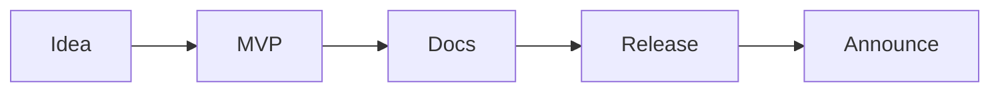

# 내 첫 오픈소스 프로젝트

> 오픈소스 101 시리즈 (10/10)


## 이 글에서 다룰 문제

*공개* 가 *학습* 을 *완성* 합니다.

## 전체 흐름


## Before/After

**Before**: "*아이디어* 만 *있고* *코드* 가 *없다*."

**After**: "*v0.1.0* 을 *공개* 하고 *피드백* 을 *받는다*."

## 첫 프로젝트 공개

### 1단계 — 아이디어와 범위

```markdown
- 이름: tinytool
- 목적: 한 줄 명령으로 X
- 비목적: GUI, 다국어
```

### 2단계 — MVP 코드

```bash
mkdir tinytool && cd tinytool
git init
python -m venv .venv
```

### 3단계 — 문서 5종

```text
README.md
LICENSE
CONTRIBUTING.md
CODE_OF_CONDUCT.md
CHANGELOG.md
```

### 4단계 — v0.1.0 릴리스

```bash
git tag v0.1.0
gh release create v0.1.0 --generate-notes
```

### 5단계 — 공지

```markdown
> Released tinytool v0.1.0. Feedback welcome!
```

## 이 코드에서 주목할 점

- *범위* 가 *작다*.
- *문서* 가 *완비*.
- *공지* 가 *유입*.

## 자주 하는 실수 5가지

1. ***완벽주의* 로 *공개* 가 *늦다*.**
2. ***라이선스* 가 *없다*.**
3. ***README* 가 *모호* 하다.**
4. ***피드백* 채널이 *없다*.**
5. ***로드맵* 이 *없다*.**

## 실무에서는 이렇게 쓰입니다

기업의 *내부 도구* 도 *오픈소스 절차* 를 *그대로* *사용* 하면 *온보딩* 이 *빨라집니다*.

## 체크리스트

- [ ] *MVP* 동작.
- [ ] *문서 5종* 완비.
- [ ] *v0.1.0* 릴리스.
- [ ] *공지* 게시.

## 정리 및 다음 단계

시리즈를 마칩니다. *첫 PR* 또는 *첫 릴리스* 로 *시작* 하세요.

<!-- toc:begin -->
- [오픈소스란 무엇인가](./01-what-is-open-source.md)
- [라이선스 이해하기](./02-understanding-licenses.md)
- [Issue 읽기](./03-reading-issues.md)
- [PR 만들기](./04-creating-pull-requests.md)
- [좋은 README](./05-good-readme.md)
- [Release 와 Versioning](./06-release-and-versioning.md)
- [Community 관리](./07-community-management.md)
- [Maintainer 의 역할](./08-maintainer-role.md)
- [오픈소스 포트폴리오](./09-open-source-portfolio.md)
- **내 첫 오픈소스 프로젝트 (현재 글)**
<!-- toc:end -->

## 참고 자료

- [Open Source Guides — Starting a Project](https://opensource.guide/starting-a-project/)
- [Choose a License](https://choosealicense.com/)
- [GitHub Releases](https://docs.github.com/en/repositories/releasing-projects-on-github)
- [Show HN](https://news.ycombinator.com/showhn.html)

Tags: OpenSource, Project, Capstone, GitHub, Beginner
