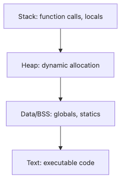

# Memory Management

When a service gets slower day after day, the root cause is often memory, not CPU. A cache grows without a ceiling, references keep old objects alive, or reclamation happens so late that the system only becomes noisy when recovery is already expensive.

That is why memory management is really a conversation about ownership and release, not only allocation.

This is post 6 in the Operating Systems 101 series. It connects process memory layout, leaks, fragmentation, and container memory limits into one practical model.

## What You Will Learn

- The process memory layout — text, data, heap, stack
- The difference between malloc/free and garbage collection
- How memory leaks and fragmentation are constructed
- The two axes of OS memory management — partitioning and reclamation

## Why It Matters

The most common cause of "the server gets slow after a while" is a memory leak, GC thrashing right before OOM, or a wrongly sized cache. Without understanding memory behavior, staring at CPU graphs gives no answers. Memory is invisible until it hits the limit, and then it is the loudest resource in the system.

> Memory management is harder on the reclamation side than on the allocation side. The hard system-design question is "who is responsible for releasing this?"

## Concept at a Glance

> Process memory has four main regions: code (text), globals (data/bss), heap, and stack. Heap holds dynamic allocations; stack grows and shrinks automatically with function calls. The OS gives each process a virtual address space so each process appears to own its own RAM.

### The four major regions of process memory


*A useful first question in any memory problem is which region is growing and who owns its lifetime.*

```text
high addr
+---------+
|  stack  |  ← function calls / locals, auto-managed
|    ↓    |
|         |
|    ↑    |
|  heap   |  ← malloc/new, freed explicitly or by GC
+---------+
| bss/data|  ← globals / statics
| text    |  ← executable code
low addr
```

## Key Terms

| Term | Description |
| --- | --- |
| Virtual address | The address a process sees (different from physical RAM) |
| Heap | Dynamic allocation region; needs explicit free or GC |
| Stack | Region auto-managed by function calls |
| Fragmentation | Free space exists but no contiguous large block |
| Memory leak | Memory no longer used but never reclaimed |

## Before / After

**Before — "memory is infinite":**

```python
cache = {}
def handle(req):
    cache[req.id] = expensive(req)   # grows forever
    return cache[req.id]
```

A few days later: OOM. Leaks happen in GC languages too — they have no special protection.

**After — "reclamation policy is explicit":**

```python
from functools import lru_cache

@lru_cache(maxsize=10_000)
def handle(req_id):
    return expensive(req_id)
```

When capacity and an eviction policy are both written down, it is no longer a leak.

## Hands-on: Step by Step

### Step 1: Look at process memory usage

```bash
python3 -c "
import os, resource
print('PID', os.getpid())
print('peak RSS (KB)', resource.getrusage(resource.RUSAGE_SELF).ru_maxrss)
"
```

`ru_maxrss` is the high-water mark of the resident set size — the actual RAM the process held.

### Step 2: Build a leak

```python
import resource, gc

def show():
    print('RSS', resource.getrusage(resource.RUSAGE_SELF).ru_maxrss)

leak = []
for i in range(5):
    leak.extend([0] * 1_000_000)
    gc.collect()
    show()
```

Even with a GC, live references prevent reclamation. Reachability decides what gets collected, not the collector.

### Step 3: Observe fragmentation

```python
# Allocate large blocks then free every other one
xs = []
for i in range(1000):
    xs.append(bytearray(1024 * 1024))   # 1MB
for i in range(0, 1000, 2):
    xs[i] = None                        # free even indices

# ~500MB free, but a single contiguous 1GB block is hard to get
```

You have plenty of free bytes but no contiguous chunk large enough — that is fragmentation.

### Step 4: Use weak references to avoid leaks

```python
import weakref

class Conn: pass

pool = weakref.WeakValueDictionary()
def get(name):
    c = pool.get(name)
    if c is None:
        c = Conn(); pool[name] = c
    return c
```

`WeakValueDictionary` drops entries automatically when no outside reference remains.

### Step 5: See container memory limits

```bash
# Memory limit and current use of a Docker container
cat /sys/fs/cgroup/memory.max 2>/dev/null || echo 'not in container'
cat /sys/fs/cgroup/memory.current 2>/dev/null || echo 'not in container'
```

Inside a container, cgroup enforces a limit independent of the host. Growing a cache without knowing the limit ends in OOM-kill.

## What to Notice in This Code

- A garbage collector reclaims only objects without live references
- A leak is "no longer used but still referenced," not "not freed"
- Fragmentation is about contiguous space, not total bytes
- Weak references and reclamation policies (LRU, etc.) are the most common leak fixes

## Five Common Mistakes

| Mistake | Problem | Fix |
| --- | --- | --- |
| Unbounded cache | OOM | Always set capacity and an eviction policy |
| Append forever to a global list | Leak | Use weak references or expirations |
| Capture large objects in closures | Not collected | Capture only the values you need |
| Ignore container limits | OOM-kill | Size caches and pools against the cgroup limit |
| "GC language, so safe" | Leaks anyway | Design the reference graph deliberately |

## How This Shows Up in Production

- Caches: capacity and eviction policy are always defined together
- Backends: per-worker memory limits with an OOM safety margin
- Data processing: streaming in chunks to cap peak RSS
- Games / embedded: pool allocation to avoid fragmentation
- Containers: capacity planning against the cgroup limit

## How a Senior Engineer Thinks

A senior engineer treats "who owns the lifetime of this object?" as a default code-review question. Any object with no documented owner is a potential leak. When adding a cache they write capacity and eviction policy together. Missing either one means OOM is just a matter of time.

A senior also knows that memory shows up late in dashboards. CPU spikes to 100% instantly, but a memory leak takes days or weeks to bite. So they monitor RSS trend lines and alert on slope, not only on absolute thresholds.

## Checklist

- [ ] I can describe the process memory regions (text/data/heap/stack)
- [ ] I can distinguish leaks from fragmentation
- [ ] My caches always declare capacity and eviction together
- [ ] I respect cgroup limits inside containers
- [ ] I monitor RSS trends, not only spot values

## Practice Problems

1. Use `resource.getrusage` to plot how RSS grows over time for the leak code. Summarize the pattern in one paragraph.

2. Replace an unbounded dict cache with `functools.lru_cache(maxsize=...)`. Run the same load and measure the RSS difference.

3. In a container limited to 64MB, decide a safe cache cap and write down your reasoning.

## Wrap-up and Next Steps

Memory management is a reclamation problem more than an allocation problem. Make ownership and release policy explicit in both code and operations and the system can run for a long time without OOM. The single habit of writing capacity and eviction policy together kills 80% of leaks.

The next article moves on to the trick that lets the OS make limited RAM look unlimited — virtual memory.

<!-- toc:begin -->
- [What is an Operating System?](./01-what-is-an-operating-system.md)
- [Processes and Threads](./02-processes-and-threads.md)
- [Scheduling](./03-scheduling.md)
- [Concurrency and Race Conditions](./04-concurrency-and-race-conditions.md)
- [Locks, Mutexes, and Semaphores](./05-locks-mutex-semaphore.md)
- **Memory Management (current)**
- Virtual Memory (upcoming)
- File Systems (upcoming)
- System Calls (upcoming)
- Containers and the Operating System (upcoming)
<!-- toc:end -->

## References

- [Tanenbaum & Bos — Modern Operating Systems](https://www.pearson.com/store/p/modern-operating-systems/P100000869539)
- [What Every Programmer Should Know About Memory — Ulrich Drepper](https://people.freebsd.org/~lstewart/articles/cpumemory.pdf)
- [Python resource module](https://docs.python.org/3/library/resource.html)
- [Linux cgroup v2 memory controller](https://docs.kernel.org/admin-guide/cgroup-v2.html#memory)

Tags: Computer Science, Operating Systems, Memory, Heap, Stack, Allocator
