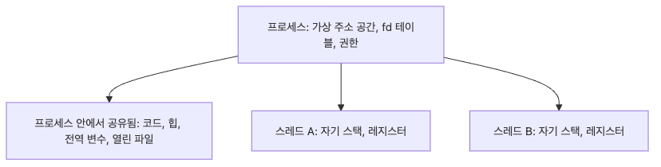

# 프로세스와 스레드

"실행 중인 프로그램"이라는 표현은 익숙하지만, 운영체제 관점에서는 너무 뭉뚱그린 말입니다. 메모리, 열린 파일, 권한, CPU 상태까지 묶인 단위가 무엇인지 분리해서 봐야 동시성 설계가 선명해집니다.

특히 프로세스와 스레드를 섞어 이해하면 공유 범위와 격리 경계를 계속 헷갈리게 됩니다. 그래서 이 글에서는 두 단위를 운영체제가 실제로 다루는 기준으로 다시 정리합니다.

이 글은 Operating Systems 101 시리즈의 2번째 글입니다.

## 이 글에서 다룰 문제

- 프로세스는 어떤 자원을 자기 것으로 가지고 있을까요?
- 스레드는 무엇을 공유하고 무엇은 따로 가질까요?
- `fork`와 `exec`는 왜 두 단계로 나뉘어 있을까요?
- CPU 작업과 I/O 작업에서는 언제 프로세스를, 언제 스레드를 골라야 할까요?

> 프로세스는 격리의 단위이고, 스레드는 실행 흐름의 단위입니다. 둘 다 동시성을 만드는 도구처럼 보이지만, 메모리와 실패 범위를 어디까지 공유할지라는 질문에 전혀 다른 답을 줍니다.

## 기본 모델
> 한 프로세스는 자기만의 가상 주소 공간, 파일 디스크립터 테이블, 신호 처리기, 권한을 가집니다. 그 안에 한 개 이상의 스레드가 있고, 스레드는 메모리와 fd는 공유하지만 자신만의 스택과 레지스터 상태를 갖습니다.

### 프로세스와 스레드의 공유 경계


*프로세스는 자원을 묶어 격리하고, 스레드는 그 안에서 실행 흐름만 늘립니다.*

```text
+-----------------------------------------+
|  Process                                |
|  +----------+ +-----------+ +--------+  |
|  | Code     | | Heap      | | Globals|  |
|  +----------+ +-----------+ +--------+  |
|  +-------- File descriptor table -----+ |
|  |  0:stdin  1:stdout  2:stderr  ...  | |
|  +-----------------------------------+  |
|                                         |
|  +-- Thread A --+   +-- Thread B --+    |
|  |  Stack       |   |  Stack       |    |
|  |  Registers   |   |  Registers   |    |
|  +--------------+   +--------------+    |
+-----------------------------------------+
```

## 같은 코드를 다르게 읽는 법

**이전 관점 — "스레드와 프로세스는 그냥 둘 다 동시 실행 도구":**

```python
# I want these two tasks to run "at the same time"
import threading, multiprocessing
```

이 한 줄은 둘 중 어느 것을 골라야 하는지 알려 주지 않습니다.

**바꿔서 보면 — "공유하는 것이 다르다"는 모델:**

```text
multiprocessing.Process : separate memory, talk via queue/pipe/shared mem
threading.Thread        : same memory, needs locks, GIL applies

CPU-bound (large numpy matmul)  -> multiprocessing usually wins
I/O-bound (100 HTTP requests)   -> threading or asyncio is enough
```

같은 "동시 실행"이라도 무엇을 공유하느냐로 도구가 갈립니다.

## 단계별로 확인하기

### 1단계: 프로세스 식별자와 부모-자식 관계 보기

```python
import os

print(f"Parent PID (this process): {os.getpid()}")

pid = os.fork()
if pid == 0:
    print(f"Child  PID: {os.getpid()}, parent: {os.getppid()}")
else:
    os.waitpid(pid, 0)
    print(f"Parent: child {pid} exited")
```

`fork`는 한 번 호출되어 두 번 리턴합니다. 부모에는 자식 PID가, 자식에는 0이 돌아옵니다. 같은 코드인데 두 줄기로 갈라지는 경험이 핵심입니다.

### 2단계: 자식 분기 이후의 메모리 격리 확인

```python
import os

x = [1, 2, 3]
if os.fork() == 0:
    x.append(99)
    print(f"Child x:  {x}")
    os._exit(0)
os.wait()
print(f"Parent x: {x}")
```

자식이 `x`를 바꿔도 부모의 `x`는 그대로입니다. 두 프로세스는 같은 메모리를 보지 못합니다(겉보기는 같지만 내부적으로는 copy-on-write).

### 3단계: 스레드는 메모리를 공유한다

```python
import threading

x = [1, 2, 3]
def worker():
    x.append(99)

t = threading.Thread(target=worker)
t.start(); t.join()
print(f"Main x: {x}")
```

같은 `x` 리스트가 보입니다. 스레드는 같은 주소 공간을 공유하기 때문에 동기화가 필요해집니다.

### 4단계: 스레드와 프로세스의 성능 감각 보기

```python
import time, math
from concurrent.futures import ThreadPoolExecutor, ProcessPoolExecutor

def cpu_heavy(n):
    return sum(math.sqrt(i) for i in range(n))

N = 5_000_000
tasks = [N] * 4

for Pool, label in [(ThreadPoolExecutor, "Thread"), (ProcessPoolExecutor, "Process")]:
    start = time.perf_counter()
    with Pool(max_workers=4) as ex:
        list(ex.map(cpu_heavy, tasks))
    print(f"{label}: {time.perf_counter() - start:.2f} s")
```

CPU 바운드 작업에서는 보통 프로세스 풀이 빠릅니다. CPython의 GIL 때문에 스레드는 같은 시점에 하나만 파이썬 코드를 실행할 수 있습니다.

### 5단계: 다른 프로그램으로 실행 이미지 바꾸기

```python
import os

if os.fork() == 0:
    os.execvp("ls", ["ls", "-la"])  # child becomes ls
    # this line is never reached
os.wait()
```

`fork`로 자식을 만들고 곧바로 `exec`로 다른 프로그램이 되는 패턴이 셸이 명령을 실행하는 표준 방식입니다. 자식 프로세스의 메모리는 새 프로그램의 이미지로 통째로 교체됩니다.

## 여기서 먼저 볼 점

- `fork`는 한 번 호출되고 두 번 리턴합니다
- 프로세스 간 메모리는 격리되어 있고, 스레드 간 메모리는 공유됩니다
- CPython의 GIL 때문에 CPU 바운드 + 스레드 조합은 종종 기대만큼 빠르지 않습니다
- `fork`+`exec`는 셸과 컨테이너 런타임의 기본 패턴입니다

## 자주 하는 실수 5가지

| 실수 | 문제 | 해결 |
| --- | --- | --- |
| 모든 동시성에 스레드 사용 | CPU 바운드는 GIL로 막힘 | CPU 바운드는 프로세스, I/O 바운드는 스레드/asyncio |
| 자식 프로세스 회수 안 함 | 좀비 프로세스 누적 | `os.wait`/`waitpid`로 회수 |
| 스레드 간 공유 데이터 락 미사용 | race condition, 알 수 없는 버그 | `threading.Lock` 또는 큐 사용 |
| `fork` 직후 큰 라이브러리 임포트 가정 | macOS에서 동작 차이, 안전성 문제 | `multiprocessing.set_start_method('spawn')` 고려 |
| 프로세스를 가볍다고 가정 | 수천 개 프로세스 생성으로 OS 자원 고갈 | 워커 풀 패턴으로 재사용 |

## 실무에서는 이렇게 본다

- 웹 서버: gunicorn은 워커 프로세스, uvicorn은 비동기, 둘을 조합
- 데이터 처리: `multiprocessing.Pool`로 CPU 바운드 ETL 분산
- 컨테이너: 컨테이너 런타임이 `clone`+`exec` 변형으로 격리된 자식 실행
- 백엔드 디버깅: `ps -ef`, `pstree`, `htop`로 프로세스/스레드 트리 확인
- 데이터 과학: `joblib`이 백엔드(스레드/프로세스)를 골라서 병렬화

## 체크리스트

- [ ] 프로세스가 가진 자원 네 가지를 말할 수 있는가
- [ ] 스레드와 프로세스가 공유하는 것과 안 하는 것을 안다
- [ ] CPU 바운드와 I/O 바운드의 적절한 도구를 안다
- [ ] `fork`와 `exec`의 역할 분리를 설명할 수 있는가
- [ ] 자식 프로세스 회수의 필요성을 안다

## 연습 문제

1. `os.fork()` 예제를 직접 실행해서 부모와 자식이 각각 어떤 PID를 보는지 정리해 보세요.
2. 같은 작업을 `ThreadPoolExecutor`와 `ProcessPoolExecutor`로 돌리고, CPU 바운드인지 I/O 바운드인지에 따라 결과가 어떻게 달라지는지 비교해 보세요.
3. `ps -ef`, `pstree`, `htop` 중 하나를 골라 지금 실행 중인 서비스의 프로세스/스레드 구조를 캡처하고, 무엇이 공유되고 무엇이 분리되는지 설명해 보세요.

## 마무리와 다음 글

프로세스는 격리된 자원 묶음이고, 스레드는 그 안에서 흐르는 동시 실행 단위입니다. 둘을 헷갈리면 동시성 코드가 미묘하게 깨지거나 성능이 기대만큼 나오지 않습니다. CPU 바운드와 I/O 바운드, 격리의 필요성, 메모리 공유 정도라는 세 가지 축으로 도구를 고를 수 있습니다.

다음 글에서는 OS가 그 많은 프로세스와 스레드 중 누구에게 CPU를 줄지를 결정하는 메커니즘 — 스케줄링을 봅니다.

<!-- toc:begin -->
- [운영체제란 무엇인가?](./01-what-is-an-operating-system.md)
- **프로세스와 스레드 (현재 글)**
- 스케줄링 (예정)
- 동시성과 경쟁 상태 (예정)
- 락, 뮤텍스, 세마포어 (예정)
- 메모리 관리 (예정)
- 가상 메모리 (예정)
- 파일 시스템 (예정)
- 시스템 콜 (예정)
- 컨테이너와 운영체제 (예정)
<!-- toc:end -->

## 참고 자료

- [Tanenbaum & Bos — Modern Operating Systems](https://www.pearson.com/store/p/modern-operating-systems/P100000869539)
- [The Linux Programming Interface — Michael Kerrisk](https://man7.org/tlpi/)
- [Python multiprocessing 문서](https://docs.python.org/3/library/multiprocessing.html)
- [Python threading 문서](https://docs.python.org/3/library/threading.html)

Tags: Computer Science, 운영체제, 프로세스, 스레드, 동시성, 시스템
