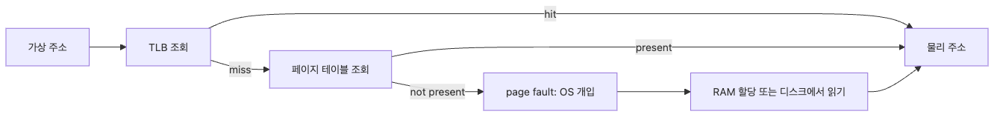

# 가상 메모리

프로세스는 늘 자기만의 넓은 메모리를 가진 것처럼 보입니다. 하지만 실제 RAM은 한정되어 있고, 여러 프로세스가 동시에 그 자원을 나눠 씁니다.

이 착시를 만드는 장치가 바로 가상 메모리입니다. 페이지 폴트와 스왑이 왜 시스템 전체를 갑자기 얼어붙게 만드는지 이해하려면 이 환상을 구성하는 부품부터 봐야 합니다.

이 글은 Operating Systems 101 시리즈의 7번째 글입니다.

## 이 글에서 다룰 문제

- 가상 주소와 물리 주소는 왜 굳이 분리되어 있을까요?
- 페이지, 페이지 테이블, TLB는 어떤 역할 분담을 할까요?
- minor fault와 major fault는 비용이 어떻게 다를까요?
- `mmap`과 copy-on-write는 실무에서 왜 자주 등장할까요?

> 가상 메모리는 RAM을 무한하게 만들어 주는 마법이 아닙니다. 각 프로세스에 독립된 주소 공간이 있는 것처럼 보이게 만들고, 그 대가를 페이지 폴트와 스왑 비용으로 정교하게 청구하는 장치입니다.

## 기본 모델
> 모든 프로세스는 자신만의 가상 주소 공간을 가집니다. 가상 주소는 페이지 단위(보통 4KB)로 잘려 페이지 테이블을 통해 물리 주소로 매핑됩니다. CPU는 이 변환을 빠르게 하기 위해 TLB라는 캐시를 가집니다. 매핑이 없거나 페이지가 디스크에 있으면 page fault가 발생합니다.

### 가상 주소가 실제 RAM으로 가는 길


*가상 메모리의 비용은 주소 변환이 캐시에 있느냐, page fault로 내려가느냐에서 갈립니다.*

```text
virtual addr  →  [TLB hit]  →  physical addr  →  RAM
                   ↓ miss
              page table walk
                   ↓ not present
              page fault → OS handles (read from disk / allocate new page)
```

## 같은 코드를 다르게 읽는 법

**이전 관점 — "상주 메모리만 보면 충분하다":**

```bash
ps -o pid,rss,cmd -p $$
# Not enough. Two processes with the same RSS can have very different speeds
```

**바꿔서 보면 — "페이지 폴트와 변환 캐시 실패를 함께 본다":**

```bash
# major fault = went to disk (slow)
ps -o pid,min_flt,maj_flt,rss,cmd -p $$
# Rising major faults suggests swap-in
```

같은 RSS여도 page fault 패턴이 다르면 체감 속도가 다릅니다.

## 단계별로 확인하기

### 1단계: 페이지 폴트 카운트 보기

```bash
python3 -c "
import resource
r = resource.getrusage(resource.RUSAGE_SELF)
print('minor faults', r.ru_minflt)
print('major faults', r.ru_majflt)
"
```

minor fault는 RAM에서 새 페이지를 잡는 비용, major fault는 디스크에서 읽어오는 비용입니다. major가 늘면 swap 의심.

### 2단계: 메모리 매핑으로 큰 파일 읽기

```python
import mmap, os

with open('big.bin', 'wb') as f:
    f.write(b'A' * (10 * 1024 * 1024))     # 10MB

with open('big.bin', 'rb') as f:
    with mmap.mmap(f.fileno(), 0, access=mmap.ACCESS_READ) as mm:
        print(mm[0:10])                     # only touched pages get loaded
```

mmap은 파일을 가상 메모리로 직접 매핑합니다. 실제 접근하는 페이지만 RAM에 올라와 큰 파일을 메모리처럼 다룰 수 있습니다.

### 3단계: 쓰기 시 복사 동작 관찰

```python
import os, time

big = bytearray(100 * 1024 * 1024)          # 100MB
pid = os.fork()
if pid == 0:                                 # child
    # Initially shares pages with the parent (CoW)
    big[0] = 1                               # write triggers a page copy
    time.sleep(2)
    os._exit(0)
else:
    os.waitpid(pid, 0)
```

`fork`는 페이지를 즉시 복사하지 않고, 쓰기가 일어날 때만 복사합니다. 메모리를 거의 안 쓰고 자식 프로세스를 만들 수 있는 핵심 기법입니다.

### 4단계: 스왑 사용량 보기

```bash
free -h
swapon --show
# or
cat /proc/swaps
```

스왑이 보이고 응답 시간이 무너진다면 RAM이 부족하거나 실제로 자주 만지는 메모리 범위가 RAM을 넘어선 상태입니다.

### 5단계: 큰 배열 접근 패턴과 변환 캐시

```python
import time
N = 5000
m = [[0]*N for _ in range(N)]

t = time.time()
for i in range(N):
    for j in range(N):
        m[i][j] = 1                          # row-major — good page locality
print('row-major', time.time() - t)

t = time.time()
for j in range(N):
    for i in range(N):
        m[i][j] = 1                          # column-major — TLB/cache misses explode
print('col-major', time.time() - t)
```

같은 데이터, 같은 횟수, 다른 접근 패턴 — 결과는 수 배 차이 납니다. 가상 메모리의 비용은 접근 패턴이 결정합니다.

## 여기서 먼저 볼 점

- mmap은 파일 I/O를 메모리 접근으로 바꿉니다 — 큰 데이터에 자연스러운 추상화
- copy-on-write는 fork를 가볍게 만드는 핵심 기법입니다
- swap이 보이기 시작하면 응답 시간은 이미 무너지고 있습니다
- 같은 RSS여도 접근 지역성에 따라 체감 속도가 크게 달라집니다

## 자주 하는 실수 5가지

| 실수 | 문제 | 해결 |
| --- | --- | --- |
| RSS만 보고 메모리 판단 | swap, page fault 무시 | major fault, swap 사용량 같이 모니터링 |
| 큰 파일을 모두 read | OOM 또는 swap | mmap 또는 chunk 스트리밍 |
| fork 후 즉시 큰 데이터 수정 | CoW 무력화, 메모리 폭증 | exec 직전까지 쓰기 최소화 |
| 접근 지역성 무시 | TLB miss 폭증 | 데이터 구조와 루프 순서를 함께 설계 |
| swap on이면 안전 | 사실 응답 시간 폭락 | 운영 시스템에서는 swap을 끄거나 최소화 |

## 실무에서는 이렇게 본다

- 데이터베이스: mmap으로 인덱스/페이지 캐시
- 컨테이너: cgroup memory + swap 설정으로 OOM 동작 제어
- ML 학습: 큰 배열은 mmap-backed numpy로 메모리 압박 완화
- 백엔드: fork 기반 워커 모델 (gunicorn, uwsgi)에서 CoW 활용
- 성능 튜닝: perf 등으로 TLB miss / page fault 측정

## 체크리스트

- [ ] 가상 주소와 물리 주소의 차이를 안다
- [ ] minor fault와 major fault의 비용 차이를 안다
- [ ] mmap이 언제 유용한지 안다
- [ ] copy-on-write의 의미를 설명할 수 있다
- [ ] swap이 보이기 시작하면 위험 신호임을 안다

## 연습 문제

1. 같은 2차원 배열을 row-major와 column-major로 채우고, 실행 시간 차이가 나는 이유를 페이지 지역성 관점에서 설명해 보세요.
2. 1GB 파일을 `read()`와 `mmap` 두 방식으로 처리해 RSS와 시간을 비교해 보세요.
3. 같은 메모리 부하를 swap on/off 환경에서 실행하고 응답성 차이를 기록해 보세요.

## 마무리와 다음 글

가상 메모리는 OS가 만든 환상이지만, page fault와 swap이라는 청구서로 정확히 비용을 회수합니다. mmap과 copy-on-write 같은 기법은 이 환상을 응용해 큰 데이터를 우아하게 다룹니다. 가상 메모리를 알면 시스템이 굳는 순간을 짚어낼 수 있습니다.

다음 글에서는 OS가 메모리만큼이나 자주 다루는 자원 — 파일 시스템으로 넘어갑니다.

<!-- toc:begin -->
- [운영체제란 무엇인가?](./01-what-is-an-operating-system.md)
- [프로세스와 스레드](./02-processes-and-threads.md)
- [스케줄링](./03-scheduling.md)
- [동시성과 경쟁 상태](./04-concurrency-and-race-conditions.md)
- [락, 뮤텍스, 세마포어](./05-locks-mutex-semaphore.md)
- [메모리 관리](./06-memory-management.md)
- **가상 메모리 (현재 글)**
- 파일 시스템 (예정)
- 시스템 콜 (예정)
- 컨테이너와 운영체제 (예정)
<!-- toc:end -->

## 참고 자료

- [Tanenbaum & Bos — Modern Operating Systems](https://www.pearson.com/store/p/modern-operating-systems/P100000869539)
- [What Every Programmer Should Know About Memory — Ulrich Drepper](https://people.freebsd.org/~lstewart/articles/cpumemory.pdf)
- [Linux mmap(2) man page](https://man7.org/linux/man-pages/man2/mmap.2.html)
- [Python mmap](https://docs.python.org/3/library/mmap.html)

Tags: Computer Science, 운영체제, 가상메모리, paging, TLB, swap
