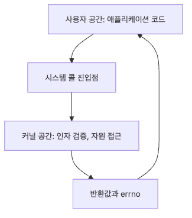

# 시스템 콜

사용자 코드가 디스크나 네트워크 카드에 직접 손을 댈 수는 없습니다. 커널 자원을 쓰려면 반드시 좁은 입구를 통과해야 하고, 그 입구가 바로 시스템 콜입니다.

같은 결과를 내는 두 프로그램이 시스템 콜 횟수 때문에 몇 배씩 차이 나는 경우가 흔합니다. 그래서 시스템 콜은 성능과 보안을 함께 읽는 기본 단위입니다.

이 글은 Operating Systems 101 시리즈의 9번째 글입니다.

## 이 글에서 다룰 문제

- 사용자 공간과 커널 공간은 무엇이 다를까요?
- 시스템 콜 한 번에는 어떤 전환 비용이 들어갈까요?
- `strace`는 왜 OS 문제를 볼 때 가장 빠른 도구일까요?
- 버퍼링, 일괄 처리, `vDSO`는 어떻게 비용을 줄일까요?

> 시스템 콜은 사용자 코드가 커널에 일을 맡길 수 있는 유일한 계약입니다. 입구가 좁은 대신 안전하며, 그만큼 호출 횟수와 방식이 성능과 공격 표면을 함께 결정합니다.

## 기본 모델
> 사용자 공간은 일반 프로그램이 도는 곳, 커널 공간은 OS의 핵심 코드가 도는 곳입니다. 둘 사이에는 권한 경계가 있고, 사용자 코드는 시스템 콜이라는 좁은 진입점만 통해 커널로 진입합니다. 진입할 때마다 컨텍스트 전환과 보안 검증이 일어나기 때문에 비쌉니다.

### 시스템 콜이 지나가는 권한 경계


*시스템 콜은 사용자 코드가 커널 자원에 들어갈 수 있는 유일한 문이며, 그만큼 매 호출에 비용이 붙습니다.*

```text
[user space]
  print(...) → write(fd, buf, n)  ← syscall entry
                       ↓
                 mode switch (user → kernel)
                       ↓
                 argument check, resource access
                       ↓
                 mode switch (kernel → user)
                       ↓
                 return value
```

## 같은 코드를 다르게 읽는 법

**이전 관점 — "한 번에 1바이트씩 쓴다":**

```python
with open('out.bin', 'wb', buffering=0) as f:
    for c in b'A' * 100_000:
        f.write(bytes([c]))     # one syscall each
# 100,000 write syscalls
```

**바꿔서 보면 — "버퍼링으로 묶어 쓴다":**

```python
with open('out.bin', 'wb') as f:    # default buffering
    f.write(b'A' * 100_000)         # effectively one write
```

같은 결과, 호출 횟수는 5자리 수 차이. 시스템 콜은 횟수가 비용입니다.

## 단계별로 확인하기

### 1단계: 시스템 콜 추적 도구로 호출 보기

```bash
strace -c python3 -c "print('hello')"
# Summary: which syscalls were called, how often, total time
```

`-c`는 카운트 요약. `-e trace=open,read,write`로 특정 syscall만 따로 볼 수도 있습니다.

### 2단계: 읽기 크기에 따른 비용 비교

```python
import os, time
fd = os.open('big.bin', os.O_RDONLY)
sizes = [1, 64, 4096, 65536]
for s in sizes:
    os.lseek(fd, 0, 0)
    t = time.time()
    while os.read(fd, s):
        pass
    print(s, time.time() - t)
os.close(fd)
```

작은 read는 syscall 비용이 지배합니다. 보통 4KB~64KB 사이가 sweet spot입니다.

### 3단계: 커널 진입 없는 시간 조회 효과

```python
import time
N = 1_000_000
t = time.time()
for _ in range(N):
    time.time()         # very fast via vDSO
print('time.time x 1M:', time.time() - t)
```

`time.time()`은 매번 syscall로 가지 않고 vDSO를 통해 사용자 공간에서 처리됩니다. 그래서 빠릅니다.

### 4단계: 벡터 입출력으로 시스템 콜 줄이기

```python
import os
fd = os.open('out.bin', os.O_WRONLY | os.O_CREAT, 0o644)
os.writev(fd, [b'header\n', b'body\n', b'footer\n'])    # one syscall
os.close(fd)
```

여러 버퍼를 한 syscall로 처리. 로그 라인 묶어 쓰기 등에 유용합니다.

### 5단계: 보안 필터로 시스템 콜 제한

```bash
# Container runtimes apply a default seccomp profile
docker info | grep -i seccomp
# If ENABLED, processes inside containers can call only an allowed set of syscalls
```

보안 측면에서 syscall은 공격 표면입니다. 필요한 것만 허용하면 익스플로잇 표면이 좁아집니다.

## 여기서 먼저 볼 점

- 시스템 콜은 횟수가 비용이고, 버퍼링/배치로 횟수를 줄이는 것이 첫 번째 최적화
- vDSO 같은 메커니즘은 같은 의미를 가진 syscall을 더 싸게 만듭니다
- strace는 "어디서 시간을 쓰는지" 모를 때 가장 빨리 단서를 주는 도구
- seccomp 같은 syscall 필터는 보안의 기본 도구입니다

## 자주 하는 실수 5가지

| 실수 | 문제 | 해결 |
| --- | --- | --- |
| 작은 단위 read/write | syscall 폭증 | 버퍼링, 배치 |
| 루프 안에서 open/close 반복 | 파일 디스크립터 누수 + 비용 | 파일 한 번 열고 재사용 |
| strace를 운영에서 상시 실행 | 성능 저하 | 짧게 샘플링 |
| 시간 측정에 syscall 가정 | vDSO 무시 | 측정 도구로 실제 비용 확인 |
| 컨테이너에서 모든 syscall 허용 | 보안 위험 | seccomp 프로파일 유지 |

## 실무에서는 이렇게 본다

- 고성능 I/O: io_uring으로 syscall 묶음 처리
- 데이터베이스: writev/sendfile로 syscall 횟수 최소화
- 컨테이너: seccomp + capabilities로 syscall 표면 제한
- 디버깅: strace, ltrace, perf로 syscall 단위 분석
- 모니터링: eBPF로 syscall 트레이스를 실시간 수집

## 체크리스트

- [ ] 사용자 공간과 커널 공간의 차이를 안다
- [ ] strace로 syscall 카운트를 볼 수 있다
- [ ] 버퍼링/배치로 syscall 횟수를 줄여 본 적이 있다
- [ ] vDSO의 의미를 안다
- [ ] seccomp가 보안에 어떻게 기여하는지 안다

## 연습 문제

1. 같은 데이터를 1B, 4KB, 64KB 단위로 써 보고 `strace -c` 결과와 실행 시간을 비교해 보세요.
2. 지금 서비스에서 자주 호출되는 시스템 콜 하나를 골라, 호출 수를 줄일 수 있는 코드 변경을 제안해 보세요.
3. 컨테이너에서 특정 시스템 콜을 막는 seccomp 프로파일을 만들어 실제로 차단되는지 확인해 보세요.

## 마무리와 다음 글

시스템 콜은 사용자 코드와 커널 사이의 유일한 약속이고, 횟수가 곧 비용입니다. 버퍼링, 배치, vDSO 같은 메커니즘은 같은 의미를 더 싸게 만들고, seccomp는 보안 표면을 좁힙니다. strace는 OS 위 어떤 미스터리든 가장 빠르게 단서를 주는 도구입니다.

다음 글에서는 지금까지 본 OS 기본기가 컨테이너 안에서는 어떻게 다시 조합되는지를 봅니다.

<!-- toc:begin -->
- [운영체제란 무엇인가?](./01-what-is-an-operating-system.md)
- [프로세스와 스레드](./02-processes-and-threads.md)
- [스케줄링](./03-scheduling.md)
- [동시성과 경쟁 상태](./04-concurrency-and-race-conditions.md)
- [락, 뮤텍스, 세마포어](./05-locks-mutex-semaphore.md)
- [메모리 관리](./06-memory-management.md)
- [가상 메모리](./07-virtual-memory.md)
- [파일 시스템](./08-file-systems.md)
- **시스템 콜 (현재 글)**
- 컨테이너와 운영체제 (예정)
<!-- toc:end -->

## 참고 자료

- [Tanenbaum & Bos — Modern Operating Systems](https://www.pearson.com/store/p/modern-operating-systems/P100000869539)
- [Linux strace man page](https://man7.org/linux/man-pages/man1/strace.1.html)
- [Linux syscalls overview](https://man7.org/linux/man-pages/man2/syscalls.2.html)
- [seccomp — Secure Computing Mode](https://man7.org/linux/man-pages/man2/seccomp.2.html)

Tags: Computer Science, 운영체제, syscall, strace, 커널, 사용자공간
