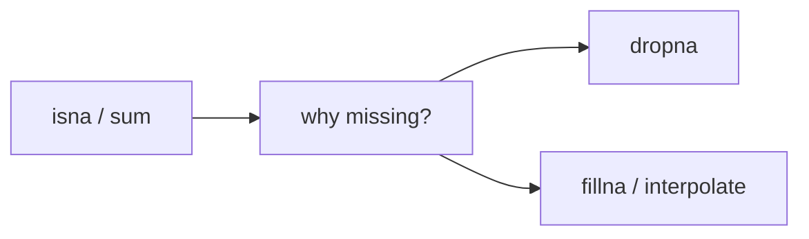

# Handling Missing Values

This is post 5 in the Pandas 101 series.

> Pandas 101 series (5/10)

<!-- a-grade-intro:begin -->

**Core question**: Are *missing values* *something to drop*, or *something to model*?

> *Missing values are *messages from your data*. If you do not know *why* a value is missing, you do not know *how* to fill it.*

<!-- a-grade-intro:end -->

## What You Will Learn

- The meaning of *NaN* and its *dtype* impact
- How to use *isna / dropna / fillna*
- The intuition behind *interpolate*
- A 5-step missing-value hands-on
- Five common mistakes

## Why It Matters

Real data is *full of missing values*. How you handle them decides *model performance* and *analysis credibility*.

## Concept at a Glance



## Key Terms

- **NaN**: *Not a Number* — *float* missing marker.
- **NA / pd.NA**: Pandas' *unified* missing marker (nullable dtypes).
- **dropna**: drop *rows/columns* with missing values.
- **fillna**: *fill* with a *constant, mean, or previous value*.
- **interpolate**: *interpolation* — fits time series naturally.

## Before/After

**Before**: *"Just dropna"* — *80% of rows* vanish.

**After**: *"Treat by cause"* — *interpolate sensors*, *model survey gaps*.

## Hands-on: Five Missing-Value Steps

### Step 1 — Detect

```python
import numpy as np, pandas as pd
df = pd.DataFrame({"x": [1, np.nan, 3], "y": [np.nan, 2, 3]})
print(df.isna())
print(df.isna().sum())
```

### Step 2 — Drop

```python
print(df.dropna())            # drop rows with any NaN
print(df.dropna(axis=1))      # drop columns with any NaN
```

### Step 3 — Fill

```python
print(df.fillna(0))
print(df.fillna(df.mean(numeric_only=True)))
```

### Step 4 — Forward / backward fill

```python
print(df.fillna(method="ffill"))
print(df.fillna(method="bfill"))
```

### Step 5 — Interpolate

```python
ts = pd.Series([1.0, np.nan, np.nan, 4.0])
print(ts.interpolate())
```

## What to Notice in This Code

- *isna().sum()* is the *first diagnostic*.
- *fillna(mean)* may *distort the distribution*.
- *interpolate* is *natural for time series*.

## Five Common Mistakes

1. **Overusing *dropna* and losing *most rows*.**
2. **Filling with *0* and *distorting the distribution*.**
3. **Using only *ffill* and ignoring *leading NaNs*.**
4. **Trying to fill *categorical* columns with the *mean*.**
5. **Treating missingness *arbitrarily* with no *recorded policy*.**

## How This Shows Up in Production

Sensor streams, surveys, transaction logs — the *missingness pattern itself* is a *signal*. Form hypotheses (*MAR/MCAR/MNAR*) and document the *handling decision*.

## How a Senior Engineer Thinks

- *Ask why* before treating missingness.
- *Document the policy*.
- Add a *"was missing" indicator column*.
- Use *interpolate* for *time series*.
- For ML, turn *missingness into a feature*.

## Checklist

- [ ] I diagnose with *isna().sum()*.
- [ ] I measure the *impact of dropna*.
- [ ] I make my *fillna strategy explicit*.
- [ ] I record the *missing rate*.

## Practice Problems

1. Print the *missing rate per column*.
2. Print *row counts before and after dropna*.
3. Compare *ffill* and *interpolate* on a *time series* and inspect differences.

## Wrap-up and Next Steps

Missing-value handling decides *analysis integrity*. Next we cover *groupby*.

<!-- toc:begin -->
- [What Is Pandas?](./01-what-is-pandas.md)
- [Series and DataFrame](./02-series-and-dataframe.md)
- [Reading CSV and Excel](./03-read-csv-and-excel.md)
- [Filtering and Selection](./04-filtering-and-selection.md)
- **Handling Missing Values (current)**
- groupby (upcoming)
- Merge and Join (upcoming)
- Time Series (upcoming)
- apply and Vectorization (upcoming)
- Real-world Data Analysis (upcoming)
<!-- toc:end -->

## References

- [pandas — Working with missing data](https://pandas.pydata.org/docs/user_guide/missing_data.html)
- [pandas — fillna](https://pandas.pydata.org/docs/reference/api/pandas.DataFrame.fillna.html)
- [pandas — interpolate](https://pandas.pydata.org/docs/reference/api/pandas.DataFrame.interpolate.html)
- [scikit-learn — Imputation](https://scikit-learn.org/stable/modules/impute.html)

Tags: Pandas, MissingValues, DataCleaning, Python, Beginner
