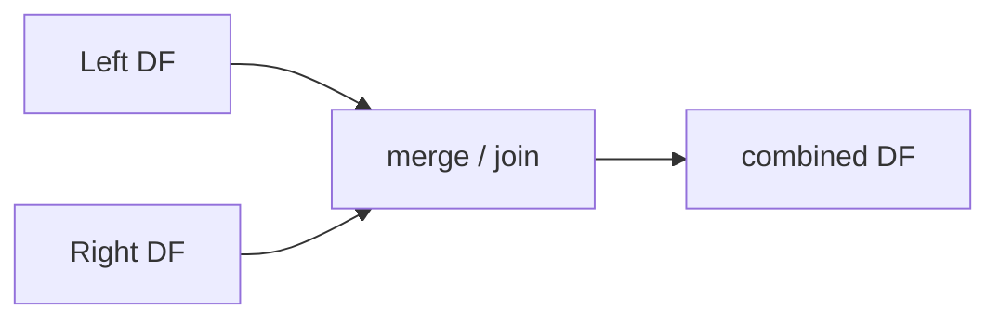

# Merge and Join

> Pandas 101 series (7/10)

<!-- a-grade-intro:begin -->

**Core question**: Why are there *both merge and join*?

> *merge keys on *columns*; join keys on *indexes*. They do the same thing, but *the key location differs*.*

<!-- a-grade-intro:end -->

## What You Will Learn

- *inner / left / right / outer / cross* joins
- The difference between *merge* and *join*
- Options *suffixes / indicator / validate*
- A 5-step join hands-on
- Five common mistakes

## Why It Matters

Real data is *spread across many tables*. *Joining ability* equals *analysis ability*.

## Concept at a Glance



## Key Terms

- **inner**: keys *present in both*.
- **left**: *all of left* + matched right.
- **right**: the opposite.
- **outer**: *union*.
- **cross**: *cartesian product*.

## Before/After

**Before**: *"One merge, rows exploded"* — *duplicate keys* cause a *cartesian blow-up*.

**After**: *"validate='one_to_one' or 'one_to_many'"* — *errors immediately* on bad assumptions.

## Hands-on: Five Join Steps

### Step 1 — Prepare data

```python
import pandas as pd
users = pd.DataFrame({"uid": [1, 2, 3], "name": ["a", "b", "c"]})
orders = pd.DataFrame({"uid": [1, 1, 2], "amount": [100, 200, 50]})
```

### Step 2 — inner

```python
print(users.merge(orders, on="uid"))
```

### Step 3 — left and outer

```python
print(users.merge(orders, on="uid", how="left"))
print(users.merge(orders, on="uid", how="outer", indicator=True))
```

### Step 4 — suffixes

```python
df1 = pd.DataFrame({"k": [1], "v": [10]})
df2 = pd.DataFrame({"k": [1], "v": [20]})
print(df1.merge(df2, on="k", suffixes=("_a", "_b")))
```

### Step 5 — validate

```python
try:
    users.merge(orders, on="uid", validate="one_to_one")
except Exception as e:
    print("expected:", type(e).__name__)
```

## What to Notice in This Code

- *indicator=True* tells you *the row's source*.
- *suffixes* resolves *duplicate column names*.
- *validate* makes *join assumptions* explicit *in code*.

## Five Common Mistakes

1. **Row explosion from *duplicate keys*.**
2. **Not knowing the default *how* is *inner*.**
3. **Skipping *suffixes* and overwriting columns.**
4. ***Mismatched key dtypes* between left and right.**
5. **Skipping *reset_index* and getting *index conflicts*.**

## How This Shows Up in Production

CRM x orders, ads x conversions, users x events — *80% of analysis is joins*. *validate* expresses your *data contract* in code.

## How a Senior Engineer Thinks

- Always *track row counts*.
- Use *validate* to *make assumptions explicit*.
- *Match key dtypes*.
- Decide whether to *deduplicate before joining*.
- *Profile* the join result.

## Checklist

- [ ] I know the *5 how options*.
- [ ] I use *validate*.
- [ ] I check sources with *indicator*.
- [ ] I use *suffixes*.

## Practice Problems

1. Print the *row count difference* between *left join* and *outer join*.
2. Construct data where *validate='one_to_one'* fails and inspect the *exception message*.
3. Use the *indicator column* to find *right-only rows*.

## Wrap-up and Next Steps

Joining is *half of analysis*. Next we cover *time series*.

<!-- toc:begin -->
- [What Is Pandas?](./01-what-is-pandas.md)
- [Series and DataFrame](./02-series-and-dataframe.md)
- [Reading CSV and Excel](./03-read-csv-and-excel.md)
- [Filtering and Selection](./04-filtering-and-selection.md)
- [Handling Missing Values](./05-missing-values.md)
- [groupby](./06-groupby.md)
- **Merge and Join (current)**
- Time Series (upcoming)
- apply and Vectorization (upcoming)
- Real-world Data Analysis (upcoming)
<!-- toc:end -->

## References

- [pandas — Merge, join, concatenate and compare](https://pandas.pydata.org/docs/user_guide/merging.html)
- [pandas — merge](https://pandas.pydata.org/docs/reference/api/pandas.DataFrame.merge.html)
- [pandas — join](https://pandas.pydata.org/docs/reference/api/pandas.DataFrame.join.html)
- [SQL Joins Explained — Mode Analytics](https://mode.com/sql-tutorial/sql-joins/)

Tags: Pandas, Merge, Join, SQL, Beginner
