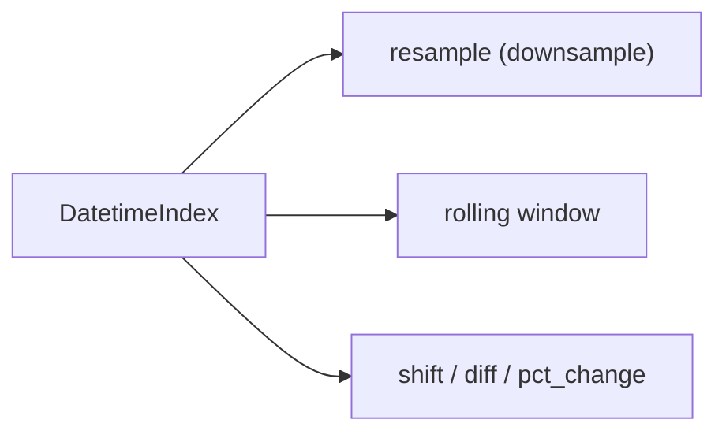

# Time Series

This is post 8 in the Pandas 101 series.

> Pandas 101 series (8/10)

<!-- a-grade-intro:begin -->

**Core question**: Why do *time series* need *their own toolkit*?

> *Time has *irregular gaps, time zones, and missing points*. Pandas' time series tools handle all of that *out of the box*.*

<!-- a-grade-intro:end -->

## What You Will Learn

- The intuition of *DatetimeIndex*
- *resample* and *rolling*
- Handling *time zones (tz)*
- A 5-step time series hands-on
- Five common mistakes

## Why It Matters

Sales, traffic, sensors, finance — *most operational data* is time series. Treating *time as an index* makes *KPI trends* visible immediately.

## Concept at a Glance



## Key Terms

- **DatetimeIndex**: an index of *time labels*.
- **resample**: *change time granularity* — daily to weekly etc.
- **rolling**: *moving window* statistics.
- **shift**: *push rows in time*.
- **tz_localize / tz_convert**: *attach / convert* time zones.

## Before/After

**Before**: *"Date columns as strings"* — *comparison, filter, aggregation are clumsy*.

**After**: *"Convert to DatetimeIndex"* — natural *string slicing* like *df.loc["2026-05"]*.

## Hands-on: Five Time Series Steps

### Step 1 — Build a DatetimeIndex

```python
import pandas as pd
idx = pd.date_range("2026-01-01", periods=10, freq="D")
ts = pd.Series(range(10), index=idx)
print(ts.head())
```

### Step 2 — Time slicing

```python
print(ts.loc["2026-01-03":"2026-01-06"])
```

### Step 3 — resample

```python
print(ts.resample("3D").sum())
```

### Step 4 — rolling

```python
print(ts.rolling(window=3).mean())
```

### Step 5 — Time zones

```python
ts2 = ts.tz_localize("UTC").tz_convert("Asia/Seoul")
print(ts2.head())
```

## What to Notice in This Code

- *String slicing* feels natural only on a *DatetimeIndex*.
- *resample* must be paired with an *aggregation function*.
- *Time zones* are *attached first*, then *converted*.

## Five Common Mistakes

1. **Skipping *to_datetime* and using strings as-is.**
2. **Calling *resample* without an *aggregation*.**
3. **Skipping *min_periods* on *rolling*.**
4. **Mixing *tz-naive* and *tz-aware* objects.**
5. **Forgetting to handle *NaN* after *shift*.**

## How This Shows Up in Production

Sales trends, user activity patterns, IoT sensor monitoring — *time-bucket conversion and window statistics* are the core of *KPI dashboards*. *Time-zone normalization* is mandatory for *global services*.

## How a Senior Engineer Thinks

- Normalize all time to *UTC* before analysis.
- Choose *resample frequency* by *analysis intent*.
- Handle *boundary NaN* from *rolling* explicitly.
- Use *interpolate* for *time series gaps*.
- Use *shift* as a *feature engineering* primitive.

## Checklist

- [ ] I create a *DatetimeIndex*.
- [ ] I call *resample* with an *aggregation*.
- [ ] I compute a *moving average* with *rolling*.
- [ ] I run *tz_convert*.

## Practice Problems

1. *Resample* a *daily series* into a *weekly sum*.
2. Build a *7-day moving average* and handle *boundary NaN*.
3. Print the result of *UTC → Asia/Seoul* conversion.

## Wrap-up and Next Steps

Time series is *a Pandas strength*. Next we cover *apply and vectorization*.

<!-- toc:begin -->
- [What Is Pandas?](./01-what-is-pandas.md)
- [Series and DataFrame](./02-series-and-dataframe.md)
- [Reading CSV and Excel](./03-read-csv-and-excel.md)
- [Filtering and Selection](./04-filtering-and-selection.md)
- [Handling Missing Values](./05-missing-values.md)
- [groupby](./06-groupby.md)
- [Merge and Join](./07-merge-and-join.md)
- **Time Series (current)**
- apply and Vectorization (upcoming)
- Real-world Data Analysis (upcoming)
<!-- toc:end -->

## References

- [pandas — Time series / date functionality](https://pandas.pydata.org/docs/user_guide/timeseries.html)
- [pandas — resample](https://pandas.pydata.org/docs/reference/api/pandas.DataFrame.resample.html)
- [pandas — rolling](https://pandas.pydata.org/docs/reference/api/pandas.DataFrame.rolling.html)
- [Forecasting — Hyndman & Athanasopoulos](https://otexts.com/fpp3/)

Tags: Pandas, TimeSeries, Resample, Datetime, Beginner
