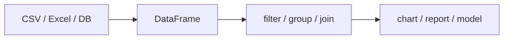

# Pandas란 무엇인가?

처음 Pandas를 배울 때 가장 헷갈리는 지점은 도구의 성격입니다. 스프레드시트를 조금 더 편하게 다루는 라이브러리처럼 보이기도 하고, 반대로 데이터 분석 전체를 떠받치는 기반 도구처럼 보이기도 합니다. 입문 단계에서 이 감각을 잘못 잡으면 이후의 필터링, 집계, 조인, 시계열 처리도 모두 흩어진 기능 목록처럼 남습니다.

이 글은 Pandas 101 시리즈의 1번째 글입니다.

Pandas를 제대로 이해하려면 기능 이름보다 먼저 역할을 잡아야 합니다. Pandas는 표 데이터를 메모리 안에서 읽고, 살펴보고, 변형하고, 집계하는 기본 작업을 매우 짧은 코드로 풀어내게 해 주는 표준 도구입니다.

## 이 글에서 다룰 문제

- Pandas는 정확히 어떤 문제를 해결하는 라이브러리일까요?
- Series와 DataFrame은 어떤 관계로 이해해야 할까요?
- 왜 많은 분석 작업이 Pandas에서 시작될까요?
- 처음 DataFrame을 만들고 살펴볼 때 어떤 순서로 접근하면 좋을까요?
- 입문자가 가장 먼저 피해야 할 실수는 무엇일까요?

> Pandas를 스프레드시트 대체재로만 보면 기능이 흩어져 보입니다. 반대로 표 데이터를 읽고, 요약하고, 조건으로 고르고, 집계하는 공통 작업을 한곳에 모아 둔 실행 환경으로 보면 이후의 모든 장이 하나의 흐름으로 연결됩니다.

## 왜 중요한가

CSV, Excel, 데이터베이스, API 응답처럼 실무 데이터의 대부분은 결국 표 형태로 도착합니다. 이때 표 데이터를 빠르게 읽고, 열 단위로 다루고, 상태를 점검하는 기본기가 없으면 분석은 시작도 하기 어렵습니다.

메모리에 들어오는 범위의 데이터라면 Pandas는 여전히 가장 실용적인 출발점입니다. 데이터 과학, 리포트 자동화, 머신러닝 전처리, 운영 지표 계산이 모두 여기서 이어집니다.

## 한눈에 보는 개념



## 핵심 용어

- 시리즈: 레이블이 붙은 1차원 배열입니다.
- **데이터프레임**: 행과 열 모두에 이름이 붙은 2차원 표입니다.
- 인덱스: 각 행을 식별하는 레이블입니다.
- **데이터 형식**: 열마다 가지는 자료형입니다.
- 벡터화: 명시적인 반복문 없이 열 단위로 계산하는 방식입니다.

## 전과 후

이전 관점: "엑셀처럼 행을 하나씩 돌면서 보자"라는 생각에 머무릅니다.

이후 관점: "표 전체를 DataFrame으로 올리고 열 단위로 계산하자"라는 관점으로 바뀝니다.

## 실습: 처음 해 보는 다섯 단계

### 1단계 - 설치하고 불러오기

```python
# pip install pandas
import pandas as pd
print(pd.__version__)
```

Pandas 작업은 거의 항상 `import pandas as pd`로 시작합니다. 버전을 먼저 확인해 두면 예제 재현이나 팀 내 환경 차이를 점검할 때 도움이 됩니다.

### 2단계 - 시리즈 만들기

```python
s = pd.Series([10, 20, 30], index=["a", "b", "c"])
print(s)
print("sum:", s.sum())
```

시리즈는 값과 인덱스가 함께 움직이는 1차원 구조입니다. 단순한 리스트처럼 보여도 합계, 정렬, 정렬 기반 연산이 바로 가능한 점이 핵심입니다.

### 3단계 - 데이터프레임 만들기

```python
df = pd.DataFrame({
    "name": ["Ada", "Linus", "Grace"],
    "age": [36, 54, 85],
})
print(df)
```

데이터프레임은 여러 시리즈를 열 단위로 묶은 구조라고 생각하면 이해가 빠릅니다. 이후 대부분의 Pandas 작업은 이 데이터프레임을 기준으로 진행됩니다.

### 4단계 - 처음 요약해 보기

```python
print(df.shape)
print(df.dtypes)
print(df.describe(include="all"))
```

`shape`, `dtypes`, `describe()`는 표를 받았을 때 가장 먼저 보는 기본 점검 세트입니다. 데이터 개수, 열 자료형, 분포를 이 세 줄로 빠르게 확인할 수 있습니다.

### 5단계 - 처음 필터링해 보기

```python
print(df[df["age"] > 40])
```

조건식으로 행을 고르는 불리언 인덱싱은 Pandas의 가장 중요한 기본 동작 중 하나입니다. 이후의 조건 선택, 이상치 탐지, 데이터 분할이 모두 여기서 이어집니다.

## 이 코드에서 먼저 봐야 할 점

- 데이터프레임은 열 중심 구조라서 열마다 자료형이 다를 수 있습니다.
- `describe()`는 숫자 요약을 확인하는 첫 도구입니다.
- 불리언 인덱싱은 SQL의 `WHERE`에 해당하는 감각으로 보면 됩니다.

## 자주 하는 실수 다섯 가지

1. 반복문으로 행을 하나씩 순회하면서 Pandas의 장점을 버립니다.
2. 자료형을 확인하지 않아 숫자처럼 보이는 문자열을 놓칩니다.
3. `SettingWithCopyWarning`를 단순 경고로 넘깁니다.
4. 인덱스의 의미를 이해하지 못한 채 `reset_index`가 필요한 시점을 놓칩니다.
5. `df.info()` 같은 메모리 점검 없이 데이터 크기부터 키웁니다.

## 실무에서는 이렇게 이어집니다

데이터 정제, 지표 계산, 리포트 생성, 머신러닝 전처리까지 거의 모든 분석 파이프라인은 Pandas에서 출발합니다. 특히 노트북 환경에서는 Pandas가 표 데이터를 이해하는 기본 언어 역할을 합니다.

## 실무에서는 이렇게 생각합니다

- 데이터를 받으면 먼저 크기와 자료형부터 확인합니다.
- 벡터화가 가능한데도 `apply`부터 쓰지 않습니다.
- 인덱스를 의미 없는 번호가 아니라 식별 키로 볼 수 있는지 판단합니다.
- 복사와 뷰의 차이를 의식합니다.
- 메모리가 한계라면 그때 Polars나 Dask 같은 다음 도구를 검토합니다.

## 체크리스트

- [ ] 데이터프레임을 직접 만들 수 있습니다.
- [ ] `shape`, `dtypes`, `describe()`를 바로 호출할 수 있습니다.
- [ ] 불리언 인덱싱으로 조건 필터링을 할 수 있습니다.
- [ ] 시리즈와 데이터프레임의 차이를 설명할 수 있습니다.

## 연습 문제

1. 3행 4열 데이터프레임을 만들고 각 열의 평균을 출력해 보세요.
2. 시리즈와 파이썬 리스트의 차이를 세 가지 적어 보세요.
3. `describe()`와 `describe(include="all")`의 출력 차이를 비교해 보세요.

## 정리와 다음 글

Pandas는 표 데이터를 다루는 파이썬의 표준 작업대입니다. 이 출발점을 잡아 두면 이후 장에서 등장할 선택, 집계, 병합, 시계열 처리도 모두 같은 문법 안에서 이어집니다. 다음 글에서는 시리즈와 데이터프레임의 내부 구조를 더 구체적으로 살펴보겠습니다.

<!-- toc:begin -->
- **Pandas란 무엇인가? (현재 글)**
- 시리즈와 데이터프레임 (예정)
- CSV와 Excel 읽기 (예정)
- 필터링과 선택 (예정)
- 결측치 처리 (예정)
- 그룹화와 집계 (예정)
- 병합과 조인 (예정)
- 시계열 데이터 다루기 (예정)
- 적용 함수와 벡터화 (예정)
- 실전 데이터 분석 (예정)
<!-- toc:end -->

## 참고 자료

- [pandas — Official Documentation](https://pandas.pydata.org/docs/)
- [10 Minutes to pandas](https://pandas.pydata.org/docs/user_guide/10min.html)
- [Wes McKinney — Python for Data Analysis](https://wesmckinney.com/book/)
- [Real Python — Pandas Tutorials](https://realpython.com/learning-paths/pandas-data-science/)

Tags: Pandas, Python, DataAnalysis, DataFrame, Beginner
