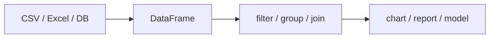

# Pandas란 무엇인가?

> Pandas 101 시리즈 (1/10)


## 이 글에서 다룰 문제

CSV, Excel, DB, API — *현실 데이터의 80%* 는 *표 형태* 입니다. *Pandas가 약하면* 데이터 분석은 *시작도 못 합니다*.

> *If your data fits in memory, Pandas is usually the right answer.*

## 개념 한눈에 보기



## Before/After

**Before**: *“엑셀처럼 한 줄씩 보면서 처리해야지”* — 1만 행에서 멈춤.

**After**: *“DataFrame 하나로 100만 행을 한 번에”* — *벡터화된 연산* 으로 수십 배 빨라짐.

## 실습: 5단계 첫 Pandas

### 1단계 — 설치와 import

```python
# pip install pandas
import pandas as pd
print(pd.__version__)
```

### 2단계 — Series 만들기

```python
s = pd.Series([10, 20, 30], index=["a", "b", "c"])
print(s)
print("sum:", s.sum())
```

### 3단계 — DataFrame 만들기

```python
df = pd.DataFrame({
    "name": ["Ada", "Linus", "Grace"],
    "age": [36, 54, 85],
})
print(df)
```

### 4단계 — 첫 요약

```python
print(df.shape)
print(df.dtypes)
print(df.describe(include="all"))
```

### 5단계 — 첫 필터링

```python
print(df[df["age"] > 40])
```

## 이 코드에서 주목할 점

- *DataFrame* 은 *열 중심* 자료구조 — 열마다 dtype이 다릅니다.
- *describe()* 는 *수치 요약* 의 첫 도구.
- *불리언 인덱싱* 은 SQL의 *WHERE* 와 같습니다.

## 자주 하는 실수 5가지

1. ***for문* 으로 행을 순회.** 벡터화 연산을 잊음.
2. ***dtype 확인을 안 함.** object로 들어와 숫자처럼 보이지만 문자열.
3. ***SettingWithCopyWarning** 을 무시.**
4. ***index 의미를 모름.** reset_index를 안 함.
5. ***메모리 사용량* 을 안 봄.** info()를 안 호출.

## 실무에서는 이렇게 쓰입니다

데이터 정제, 리포트 생성, ML 전처리, 대시보드 데이터 가공 — *모든 데이터 파이프라인의 시작점* 이 Pandas입니다. *Jupyter + Pandas* 는 데이터 분석의 *기본 세트*.

## 체크리스트

- [ ] *DataFrame* 을 만들 수 있다.
- [ ] *shape, dtypes, describe* 를 호출한다.
- [ ] *불리언 인덱싱* 으로 필터링한다.
- [ ] *Series 와 DataFrame* 의 차이를 안다.

## 정리 및 다음 단계

Pandas는 *표 형식 데이터의 표준어* 입니다. 다음 글에서는 *Series와 DataFrame* 의 *내부 구조* 를 깊게 다룹니다.

<!-- toc:begin -->
- **Pandas란 무엇인가? (현재 글)**
- Series와 DataFrame (예정)
- CSV와 Excel 읽기 (예정)
- filtering과 selection (예정)
- missing value 처리 (예정)
- groupby (예정)
- merge와 join (예정)
- time series (예정)
- apply와 vectorization (예정)
- 실전 데이터 분석 (예정)
<!-- toc:end -->

## 참고 자료

- [pandas — Official Documentation](https://pandas.pydata.org/docs/)
- [10 Minutes to pandas](https://pandas.pydata.org/docs/user_guide/10min.html)
- [Wes McKinney — Python for Data Analysis](https://wesmckinney.com/book/)
- [Real Python — Pandas Tutorials](https://realpython.com/learning-paths/pandas-data-science/)

Tags: Pandas, Python, DataAnalysis, DataFrame, Beginner
