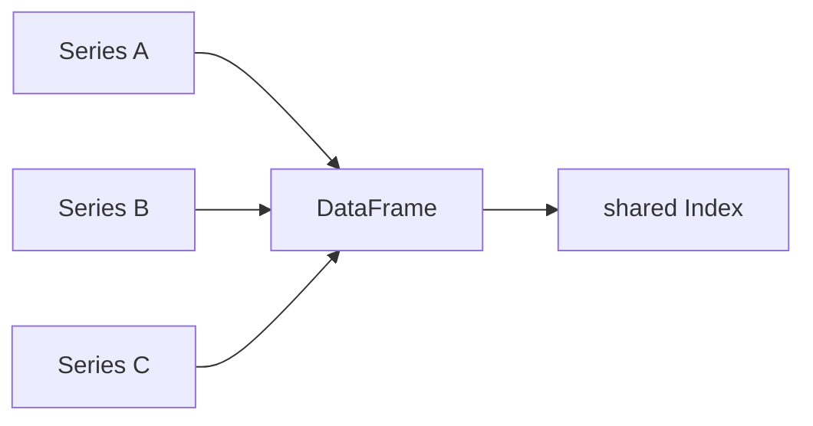

# Series와 DataFrame

> Pandas 101 시리즈 (2/10)

<!-- a-grade-intro:begin -->

**핵심 질문**: *Series* 와 *DataFrame* 은 *서로 다른 것* 일까요, *같은 가족* 일까요?

> *DataFrame은 *Series의 모음* 입니다. 둘은 *같은 라벨 시스템* 을 공유합니다.*

<!-- a-grade-intro:end -->

## 이 글에서 배울 것

- *Series* 의 *내부 구조*
- *DataFrame* 의 *열 단위 사고*
- *Index* 의 역할
- 5단계 직접 만들어보기
- 흔한 함정 5가지

## 왜 중요한가

Pandas의 *모든 동작* 은 결국 *Series 단위로 환원* 됩니다. *DataFrame* 의 한 열은 *Series* 입니다. 이 모델을 이해하면 *나머지가 쉬워집니다*.

## 개념 한눈에 보기



## 핵심 용어 정리

- **Series**: *값 + 인덱스* — *NumPy 배열* 위에 *라벨* 을 얹은 것.
- **DataFrame**: *공통 인덱스* 를 가진 *Series들의 dict*.
- **values**: 내부의 *NumPy 배열*.
- **index**: 행 라벨.
- **columns**: 열 라벨.

## Before/After

**Before**: *“DataFrame은 그냥 표”* — 행 단위로만 봄.

**After**: *“DataFrame은 Series의 모음”* — *열 단위 연산* 을 자유롭게 함.

## 실습: 5단계 자료구조 직접 만들기

### 1단계 — Series 생성과 속성

```python
import pandas as pd
s = pd.Series([1.0, 2.0, 3.0], index=["a", "b", "c"], name="x")
print(s.values, s.index, s.name)
```

### 2단계 — Series 산술

```python
print(s * 10)
print(s + s)
```

### 3단계 — DataFrame 생성

```python
df = pd.DataFrame({
    "x": [1, 2, 3],
    "y": [10, 20, 30],
}, index=["a", "b", "c"])
print(df)
```

### 4단계 — 열 추출은 Series

```python
col = df["x"]
print(type(col), col)
```

### 5단계 — 인덱스 정렬 자동 매칭

```python
s1 = pd.Series([1, 2, 3], index=["a", "b", "c"])
s2 = pd.Series([10, 20, 30], index=["b", "c", "d"])
print(s1 + s2)
```

## 이 코드에서 주목할 점

- *df["x"]* 는 *Series* 를 돌려줍니다.
- *Series* 끼리 더할 때 *index가 자동 정렬* 됩니다.
- *NaN* 은 *정렬 실패의 표시* 입니다.

## 자주 하는 실수 5가지

1. ***df["x"]* 를 *DataFrame* 으로 착각.**
2. ***index 정렬 차이* 로 *NaN 발생* 을 놓침.**
3. ***values* 를 무시하고 항상 NumPy로 강제 변환.**
4. ***name* 속성을 활용하지 않음.**
5. ***두 DataFrame을 더할 때* 순서가 같다고 가정.**

## 실무에서는 이렇게 쓰입니다

A/B 테스트 결과 비교, 시계열 합산, *서로 다른 소스의 데이터* 를 *index 키* 로 자동 정렬 — *Pandas의 마법* 의 정체가 *index 정렬* 입니다.

## 시니어 엔지니어는 이렇게 생각합니다

- *index 의미* 를 *항상 의식* 한다.
- *열 추출* 은 *Series 사고* 로 본다.
- *정렬 실패의 NaN* 을 *디버깅 단서* 로 본다.
- *df.values* 의존을 줄인다.
- *name* 으로 시리즈를 식별한다.

## 체크리스트

- [ ] *Series* 와 *DataFrame* 을 구분한다.
- [ ] *index* 와 *columns* 를 안다.
- [ ] *df["col"]* 의 타입이 *Series* 임을 안다.
- [ ] *index 정렬* 이 *자동* 임을 안다.

## 연습 문제

1. *3개의 Series* 를 만들어 *DataFrame* 으로 묶고 *공통 인덱스* 를 확인하세요.
2. *서로 다른 인덱스* 를 가진 두 Series를 *덧셈* 하여 *NaN 위치* 를 확인하세요.
3. *df["x"]* 와 *df[["x"]]* 의 *타입 차이* 를 코드로 보이세요.

## 정리 및 다음 단계

DataFrame은 *Series의 모음* 입니다. 다음 글에서는 *CSV와 Excel을 읽는 법* 을 다룹니다.

<!-- toc:begin -->
- [Pandas란 무엇인가?](./01-what-is-pandas.md)
- **Series와 DataFrame (현재 글)**
- CSV와 Excel 읽기 (예정)
- filtering과 selection (예정)
- missing value 처리 (예정)
- groupby (예정)
- merge와 join (예정)
- time series (예정)
- apply와 vectorization (예정)
- 실전 데이터 분석 (예정)
<!-- toc:end -->

## 참고 자료

- [pandas — Series API](https://pandas.pydata.org/docs/reference/series.html)
- [pandas — DataFrame API](https://pandas.pydata.org/docs/reference/frame.html)
- [pandas — Intro to data structures](https://pandas.pydata.org/docs/user_guide/dsintro.html)
- [Wes McKinney — Python for Data Analysis](https://wesmckinney.com/book/)

Tags: Pandas, Series, DataFrame, Python, Beginner
